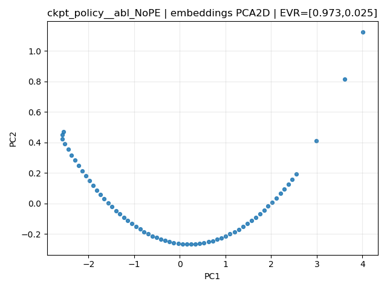
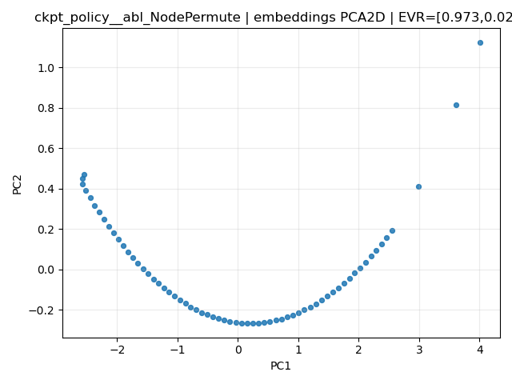

# Figures Bundle Index

- Generated: `2025-12-29T05:43:36Z`
- Bundle root: `/mnt/c/Users/Angel/Desktop/CS598/acpl-qwalk/eval/_bundle_figs_smoke`
- Figures entries: `9`

## Suite: `basic_valid`

### Run: `basic_valid_ckpt_model_last.pt_10_1_1a810b6b`

- Checkpoint: `runs/testing/model_last.pt`
- Evaldir: `/mnt/c/Users/Angel/Desktop/CS598/acpl-qwalk/eval/tmp_smoke`
- Meta hash: `1a810b6b4ed9d00de323c95f5493abbe`

#### Condition: `ckpt_policy`

- **Pt** `Pt__ckpt_policy.png`

- **embeddings_pca2d** `embeddings_pca2d__ckpt_policy.png`

#### Condition: `ckpt_policy__abl_GlobalCoin`

- **Pt** `Pt__ckpt_policy_abl_GlobalCoin.png`

- **embeddings_pca2d** `embeddings_pca2d__ckpt_policy_abl_GlobalCoin.png`

#### Condition: `ckpt_policy__abl_NoPE`

- **Pt** `Pt__ckpt_policy_abl_NoPE.png`

- **embeddings_pca2d** `embeddings_pca2d__ckpt_policy_abl_NoPE.png`

#### Condition: `ckpt_policy__abl_NodePermute`

- **embeddings_pca2d** `embeddings_pca2d__ckpt_policy_abl_NodePermute.png`

#### Condition: `ckpt_policy__abl_TimeFrozen`

- **Pt** `Pt__ckpt_policy_abl_TimeFrozen.png`

- **embeddings_pca2d** `embeddings_pca2d__ckpt_policy_abl_TimeFrozen.png`

