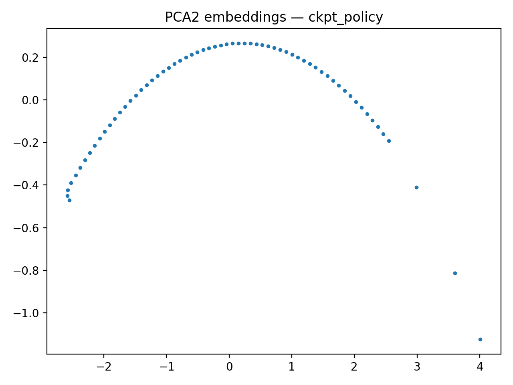

# Figures Bundle Index

- Generated: `2025-12-29T22:22:18Z`
- Bundle root: `/mnt/c/Users/Angel/Desktop/CS598/acpl-qwalk/eval/_paper`
- Figures entries: `6`

## Suite: `basic_valid`

### Run: `basic_valid_ckpt_model_last.pt_10_1_059eaca8`

- Checkpoint: `runs/testing/model_last.pt`
- Evaldir: `/mnt/c/Users/Angel/Desktop/CS598/acpl-qwalk/eval/tmp3`
- Meta hash: `059eaca8ebe982a254ff114925fe89f3`

#### Condition: `ckpt_policy`

- **Pt** `basic_valid__Pt.png`

- **embedding_artifact** `basic_valid__embedding_artifact.png`

- **mask_sensitivity** `basic_valid__mask_sensitivity.png`

- **mask_sensitivity** `basic_valid__mask_sensitivity__3f931894__2.png`

- **mask_sensitivity** `basic_valid__mask_sensitivity__6432ea54__2.png`

- **mask_sensitivity** `basic_valid__mask_sensitivity__b3a580f1__2.png`

