# Figures Bundle Index

- Generated: `2026-01-15T22:32:19Z`
- Bundle root: `/mnt/c/Users/Angel/Desktop/CS598/acpl-qwalk/results/figures_bundle`
- Figures entries: `323`

## Suite: `mixing-grid`

### Run: `mixing-grid__baseline__ckpt__256__0_1_2_3_4_5_6_7_8_9__9fb25867`

- Evaldir: `/mnt/c/Users/Angel/Desktop/CS598/acpl-qwalk/eval/mixing-grid/baseline/hadamard`
- Meta hash: `9fb25867090653bdb8b6a63cd9b4114a`

#### Condition: `baseline_hadamard`

- **position_timelines** `run__mixing-grid__baseline__ckpt__256__0_1_2_3_4_5_6_7_8_9__9fb25867__baseline_hadamard.png`

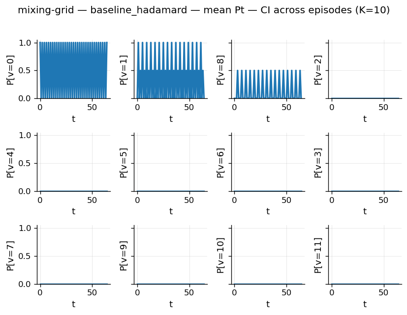

- **tv_to_uniform** `run__mixing-grid__baseline__ckpt__256__0_1_2_3_4_5_6_7_8_9__9fb25867__baseline_hadamard.png`

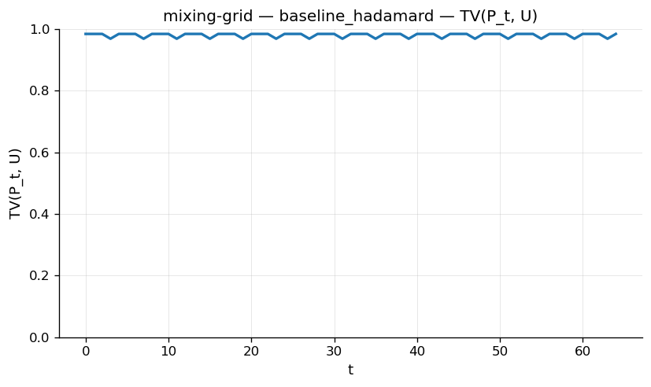

### Run: `mixing-grid__ckpt__seed0__256__0_1_2_3_4_5_6_7_8_9__dd0c89e8`

- Checkpoint: `runs/mixing-grid/seed0`
- Evaldir: `/mnt/c/Users/Angel/Desktop/CS598/acpl-qwalk/eval/mixing-grid/seed0/main`
- Meta hash: `dd0c89e87c5c8ebaa5258dc6469bbda1`

#### Condition: `ckpt_policy`

- **position_timelines** `run__mixing-grid__ckpt__seed0__256__0_1_2_3_4_5_6_7_8_9__dd0c89e8__ckpt_policy.png`

- **tv_to_uniform** `run__mixing-grid__ckpt__seed0__256__0_1_2_3_4_5_6_7_8_9__dd0c89e8__ckpt_policy.png`

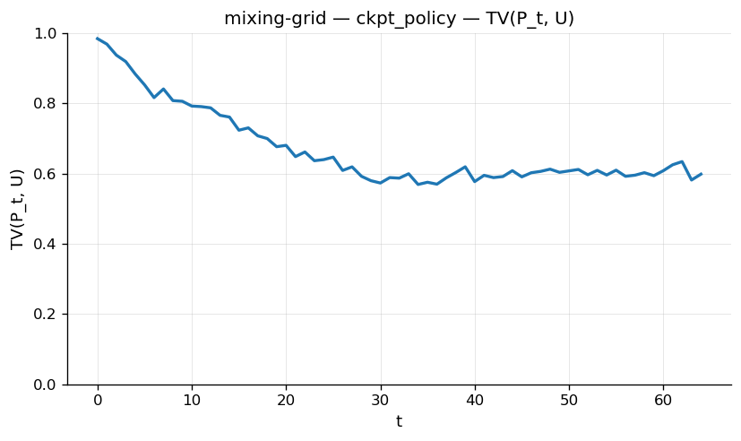

#### Condition: `ckpt_policy_abl_GlobalCoin`

- **position_timelines** `run__mixing-grid__ckpt__seed0__256__0_1_2_3_4_5_6_7_8_9__dd0c89e8__ckpt_policy_abl_GlobalCoin.png`

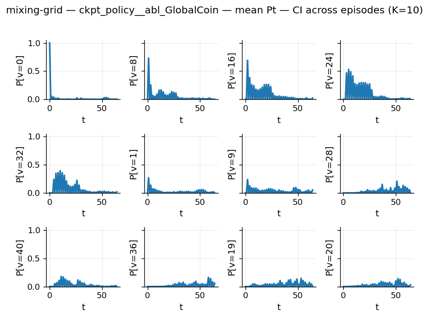

- **tv_to_uniform** `run__mixing-grid__ckpt__seed0__256__0_1_2_3_4_5_6_7_8_9__dd0c89e8__ckpt_policy_abl_GlobalCoin.png`

#### Condition: `ckpt_policy_abl_NoPE`

- **position_timelines** `run__mixing-grid__ckpt__seed0__256__0_1_2_3_4_5_6_7_8_9__dd0c89e8__ckpt_policy_abl_NoPE.png`

- **tv_to_uniform** `run__mixing-grid__ckpt__seed0__256__0_1_2_3_4_5_6_7_8_9__dd0c89e8__ckpt_policy_abl_NoPE.png`

#### Condition: `ckpt_policy_abl_NodePermute`

- **position_timelines** `run__mixing-grid__ckpt__seed0__256__0_1_2_3_4_5_6_7_8_9__dd0c89e8__ckpt_policy_abl_NodePermute.png`

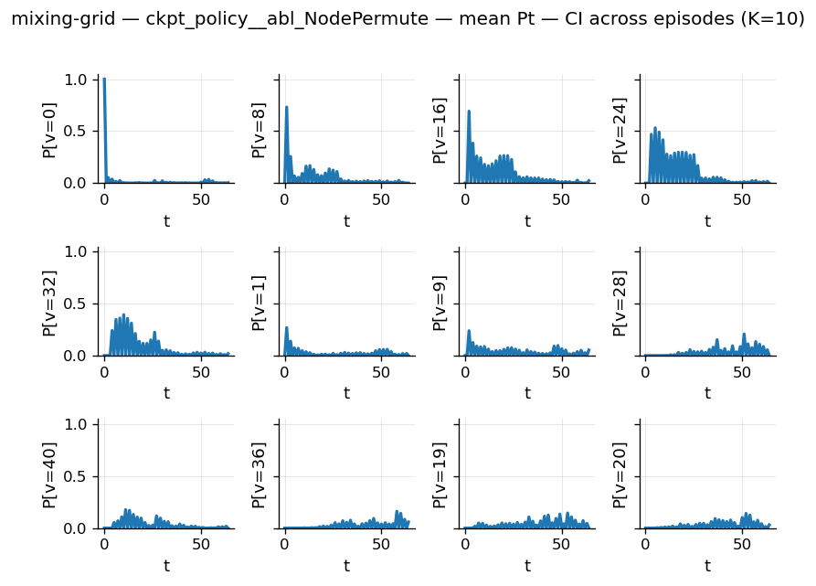

- **tv_to_uniform** `run__mixing-grid__ckpt__seed0__256__0_1_2_3_4_5_6_7_8_9__dd0c89e8__ckpt_policy_abl_NodePermute.png`

#### Condition: `ckpt_policy_abl_TimeFrozen`

- **position_timelines** `run__mixing-grid__ckpt__seed0__256__0_1_2_3_4_5_6_7_8_9__dd0c89e8__ckpt_policy_abl_TimeFrozen.png`

- **tv_to_uniform** `run__mixing-grid__ckpt__seed0__256__0_1_2_3_4_5_6_7_8_9__dd0c89e8__ckpt_policy_abl_TimeFrozen.png`

### Run: `mixing-grid__ckpt__seed1__256__0_1_2_3_4_5_6_7_8_9__dc696e30`

- Checkpoint: `runs/mixing-grid/seed1`
- Evaldir: `/mnt/c/Users/Angel/Desktop/CS598/acpl-qwalk/eval/mixing-grid/seed1/main`
- Meta hash: `dc696e3000ea5f4c419a685c2f9ef683`

#### Condition: `ckpt_policy`

- **position_timelines** `run__mixing-grid__ckpt__seed1__256__0_1_2_3_4_5_6_7_8_9__dc696e30__ckpt_policy.png`

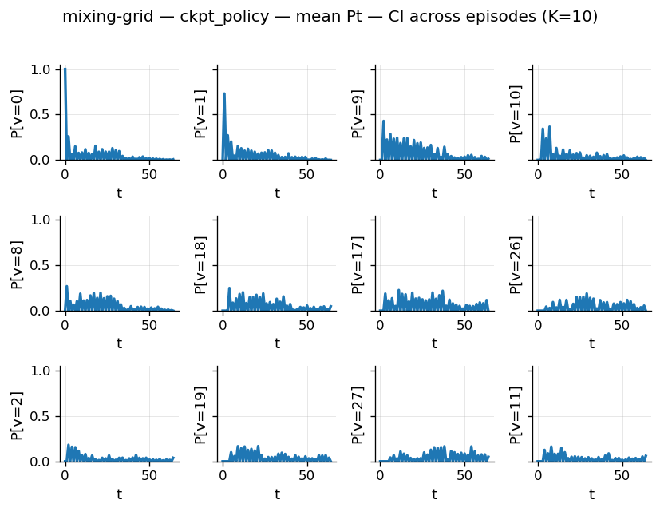

- **tv_to_uniform** `run__mixing-grid__ckpt__seed1__256__0_1_2_3_4_5_6_7_8_9__dc696e30__ckpt_policy.png`

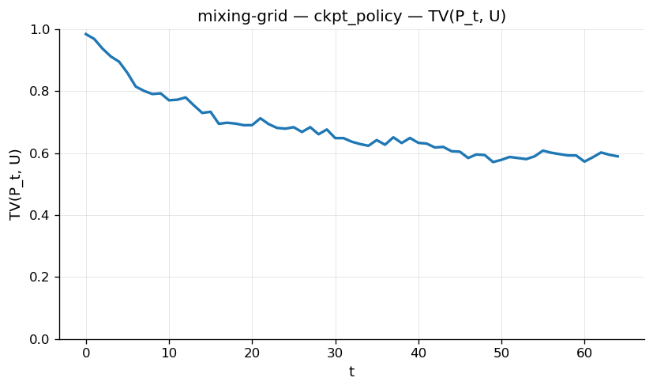

#### Condition: `ckpt_policy_abl_GlobalCoin`

- **position_timelines** `run__mixing-grid__ckpt__seed1__256__0_1_2_3_4_5_6_7_8_9__dc696e30__ckpt_policy_abl_GlobalCoin.png`

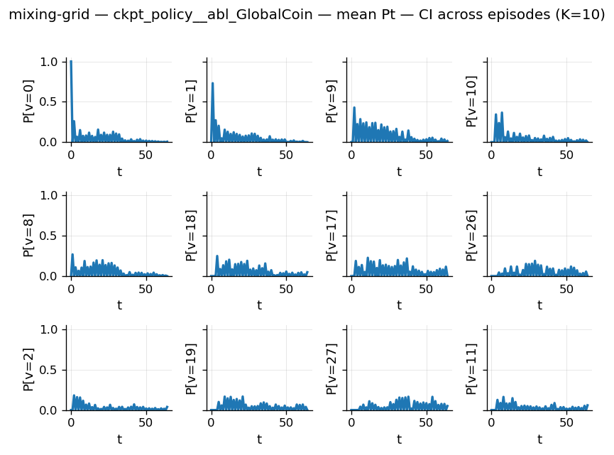

- **tv_to_uniform** `run__mixing-grid__ckpt__seed1__256__0_1_2_3_4_5_6_7_8_9__dc696e30__ckpt_policy_abl_GlobalCoin.png`

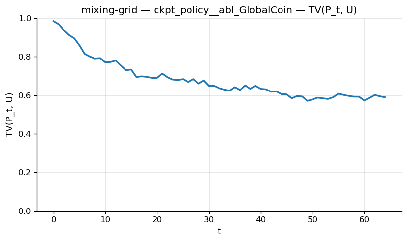

#### Condition: `ckpt_policy_abl_NoPE`

- **position_timelines** `run__mixing-grid__ckpt__seed1__256__0_1_2_3_4_5_6_7_8_9__dc696e30__ckpt_policy_abl_NoPE.png`

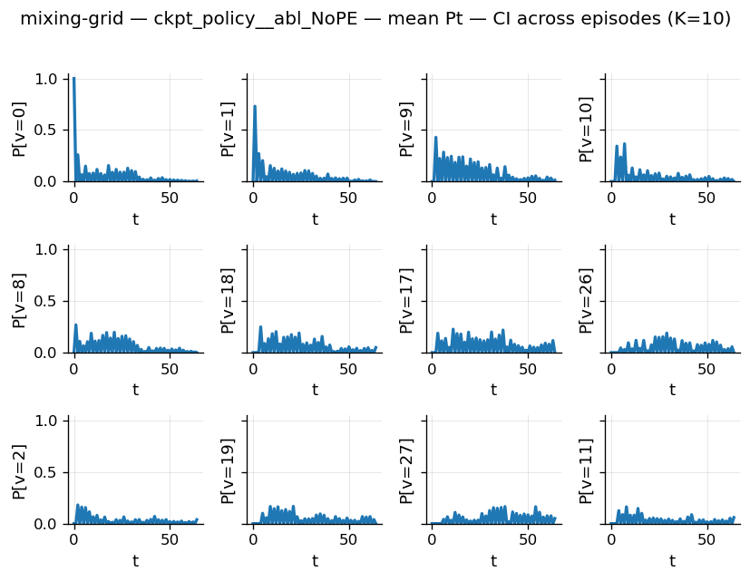

- **tv_to_uniform** `run__mixing-grid__ckpt__seed1__256__0_1_2_3_4_5_6_7_8_9__dc696e30__ckpt_policy_abl_NoPE.png`

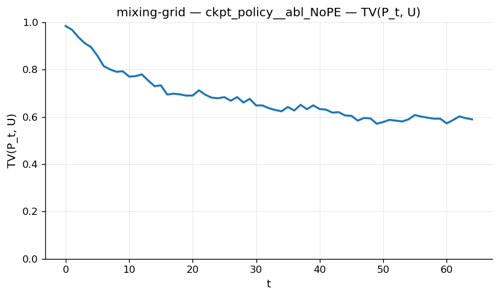

#### Condition: `ckpt_policy_abl_NodePermute`

- **position_timelines** `run__mixing-grid__ckpt__seed1__256__0_1_2_3_4_5_6_7_8_9__dc696e30__ckpt_policy_abl_NodePermute.png`

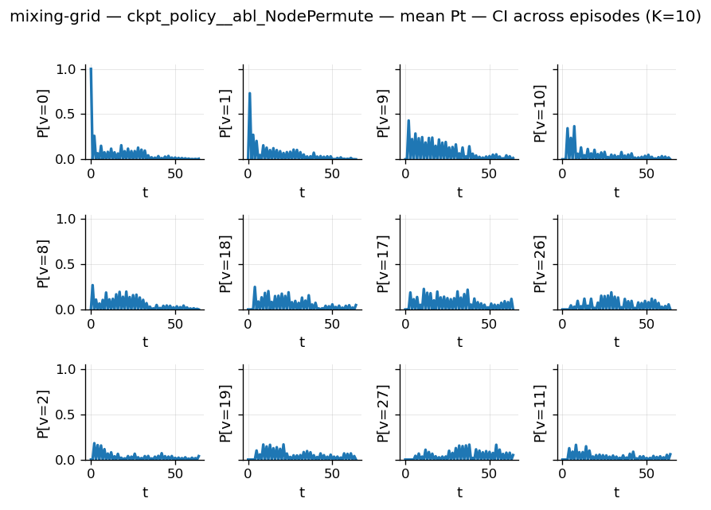

- **tv_to_uniform** `run__mixing-grid__ckpt__seed1__256__0_1_2_3_4_5_6_7_8_9__dc696e30__ckpt_policy_abl_NodePermute.png`

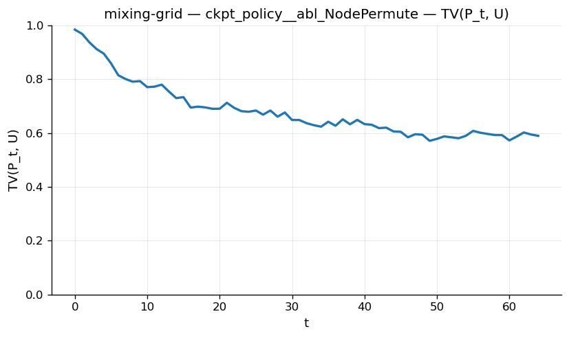

#### Condition: `ckpt_policy_abl_TimeFrozen`

- **position_timelines** `run__mixing-grid__ckpt__seed1__256__0_1_2_3_4_5_6_7_8_9__dc696e30__ckpt_policy_abl_TimeFrozen.png`

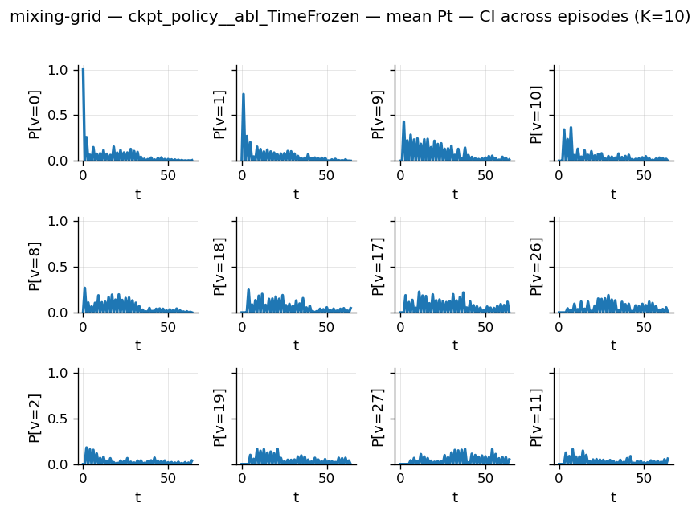

- **tv_to_uniform** `run__mixing-grid__ckpt__seed1__256__0_1_2_3_4_5_6_7_8_9__dc696e30__ckpt_policy_abl_TimeFrozen.png`

### Run: `mixing-grid__ckpt__seed2__256__0_1_2_3_4_5_6_7_8_9__7106df31`

- Checkpoint: `runs/mixing-grid/seed2`
- Evaldir: `/mnt/c/Users/Angel/Desktop/CS598/acpl-qwalk/eval/mixing-grid/seed2/main`
- Meta hash: `7106df3102cc85a0a849de4799919557`

#### Condition: `ckpt_policy`

- **position_timelines** `run__mixing-grid__ckpt__seed2__256__0_1_2_3_4_5_6_7_8_9__7106df31__ckpt_policy.png`

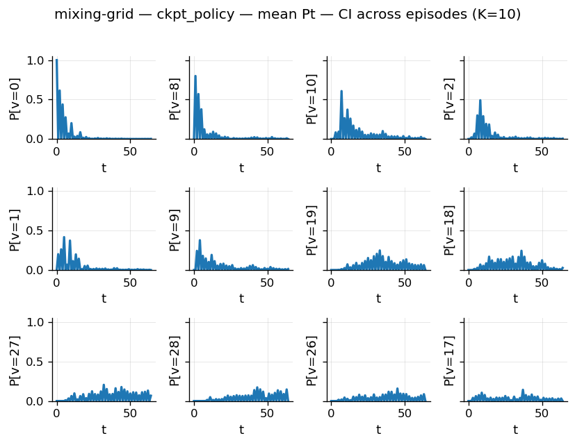

- **tv_to_uniform** `run__mixing-grid__ckpt__seed2__256__0_1_2_3_4_5_6_7_8_9__7106df31__ckpt_policy.png`

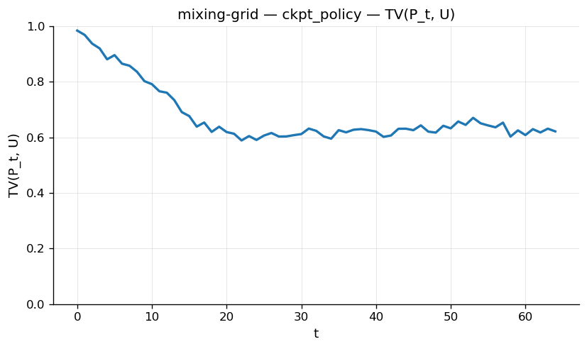

#### Condition: `ckpt_policy_abl_GlobalCoin`

- **position_timelines** `run__mixing-grid__ckpt__seed2__256__0_1_2_3_4_5_6_7_8_9__7106df31__ckpt_policy_abl_GlobalCoin.png`

- **tv_to_uniform** `run__mixing-grid__ckpt__seed2__256__0_1_2_3_4_5_6_7_8_9__7106df31__ckpt_policy_abl_GlobalCoin.png`

#### Condition: `ckpt_policy_abl_NoPE`

- **position_timelines** `run__mixing-grid__ckpt__seed2__256__0_1_2_3_4_5_6_7_8_9__7106df31__ckpt_policy_abl_NoPE.png`

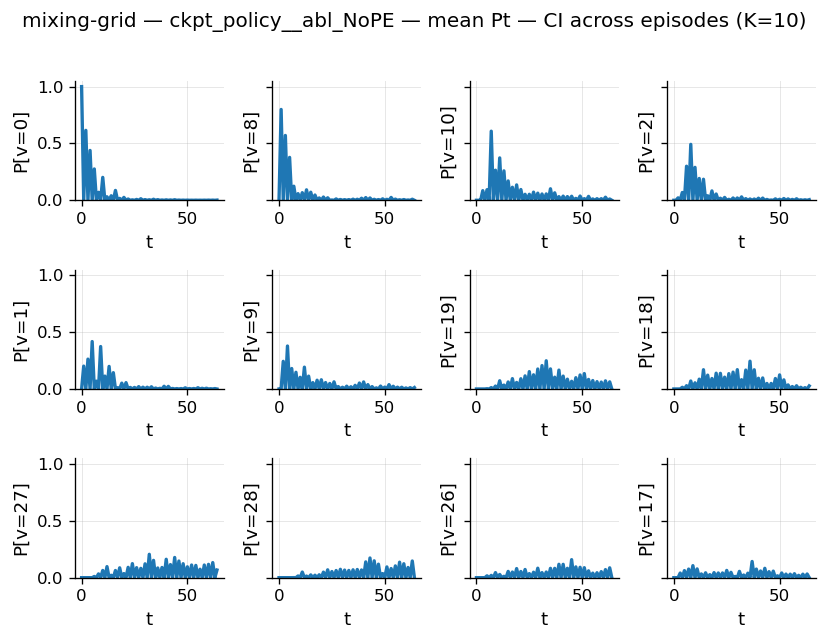

- **tv_to_uniform** `run__mixing-grid__ckpt__seed2__256__0_1_2_3_4_5_6_7_8_9__7106df31__ckpt_policy_abl_NoPE.png`

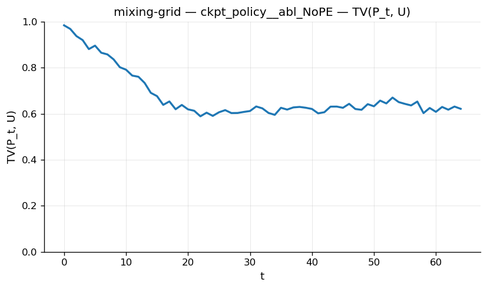

#### Condition: `ckpt_policy_abl_NodePermute`

- **position_timelines** `run__mixing-grid__ckpt__seed2__256__0_1_2_3_4_5_6_7_8_9__7106df31__ckpt_policy_abl_NodePermute.png`

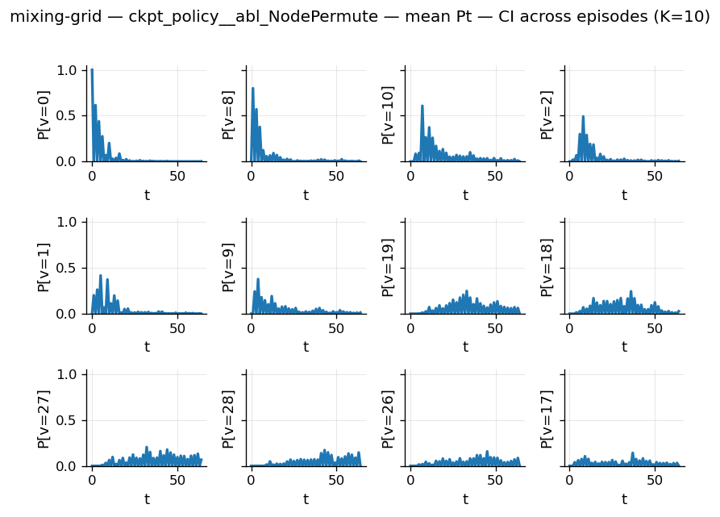

- **tv_to_uniform** `run__mixing-grid__ckpt__seed2__256__0_1_2_3_4_5_6_7_8_9__7106df31__ckpt_policy_abl_NodePermute.png`

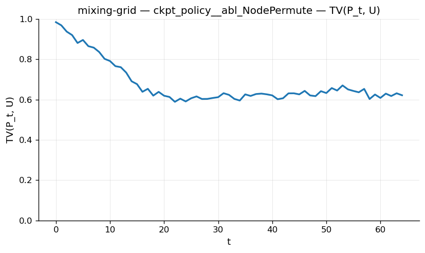

#### Condition: `ckpt_policy_abl_TimeFrozen`

- **position_timelines** `run__mixing-grid__ckpt__seed2__256__0_1_2_3_4_5_6_7_8_9__7106df31__ckpt_policy_abl_TimeFrozen.png`

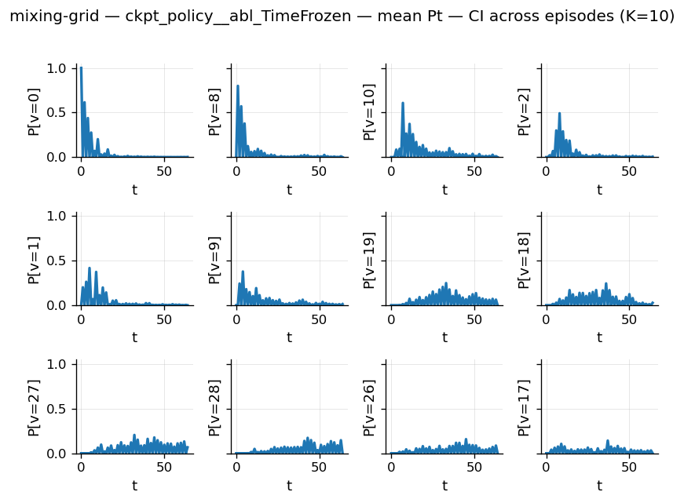

- **tv_to_uniform** `run__mixing-grid__ckpt__seed2__256__0_1_2_3_4_5_6_7_8_9__7106df31__ckpt_policy_abl_TimeFrozen.png`

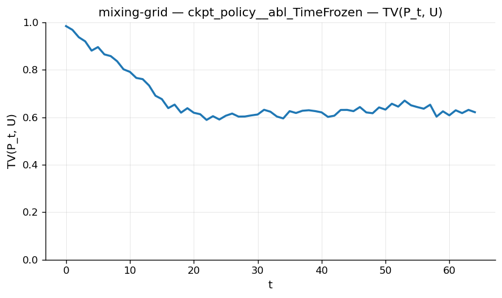

## Suite: `robust-line-disorder`

### Run: `robust-line-disorder__baseline__ckpt__256__0_1_2_3_4_5_6_7_8_9__7ce1d6fc`

- Evaldir: `/mnt/c/Users/Angel/Desktop/CS598/acpl-qwalk/eval/robust-line-disorder/baseline/hadamard`
- Meta hash: `7ce1d6fc1bc8234b62a7c633a73bbea7`

#### Condition: `baseline_hadamard`

- **confusion_matrix** `run__robust-line-disorder__baseline__ckpt__256__0_1_2_3_4_5_6_7_8_9__7ce1d6fc__baseline_hadamard.png`

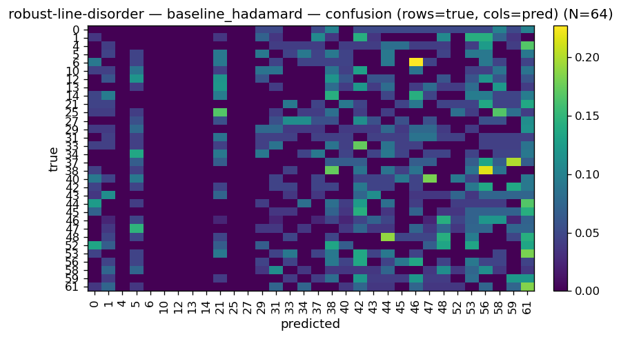

- **position_timelines** `run__robust-line-disorder__baseline__ckpt__256__0_1_2_3_4_5_6_7_8_9__7ce1d6fc__baseline_hadamard.png`

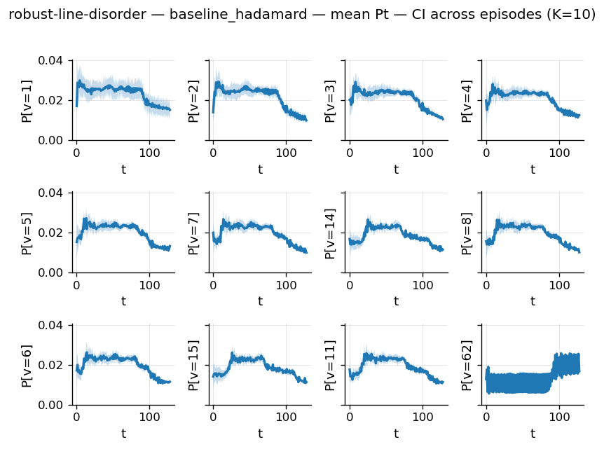

- **tv_to_uniform** `run__robust-line-disorder__baseline__ckpt__256__0_1_2_3_4_5_6_7_8_9__7ce1d6fc__baseline_hadamard.png`

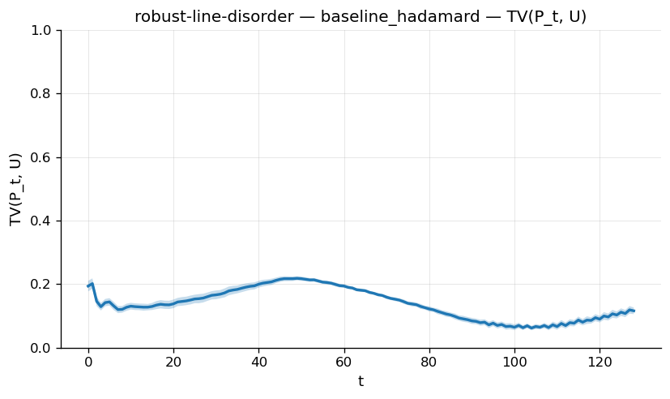

### Run: `robust-line-disorder__ckpt__seed0__256__0_1_2_3_4_5_6_7_8_9__9144b899`

- Checkpoint: `runs/robust-line-disorder/seed0`
- Evaldir: `/mnt/c/Users/Angel/Desktop/CS598/acpl-qwalk/eval/robust-line-disorder/seed0/main`
- Meta hash: `9144b899d4a4ea70f9914b2a0921ee7d`

#### Condition: `ckpt_policy`

- **confusion_matrix** `run__robust-line-disorder__ckpt__seed0__256__0_1_2_3_4_5_6_7_8_9__9144b899__ckpt_policy.png`

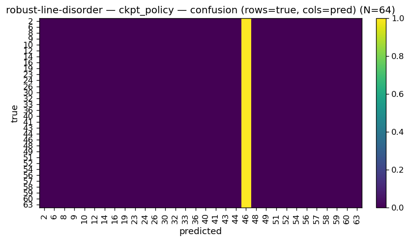

- **position_timelines** `run__robust-line-disorder__ckpt__seed0__256__0_1_2_3_4_5_6_7_8_9__9144b899__ckpt_policy.png`

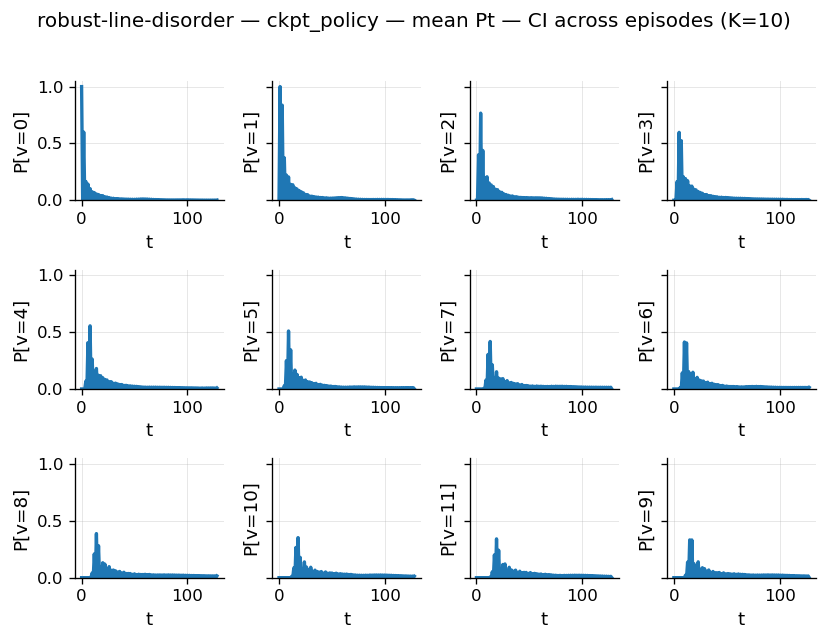

- **tv_to_uniform** `run__robust-line-disorder__ckpt__seed0__256__0_1_2_3_4_5_6_7_8_9__9144b899__ckpt_policy.png`

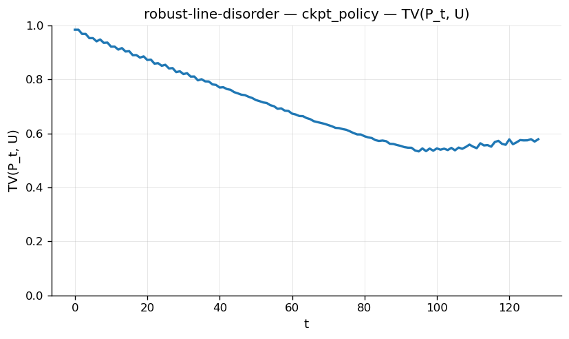

#### Condition: `ckpt_policy_abl_GlobalCoin`

- **confusion_matrix** `run__robust-line-disorder__ckpt__seed0__256__0_1_2_3_4_5_6_7_8_9__9144b899__ckpt_policy_abl_GlobalCoin.png`

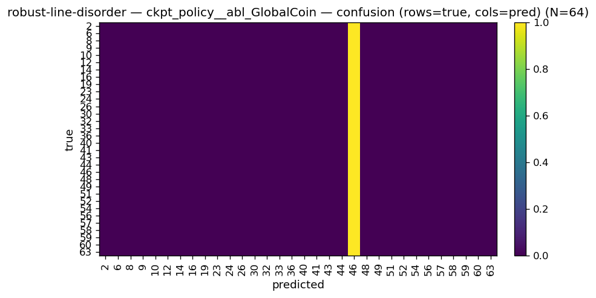

- **position_timelines** `run__robust-line-disorder__ckpt__seed0__256__0_1_2_3_4_5_6_7_8_9__9144b899__ckpt_policy_abl_GlobalCoin.png`

- **tv_to_uniform** `run__robust-line-disorder__ckpt__seed0__256__0_1_2_3_4_5_6_7_8_9__9144b899__ckpt_policy_abl_GlobalCoin.png`

#### Condition: `ckpt_policy_abl_NoPE`

- **confusion_matrix** `run__robust-line-disorder__ckpt__seed0__256__0_1_2_3_4_5_6_7_8_9__9144b899__ckpt_policy_abl_NoPE.png`

- **position_timelines** `run__robust-line-disorder__ckpt__seed0__256__0_1_2_3_4_5_6_7_8_9__9144b899__ckpt_policy_abl_NoPE.png`

- **tv_to_uniform** `run__robust-line-disorder__ckpt__seed0__256__0_1_2_3_4_5_6_7_8_9__9144b899__ckpt_policy_abl_NoPE.png`

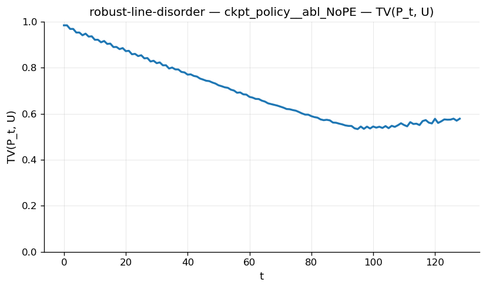

#### Condition: `ckpt_policy_abl_NodePermute`

- **confusion_matrix** `run__robust-line-disorder__ckpt__seed0__256__0_1_2_3_4_5_6_7_8_9__9144b899__ckpt_policy_abl_NodePermute.png`

- **position_timelines** `run__robust-line-disorder__ckpt__seed0__256__0_1_2_3_4_5_6_7_8_9__9144b899__ckpt_policy_abl_NodePermute.png`

- **tv_to_uniform** `run__robust-line-disorder__ckpt__seed0__256__0_1_2_3_4_5_6_7_8_9__9144b899__ckpt_policy_abl_NodePermute.png`

#### Condition: `ckpt_policy_abl_TimeFrozen`

- **confusion_matrix** `run__robust-line-disorder__ckpt__seed0__256__0_1_2_3_4_5_6_7_8_9__9144b899__ckpt_policy_abl_TimeFrozen.png`

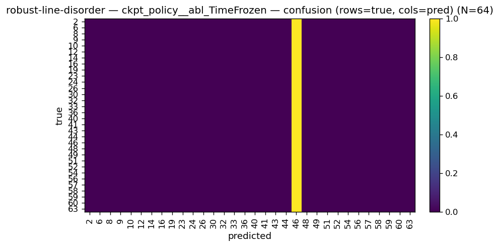

- **position_timelines** `run__robust-line-disorder__ckpt__seed0__256__0_1_2_3_4_5_6_7_8_9__9144b899__ckpt_policy_abl_TimeFrozen.png`

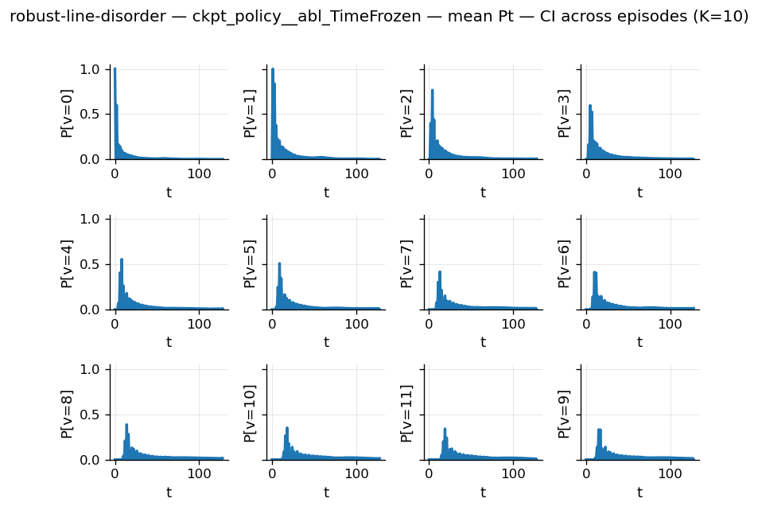

- **tv_to_uniform** `run__robust-line-disorder__ckpt__seed0__256__0_1_2_3_4_5_6_7_8_9__9144b899__ckpt_policy_abl_TimeFrozen.png`

### Run: `robust-line-disorder__ckpt__seed0__256__0_1_2_3_4_5_6_7_8_9__d80ed609`

- Checkpoint: `runs/robust-line-disorder/seed0`
- Evaldir: `/mnt/c/Users/Angel/Desktop/CS598/acpl-qwalk/eval/robust-line-disorder/seed0/robust_sweep`
- Meta hash: `d80ed60944dbac2b325b9f722ff97dba`

#### Condition: `ckpt_policy`

- **confusion_matrix** `run__robust-line-disorder__ckpt__seed0__256__0_1_2_3_4_5_6_7_8_9__d80ed609__ckpt_policy.png`

- **position_timelines** `run__robust-line-disorder__ckpt__seed0__256__0_1_2_3_4_5_6_7_8_9__d80ed609__ckpt_policy.png`

- **tv_to_uniform** `run__robust-line-disorder__ckpt__seed0__256__0_1_2_3_4_5_6_7_8_9__d80ed609__ckpt_policy.png`

#### Condition: `ckpt_policy_abl_GlobalCoin`

- **confusion_matrix** `run__robust-line-disorder__ckpt__seed0__256__0_1_2_3_4_5_6_7_8_9__d80ed609__ckpt_policy_abl_GlobalCoin.png`

- **position_timelines** `run__robust-line-disorder__ckpt__seed0__256__0_1_2_3_4_5_6_7_8_9__d80ed609__ckpt_policy_abl_GlobalCoin.png`

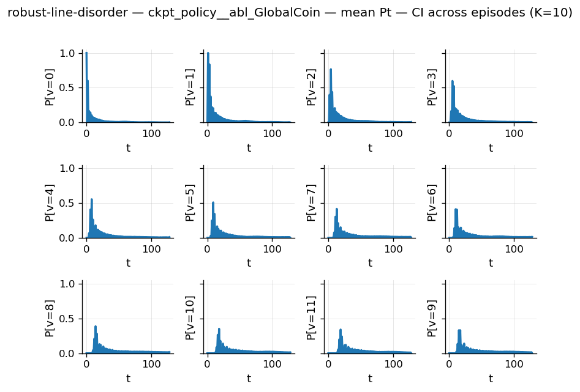

- **tv_to_uniform** `run__robust-line-disorder__ckpt__seed0__256__0_1_2_3_4_5_6_7_8_9__d80ed609__ckpt_policy_abl_GlobalCoin.png`

#### Condition: `ckpt_policy_abl_NoPE`

- **confusion_matrix** `run__robust-line-disorder__ckpt__seed0__256__0_1_2_3_4_5_6_7_8_9__d80ed609__ckpt_policy_abl_NoPE.png`

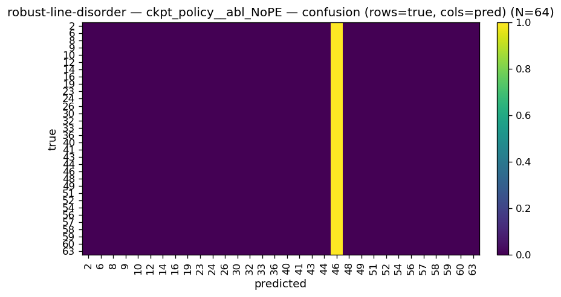

- **position_timelines** `run__robust-line-disorder__ckpt__seed0__256__0_1_2_3_4_5_6_7_8_9__d80ed609__ckpt_policy_abl_NoPE.png`

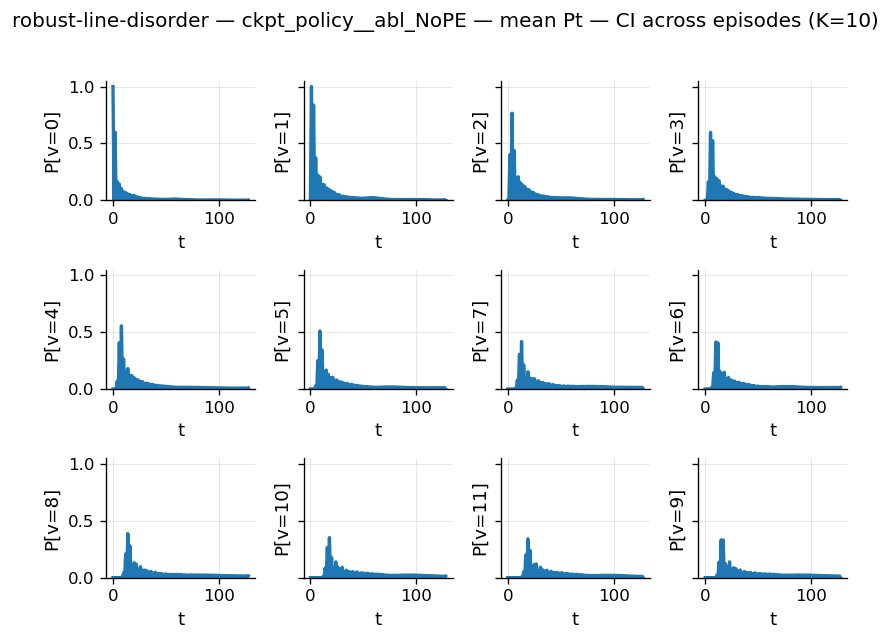

- **tv_to_uniform** `run__robust-line-disorder__ckpt__seed0__256__0_1_2_3_4_5_6_7_8_9__d80ed609__ckpt_policy_abl_NoPE.png`

#### Condition: `ckpt_policy_abl_NodePermute`

- **confusion_matrix** `run__robust-line-disorder__ckpt__seed0__256__0_1_2_3_4_5_6_7_8_9__d80ed609__ckpt_policy_abl_NodePermute.png`

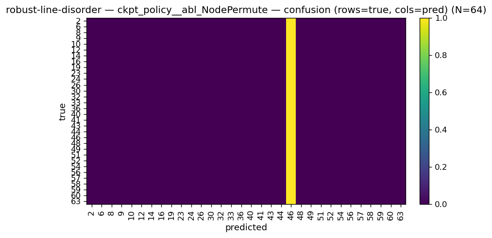

- **position_timelines** `run__robust-line-disorder__ckpt__seed0__256__0_1_2_3_4_5_6_7_8_9__d80ed609__ckpt_policy_abl_NodePermute.png`

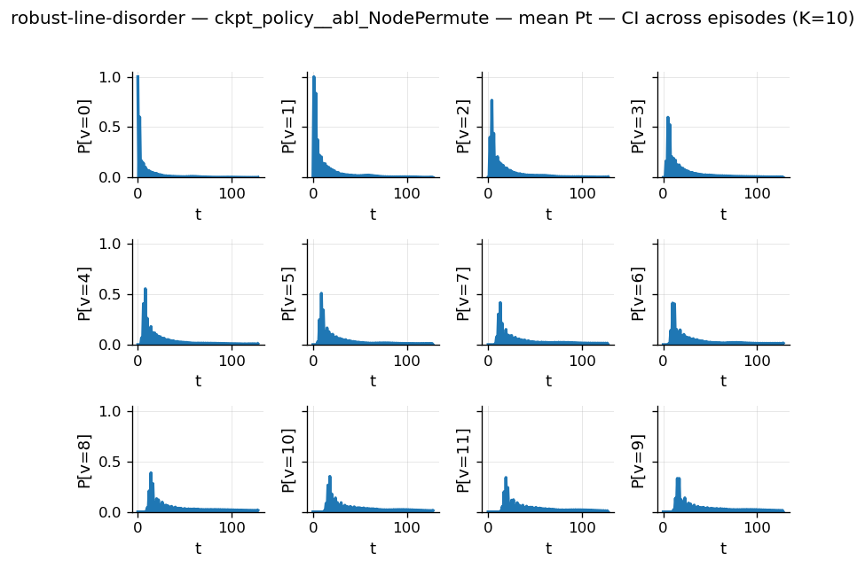

- **tv_to_uniform** `run__robust-line-disorder__ckpt__seed0__256__0_1_2_3_4_5_6_7_8_9__d80ed609__ckpt_policy_abl_NodePermute.png`

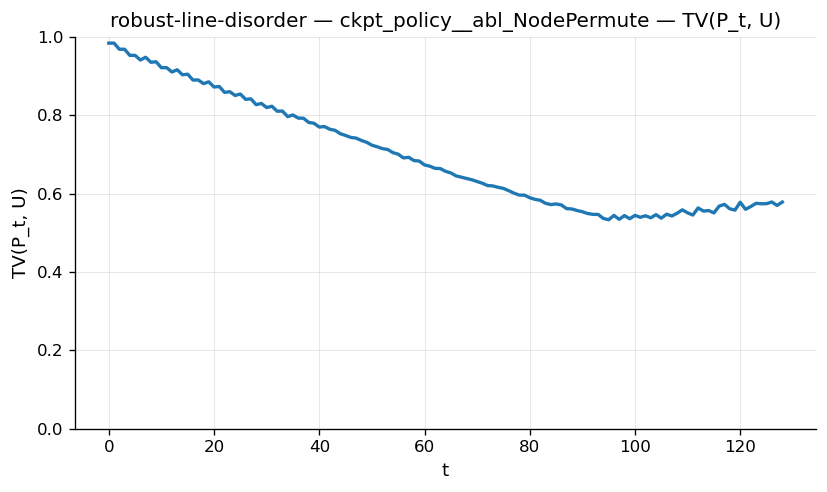

#### Condition: `ckpt_policy_abl_TimeFrozen`

- **confusion_matrix** `run__robust-line-disorder__ckpt__seed0__256__0_1_2_3_4_5_6_7_8_9__d80ed609__ckpt_policy_abl_TimeFrozen.png`

- **position_timelines** `run__robust-line-disorder__ckpt__seed0__256__0_1_2_3_4_5_6_7_8_9__d80ed609__ckpt_policy_abl_TimeFrozen.png`

- **tv_to_uniform** `run__robust-line-disorder__ckpt__seed0__256__0_1_2_3_4_5_6_7_8_9__d80ed609__ckpt_policy_abl_TimeFrozen.png`

### Run: `robust-line-disorder__ckpt__seed1__256__0_1_2_3_4_5_6_7_8_9__0ecc3c05`

- Checkpoint: `runs/robust-line-disorder/seed1`
- Evaldir: `/mnt/c/Users/Angel/Desktop/CS598/acpl-qwalk/eval/robust-line-disorder/seed1/robust_sweep`
- Meta hash: `0ecc3c05f95a71159d8efc02bda3b08f`

#### Condition: `ckpt_policy`

- **confusion_matrix** `run__robust-line-disorder__ckpt__seed1__256__0_1_2_3_4_5_6_7_8_9__0ecc3c05__ckpt_policy.png`

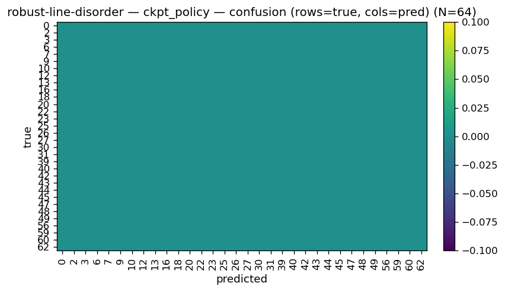

- **position_timelines** `run__robust-line-disorder__ckpt__seed1__256__0_1_2_3_4_5_6_7_8_9__0ecc3c05__ckpt_policy.png`

- **tv_to_uniform** `run__robust-line-disorder__ckpt__seed1__256__0_1_2_3_4_5_6_7_8_9__0ecc3c05__ckpt_policy.png`

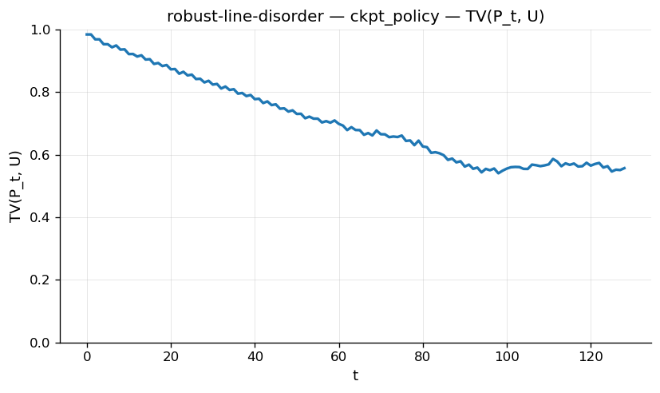

#### Condition: `ckpt_policy_abl_GlobalCoin`

- **confusion_matrix** `run__robust-line-disorder__ckpt__seed1__256__0_1_2_3_4_5_6_7_8_9__0ecc3c05__ckpt_policy_abl_GlobalCoin.png`

- **position_timelines** `run__robust-line-disorder__ckpt__seed1__256__0_1_2_3_4_5_6_7_8_9__0ecc3c05__ckpt_policy_abl_GlobalCoin.png`

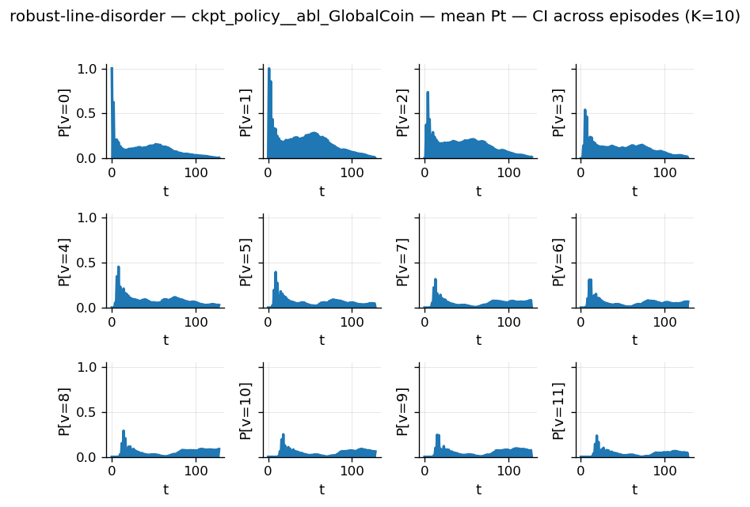

- **tv_to_uniform** `run__robust-line-disorder__ckpt__seed1__256__0_1_2_3_4_5_6_7_8_9__0ecc3c05__ckpt_policy_abl_GlobalCoin.png`

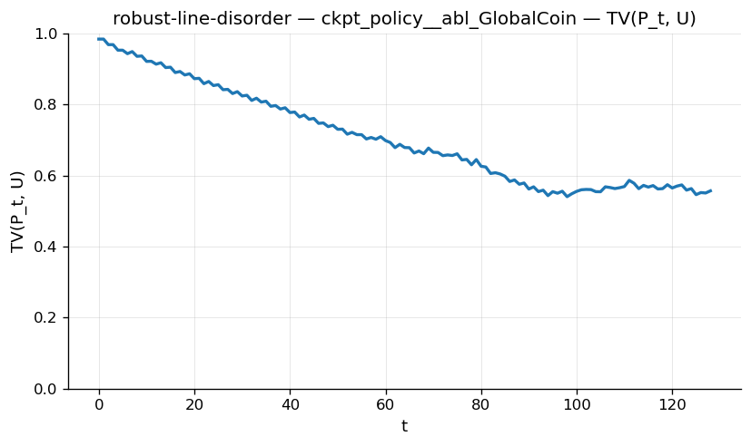

#### Condition: `ckpt_policy_abl_NoPE`

- **confusion_matrix** `run__robust-line-disorder__ckpt__seed1__256__0_1_2_3_4_5_6_7_8_9__0ecc3c05__ckpt_policy_abl_NoPE.png`

- **position_timelines** `run__robust-line-disorder__ckpt__seed1__256__0_1_2_3_4_5_6_7_8_9__0ecc3c05__ckpt_policy_abl_NoPE.png`

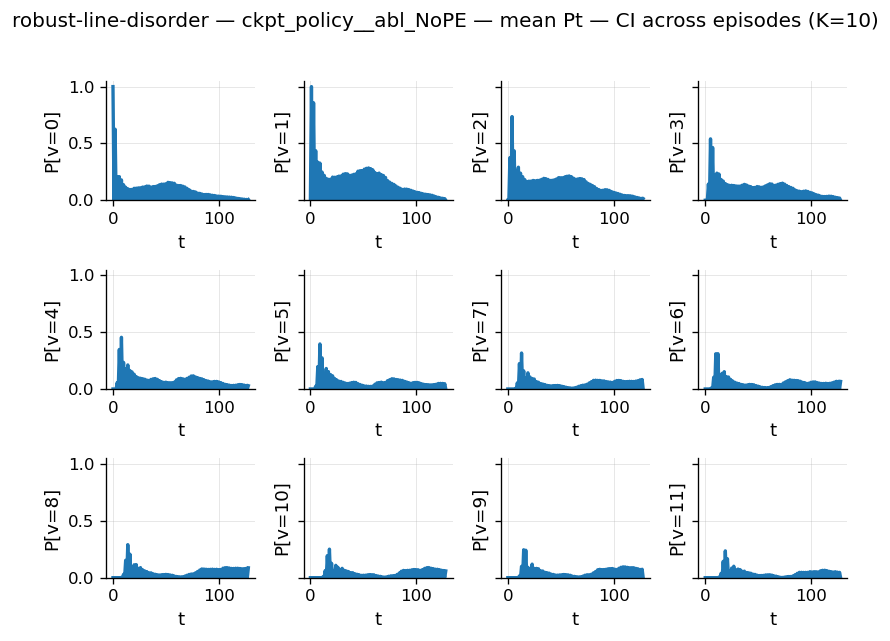

- **tv_to_uniform** `run__robust-line-disorder__ckpt__seed1__256__0_1_2_3_4_5_6_7_8_9__0ecc3c05__ckpt_policy_abl_NoPE.png`

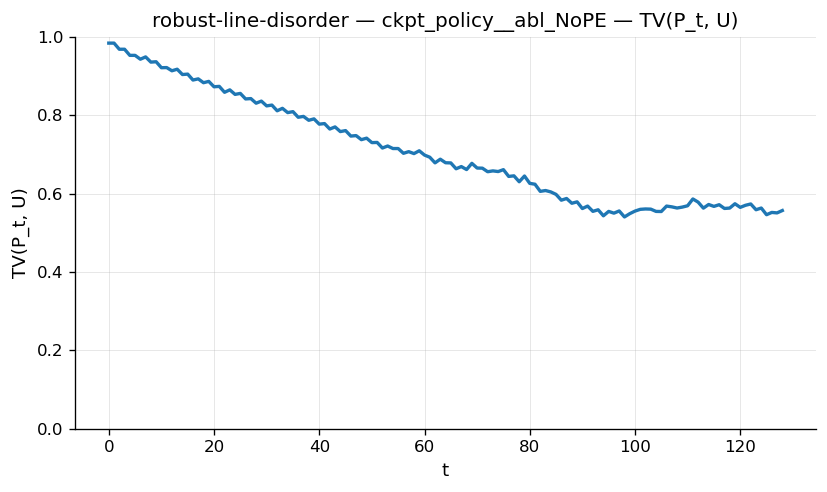

#### Condition: `ckpt_policy_abl_NodePermute`

- **confusion_matrix** `run__robust-line-disorder__ckpt__seed1__256__0_1_2_3_4_5_6_7_8_9__0ecc3c05__ckpt_policy_abl_NodePermute.png`

- **position_timelines** `run__robust-line-disorder__ckpt__seed1__256__0_1_2_3_4_5_6_7_8_9__0ecc3c05__ckpt_policy_abl_NodePermute.png`

- **tv_to_uniform** `run__robust-line-disorder__ckpt__seed1__256__0_1_2_3_4_5_6_7_8_9__0ecc3c05__ckpt_policy_abl_NodePermute.png`

#### Condition: `ckpt_policy_abl_TimeFrozen`

- **confusion_matrix** `run__robust-line-disorder__ckpt__seed1__256__0_1_2_3_4_5_6_7_8_9__0ecc3c05__ckpt_policy_abl_TimeFrozen.png`

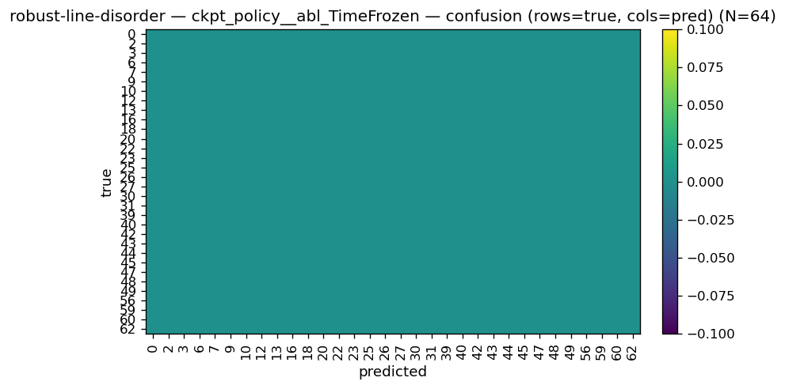

- **position_timelines** `run__robust-line-disorder__ckpt__seed1__256__0_1_2_3_4_5_6_7_8_9__0ecc3c05__ckpt_policy_abl_TimeFrozen.png`

- **tv_to_uniform** `run__robust-line-disorder__ckpt__seed1__256__0_1_2_3_4_5_6_7_8_9__0ecc3c05__ckpt_policy_abl_TimeFrozen.png`

### Run: `robust-line-disorder__ckpt__seed1__256__0_1_2_3_4_5_6_7_8_9__e4ba29d5`

- Checkpoint: `runs/robust-line-disorder/seed1`
- Evaldir: `/mnt/c/Users/Angel/Desktop/CS598/acpl-qwalk/eval/robust-line-disorder/seed1/main`
- Meta hash: `e4ba29d5a2bce312b777b279f8ed5daf`

#### Condition: `ckpt_policy`

- **confusion_matrix** `run__robust-line-disorder__ckpt__seed1__256__0_1_2_3_4_5_6_7_8_9__e4ba29d5__ckpt_policy.png`

- **position_timelines** `run__robust-line-disorder__ckpt__seed1__256__0_1_2_3_4_5_6_7_8_9__e4ba29d5__ckpt_policy.png`

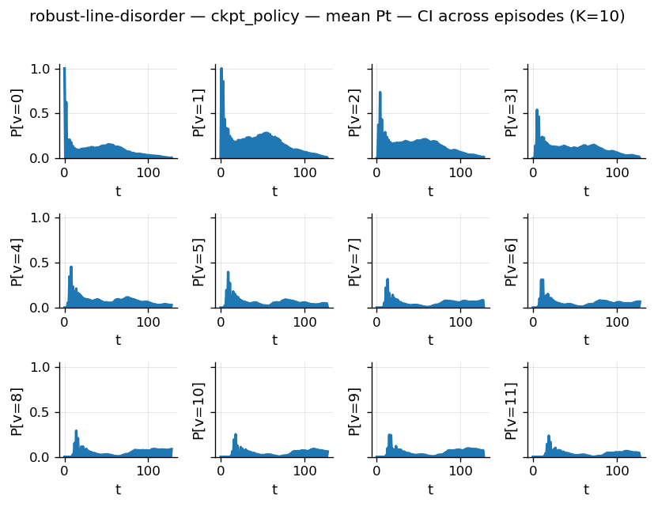

- **tv_to_uniform** `run__robust-line-disorder__ckpt__seed1__256__0_1_2_3_4_5_6_7_8_9__e4ba29d5__ckpt_policy.png`

#### Condition: `ckpt_policy_abl_GlobalCoin`

- **confusion_matrix** `run__robust-line-disorder__ckpt__seed1__256__0_1_2_3_4_5_6_7_8_9__e4ba29d5__ckpt_policy_abl_GlobalCoin.png`

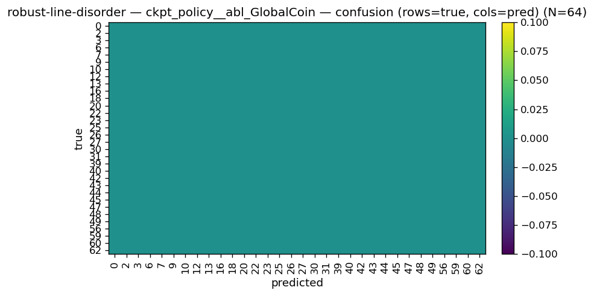

- **position_timelines** `run__robust-line-disorder__ckpt__seed1__256__0_1_2_3_4_5_6_7_8_9__e4ba29d5__ckpt_policy_abl_GlobalCoin.png`

- **tv_to_uniform** `run__robust-line-disorder__ckpt__seed1__256__0_1_2_3_4_5_6_7_8_9__e4ba29d5__ckpt_policy_abl_GlobalCoin.png`

#### Condition: `ckpt_policy_abl_NoPE`

- **confusion_matrix** `run__robust-line-disorder__ckpt__seed1__256__0_1_2_3_4_5_6_7_8_9__e4ba29d5__ckpt_policy_abl_NoPE.png`

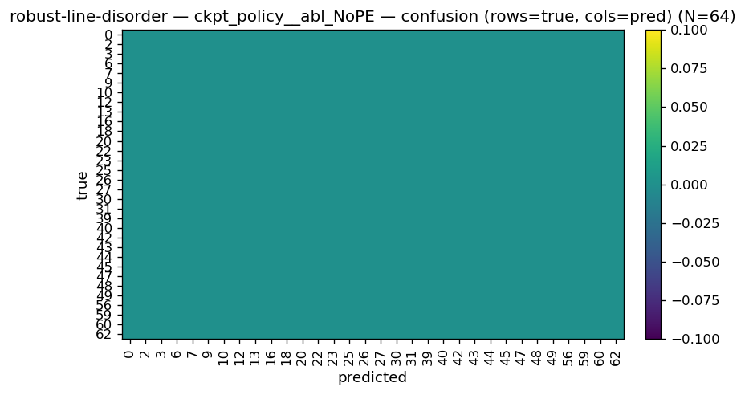

- **position_timelines** `run__robust-line-disorder__ckpt__seed1__256__0_1_2_3_4_5_6_7_8_9__e4ba29d5__ckpt_policy_abl_NoPE.png`

- **tv_to_uniform** `run__robust-line-disorder__ckpt__seed1__256__0_1_2_3_4_5_6_7_8_9__e4ba29d5__ckpt_policy_abl_NoPE.png`

#### Condition: `ckpt_policy_abl_NodePermute`

- **confusion_matrix** `run__robust-line-disorder__ckpt__seed1__256__0_1_2_3_4_5_6_7_8_9__e4ba29d5__ckpt_policy_abl_NodePermute.png`

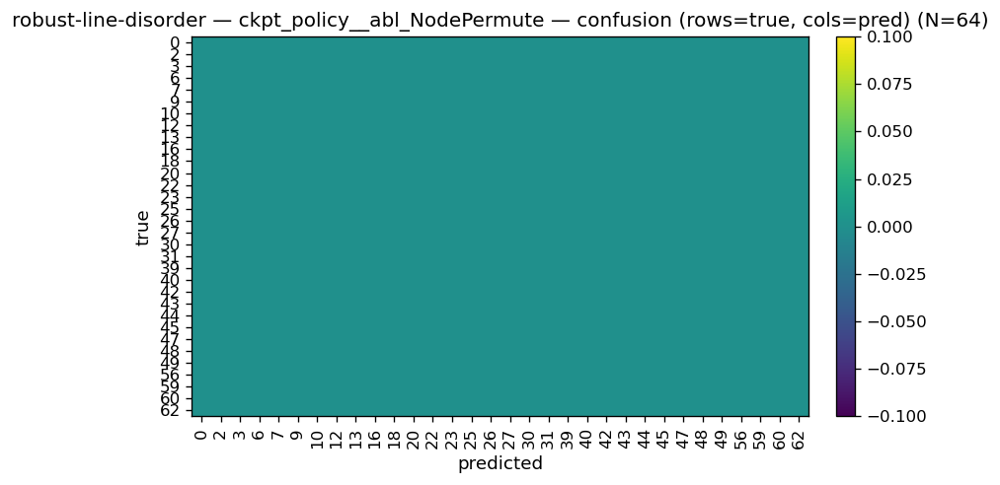

- **position_timelines** `run__robust-line-disorder__ckpt__seed1__256__0_1_2_3_4_5_6_7_8_9__e4ba29d5__ckpt_policy_abl_NodePermute.png`

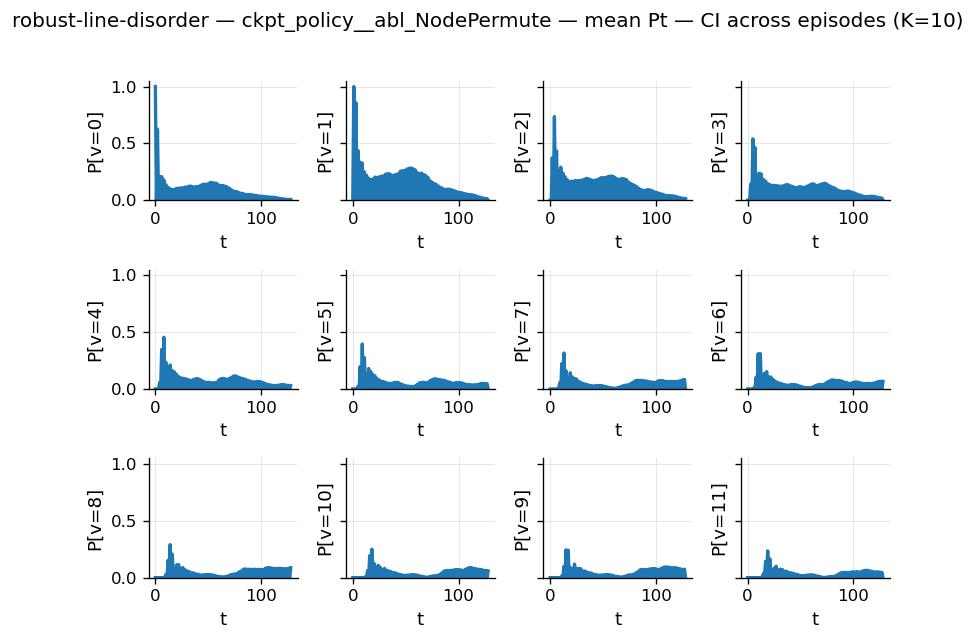

- **tv_to_uniform** `run__robust-line-disorder__ckpt__seed1__256__0_1_2_3_4_5_6_7_8_9__e4ba29d5__ckpt_policy_abl_NodePermute.png`

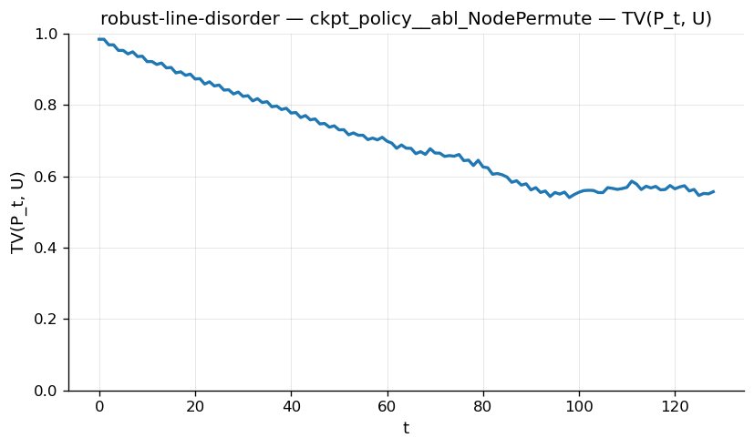

#### Condition: `ckpt_policy_abl_TimeFrozen`

- **confusion_matrix** `run__robust-line-disorder__ckpt__seed1__256__0_1_2_3_4_5_6_7_8_9__e4ba29d5__ckpt_policy_abl_TimeFrozen.png`

- **position_timelines** `run__robust-line-disorder__ckpt__seed1__256__0_1_2_3_4_5_6_7_8_9__e4ba29d5__ckpt_policy_abl_TimeFrozen.png`

- **tv_to_uniform** `run__robust-line-disorder__ckpt__seed1__256__0_1_2_3_4_5_6_7_8_9__e4ba29d5__ckpt_policy_abl_TimeFrozen.png`

### Run: `robust-line-disorder__ckpt__seed2__256__0_1_2_3_4_5_6_7_8_9__483ec6f5`

- Checkpoint: `runs/robust-line-disorder/seed2`
- Evaldir: `/mnt/c/Users/Angel/Desktop/CS598/acpl-qwalk/eval/robust-line-disorder/seed2/robust_sweep`
- Meta hash: `483ec6f5c4ee03846991bd0853d00fd3`

#### Condition: `ckpt_policy`

- **confusion_matrix** `run__robust-line-disorder__ckpt__seed2__256__0_1_2_3_4_5_6_7_8_9__483ec6f5__ckpt_policy.png`

- **position_timelines** `run__robust-line-disorder__ckpt__seed2__256__0_1_2_3_4_5_6_7_8_9__483ec6f5__ckpt_policy.png`

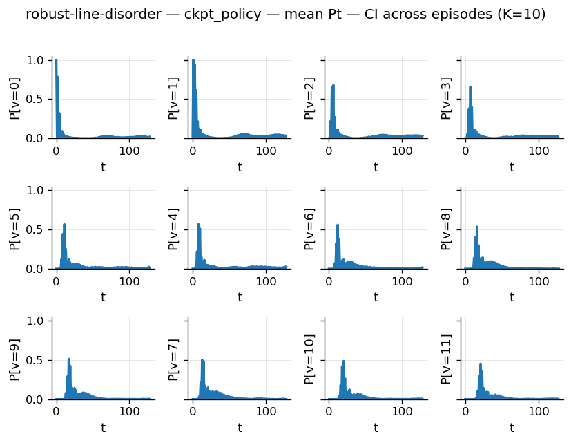

- **tv_to_uniform** `run__robust-line-disorder__ckpt__seed2__256__0_1_2_3_4_5_6_7_8_9__483ec6f5__ckpt_policy.png`

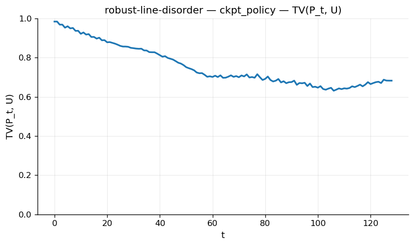

#### Condition: `ckpt_policy_abl_GlobalCoin`

- **confusion_matrix** `run__robust-line-disorder__ckpt__seed2__256__0_1_2_3_4_5_6_7_8_9__483ec6f5__ckpt_policy_abl_GlobalCoin.png`

- **position_timelines** `run__robust-line-disorder__ckpt__seed2__256__0_1_2_3_4_5_6_7_8_9__483ec6f5__ckpt_policy_abl_GlobalCoin.png`

- **tv_to_uniform** `run__robust-line-disorder__ckpt__seed2__256__0_1_2_3_4_5_6_7_8_9__483ec6f5__ckpt_policy_abl_GlobalCoin.png`

#### Condition: `ckpt_policy_abl_NoPE`

- **confusion_matrix** `run__robust-line-disorder__ckpt__seed2__256__0_1_2_3_4_5_6_7_8_9__483ec6f5__ckpt_policy_abl_NoPE.png`

- **position_timelines** `run__robust-line-disorder__ckpt__seed2__256__0_1_2_3_4_5_6_7_8_9__483ec6f5__ckpt_policy_abl_NoPE.png`

- **tv_to_uniform** `run__robust-line-disorder__ckpt__seed2__256__0_1_2_3_4_5_6_7_8_9__483ec6f5__ckpt_policy_abl_NoPE.png`

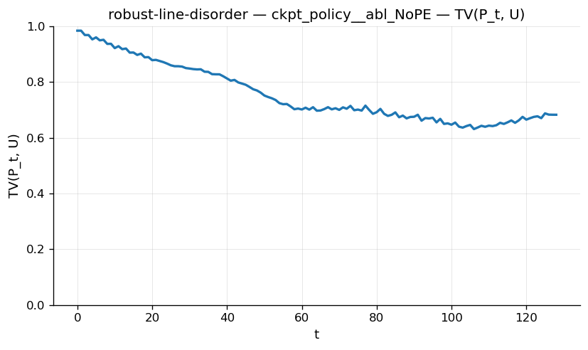

#### Condition: `ckpt_policy_abl_NodePermute`

- **confusion_matrix** `run__robust-line-disorder__ckpt__seed2__256__0_1_2_3_4_5_6_7_8_9__483ec6f5__ckpt_policy_abl_NodePermute.png`

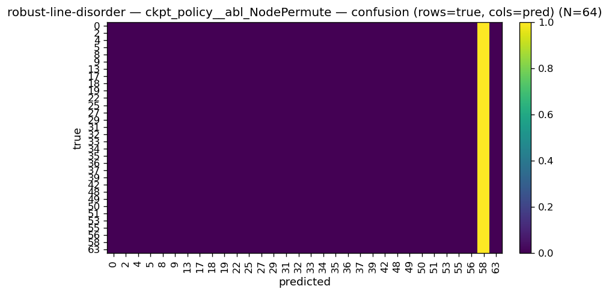

- **position_timelines** `run__robust-line-disorder__ckpt__seed2__256__0_1_2_3_4_5_6_7_8_9__483ec6f5__ckpt_policy_abl_NodePermute.png`

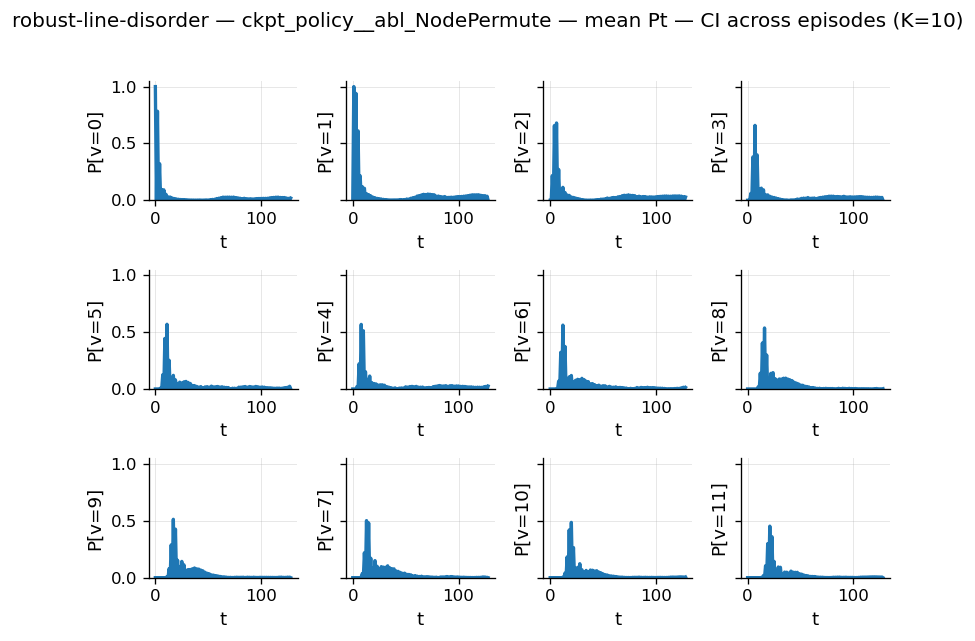

- **tv_to_uniform** `run__robust-line-disorder__ckpt__seed2__256__0_1_2_3_4_5_6_7_8_9__483ec6f5__ckpt_policy_abl_NodePermute.png`

#### Condition: `ckpt_policy_abl_TimeFrozen`

- **confusion_matrix** `run__robust-line-disorder__ckpt__seed2__256__0_1_2_3_4_5_6_7_8_9__483ec6f5__ckpt_policy_abl_TimeFrozen.png`

- **position_timelines** `run__robust-line-disorder__ckpt__seed2__256__0_1_2_3_4_5_6_7_8_9__483ec6f5__ckpt_policy_abl_TimeFrozen.png`

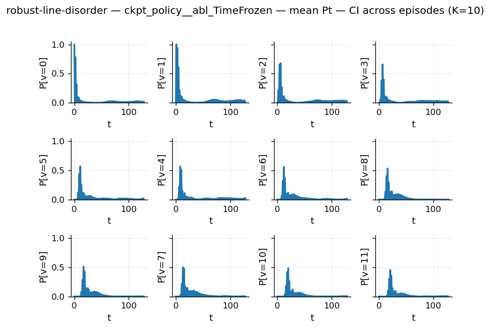

- **tv_to_uniform** `run__robust-line-disorder__ckpt__seed2__256__0_1_2_3_4_5_6_7_8_9__483ec6f5__ckpt_policy_abl_TimeFrozen.png`

### Run: `robust-line-disorder__ckpt__seed2__256__0_1_2_3_4_5_6_7_8_9__cda5ad13`

- Checkpoint: `runs/robust-line-disorder/seed2`
- Evaldir: `/mnt/c/Users/Angel/Desktop/CS598/acpl-qwalk/eval/robust-line-disorder/seed2/main`
- Meta hash: `cda5ad13196c9dccf5904b79effcdc00`

#### Condition: `ckpt_policy`

- **confusion_matrix** `run__robust-line-disorder__ckpt__seed2__256__0_1_2_3_4_5_6_7_8_9__cda5ad13__ckpt_policy.png`

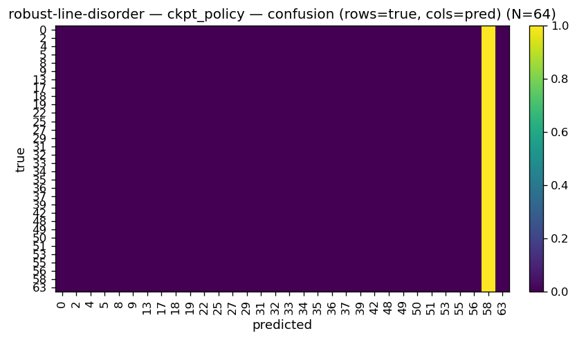

- **position_timelines** `run__robust-line-disorder__ckpt__seed2__256__0_1_2_3_4_5_6_7_8_9__cda5ad13__ckpt_policy.png`

- **tv_to_uniform** `run__robust-line-disorder__ckpt__seed2__256__0_1_2_3_4_5_6_7_8_9__cda5ad13__ckpt_policy.png`

#### Condition: `ckpt_policy_abl_GlobalCoin`

- **confusion_matrix** `run__robust-line-disorder__ckpt__seed2__256__0_1_2_3_4_5_6_7_8_9__cda5ad13__ckpt_policy_abl_GlobalCoin.png`

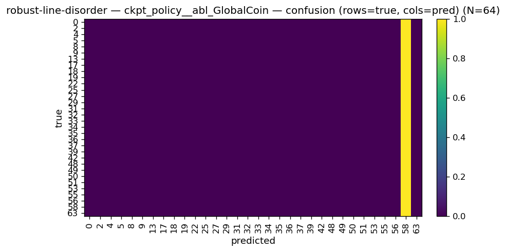

- **position_timelines** `run__robust-line-disorder__ckpt__seed2__256__0_1_2_3_4_5_6_7_8_9__cda5ad13__ckpt_policy_abl_GlobalCoin.png`

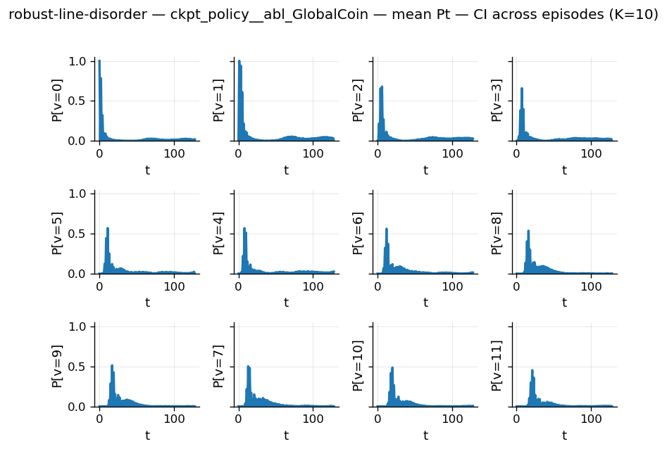

- **tv_to_uniform** `run__robust-line-disorder__ckpt__seed2__256__0_1_2_3_4_5_6_7_8_9__cda5ad13__ckpt_policy_abl_GlobalCoin.png`

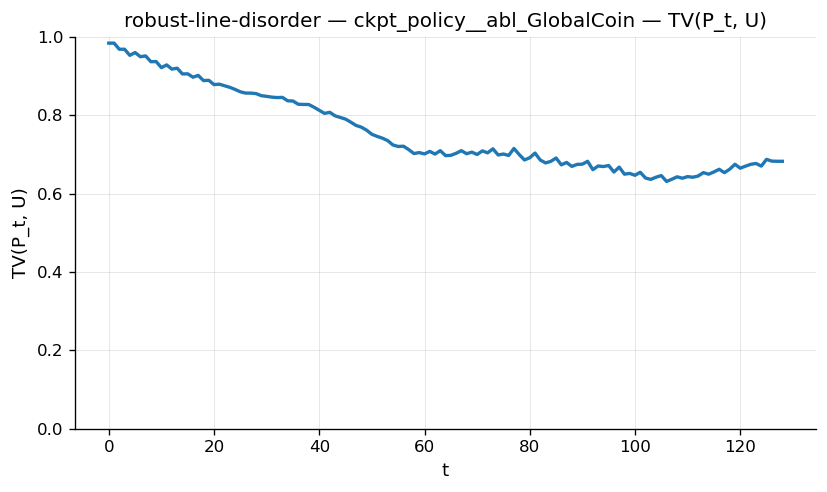

#### Condition: `ckpt_policy_abl_NoPE`

- **confusion_matrix** `run__robust-line-disorder__ckpt__seed2__256__0_1_2_3_4_5_6_7_8_9__cda5ad13__ckpt_policy_abl_NoPE.png`

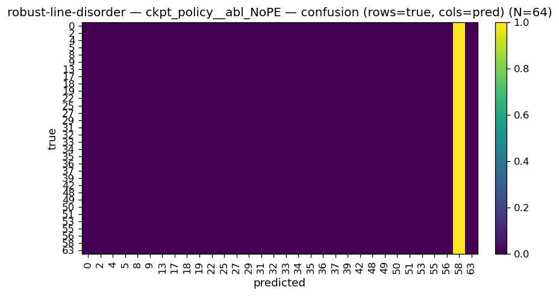

- **position_timelines** `run__robust-line-disorder__ckpt__seed2__256__0_1_2_3_4_5_6_7_8_9__cda5ad13__ckpt_policy_abl_NoPE.png`

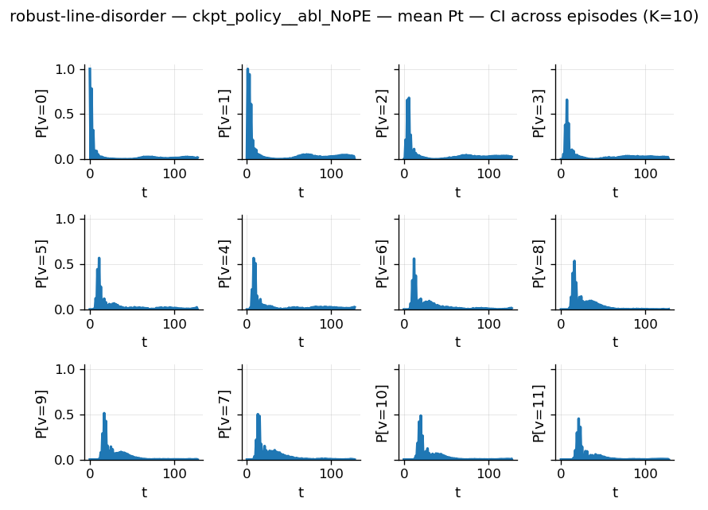

- **tv_to_uniform** `run__robust-line-disorder__ckpt__seed2__256__0_1_2_3_4_5_6_7_8_9__cda5ad13__ckpt_policy_abl_NoPE.png`

#### Condition: `ckpt_policy_abl_NodePermute`

- **confusion_matrix** `run__robust-line-disorder__ckpt__seed2__256__0_1_2_3_4_5_6_7_8_9__cda5ad13__ckpt_policy_abl_NodePermute.png`

- **position_timelines** `run__robust-line-disorder__ckpt__seed2__256__0_1_2_3_4_5_6_7_8_9__cda5ad13__ckpt_policy_abl_NodePermute.png`

- **tv_to_uniform** `run__robust-line-disorder__ckpt__seed2__256__0_1_2_3_4_5_6_7_8_9__cda5ad13__ckpt_policy_abl_NodePermute.png`

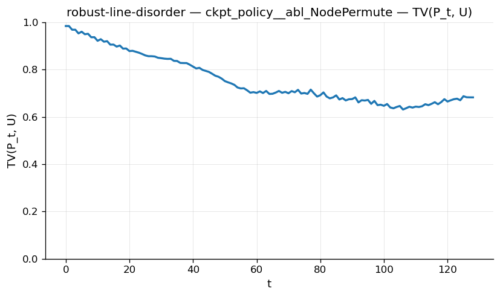

#### Condition: `ckpt_policy_abl_TimeFrozen`

- **confusion_matrix** `run__robust-line-disorder__ckpt__seed2__256__0_1_2_3_4_5_6_7_8_9__cda5ad13__ckpt_policy_abl_TimeFrozen.png`

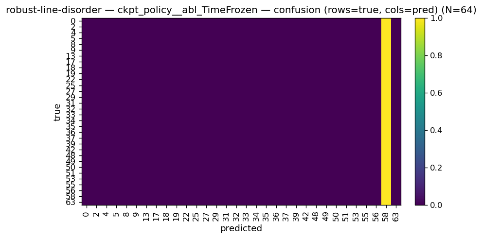

- **position_timelines** `run__robust-line-disorder__ckpt__seed2__256__0_1_2_3_4_5_6_7_8_9__cda5ad13__ckpt_policy_abl_TimeFrozen.png`

- **tv_to_uniform** `run__robust-line-disorder__ckpt__seed2__256__0_1_2_3_4_5_6_7_8_9__cda5ad13__ckpt_policy_abl_TimeFrozen.png`

## Suite: `search-grid`

### Run: `search-grid__baseline__ckpt__256__0_1_2_3_4_5_6_7_8_9__be386e4e`

- Evaldir: `/mnt/c/Users/Angel/Desktop/CS598/acpl-qwalk/eval/search-grid/baseline/hadamard`
- Meta hash: `be386e4e7231a5a9bd595c75c4170bdb`

#### Condition: `baseline_hadamard`

- **confusion_matrix** `run__search-grid__baseline__ckpt__256__0_1_2_3_4_5_6_7_8_9__be386e4e__baseline_hadamard.png`

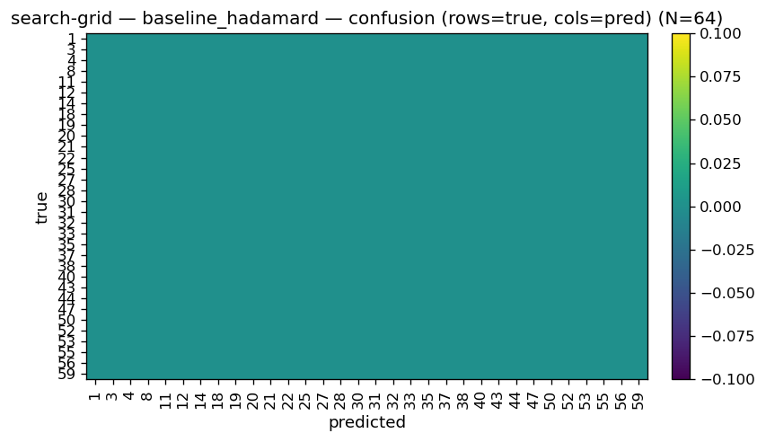

- **position_timelines** `run__search-grid__baseline__ckpt__256__0_1_2_3_4_5_6_7_8_9__be386e4e__baseline_hadamard.png`

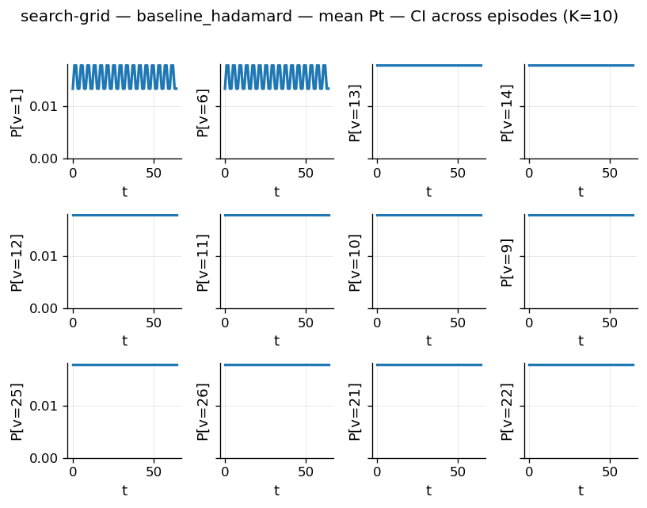

- **tv_to_uniform** `run__search-grid__baseline__ckpt__256__0_1_2_3_4_5_6_7_8_9__be386e4e__baseline_hadamard.png`

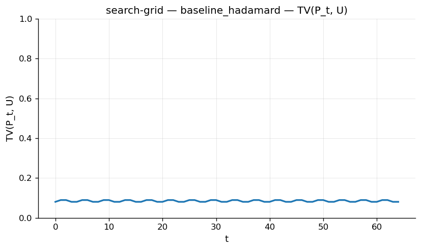

### Run: `search-grid__ckpt__seed0__256__0_1_2_3_4_5_6_7_8_9__a24bc734`

- Checkpoint: `runs/search-grid/seed0`
- Evaldir: `/mnt/c/Users/Angel/Desktop/CS598/acpl-qwalk/eval/search-grid/seed0/main`
- Meta hash: `a24bc7341b4cda7ba03da4e6543c4b2e`

#### Condition: `ckpt_policy`

- **position_timelines** `run__search-grid__ckpt__seed0__256__0_1_2_3_4_5_6_7_8_9__a24bc734__ckpt_policy.png`

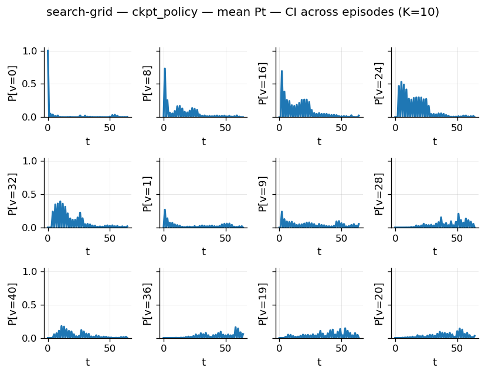

- **tv_to_uniform** `run__search-grid__ckpt__seed0__256__0_1_2_3_4_5_6_7_8_9__a24bc734__ckpt_policy.png`

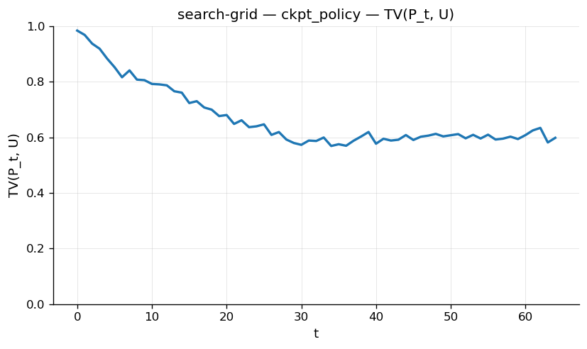

#### Condition: `ckpt_policy_abl_GlobalCoin`

- **position_timelines** `run__search-grid__ckpt__seed0__256__0_1_2_3_4_5_6_7_8_9__a24bc734__ckpt_policy_abl_GlobalCoin.png`

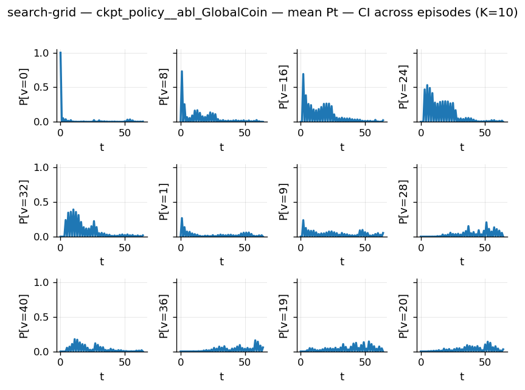

- **tv_to_uniform** `run__search-grid__ckpt__seed0__256__0_1_2_3_4_5_6_7_8_9__a24bc734__ckpt_policy_abl_GlobalCoin.png`

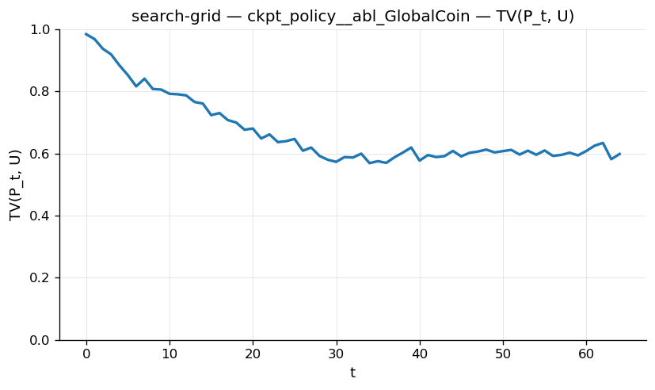

#### Condition: `ckpt_policy_abl_NoPE`

- **position_timelines** `run__search-grid__ckpt__seed0__256__0_1_2_3_4_5_6_7_8_9__a24bc734__ckpt_policy_abl_NoPE.png`

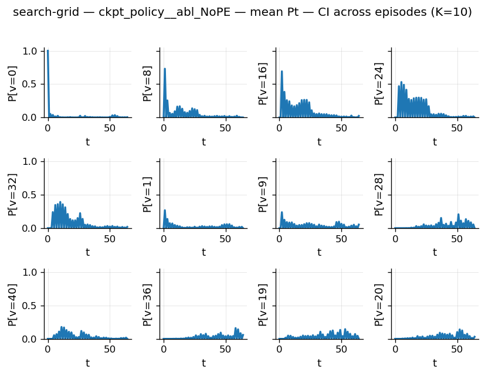

- **tv_to_uniform** `run__search-grid__ckpt__seed0__256__0_1_2_3_4_5_6_7_8_9__a24bc734__ckpt_policy_abl_NoPE.png`

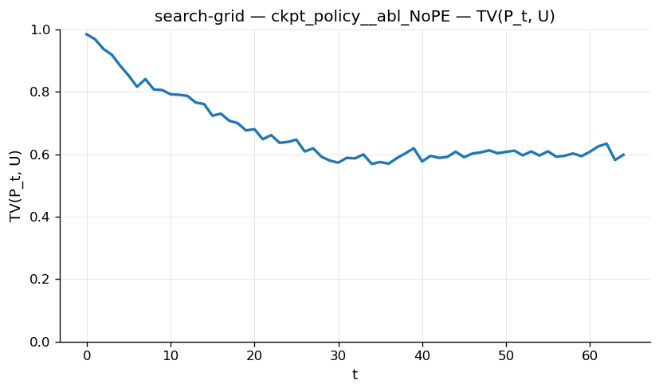

#### Condition: `ckpt_policy_abl_NodePermute`

- **position_timelines** `run__search-grid__ckpt__seed0__256__0_1_2_3_4_5_6_7_8_9__a24bc734__ckpt_policy_abl_NodePermute.png`

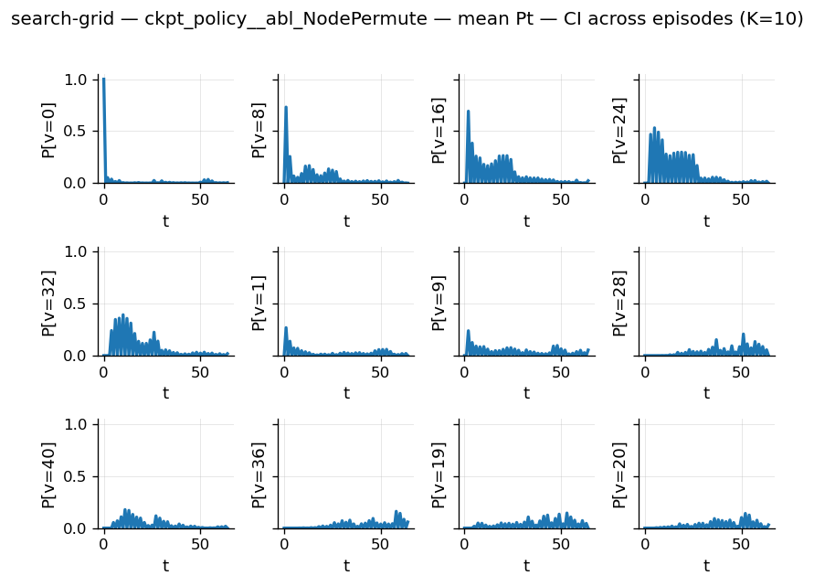

- **tv_to_uniform** `run__search-grid__ckpt__seed0__256__0_1_2_3_4_5_6_7_8_9__a24bc734__ckpt_policy_abl_NodePermute.png`

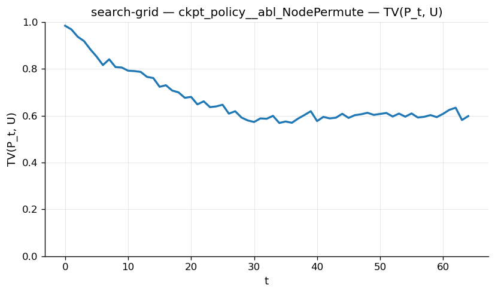

#### Condition: `ckpt_policy_abl_TimeFrozen`

- **position_timelines** `run__search-grid__ckpt__seed0__256__0_1_2_3_4_5_6_7_8_9__a24bc734__ckpt_policy_abl_TimeFrozen.png`

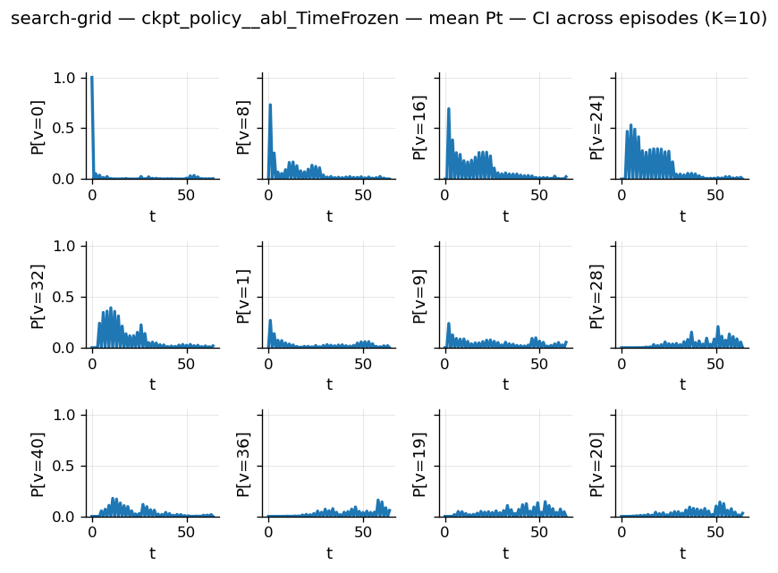

- **tv_to_uniform** `run__search-grid__ckpt__seed0__256__0_1_2_3_4_5_6_7_8_9__a24bc734__ckpt_policy_abl_TimeFrozen.png`

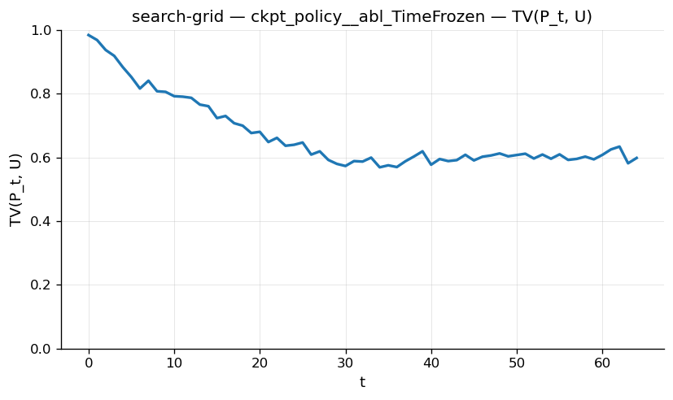

### Run: `search-grid__ckpt__seed1__256__0_1_2_3_4_5_6_7_8_9__b13e14a8`

- Checkpoint: `runs/search-grid/seed1`
- Evaldir: `/mnt/c/Users/Angel/Desktop/CS598/acpl-qwalk/eval/search-grid/seed1/main`
- Meta hash: `b13e14a8d5507953095db4fb24958fd9`

#### Condition: `ckpt_policy`

- **confusion_matrix** `run__search-grid__ckpt__seed1__256__0_1_2_3_4_5_6_7_8_9__b13e14a8__ckpt_policy.png`

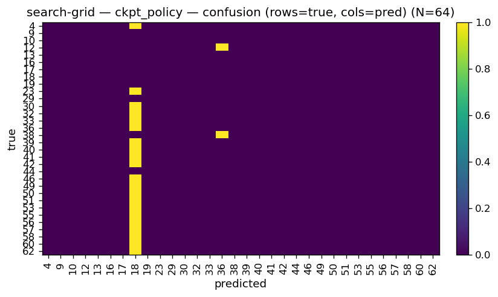

- **position_timelines** `run__search-grid__ckpt__seed1__256__0_1_2_3_4_5_6_7_8_9__b13e14a8__ckpt_policy.png`

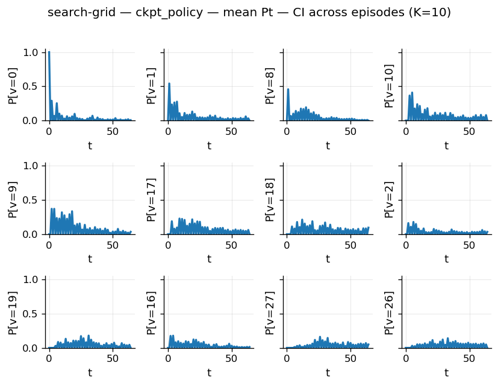

- **tv_to_uniform** `run__search-grid__ckpt__seed1__256__0_1_2_3_4_5_6_7_8_9__b13e14a8__ckpt_policy.png`

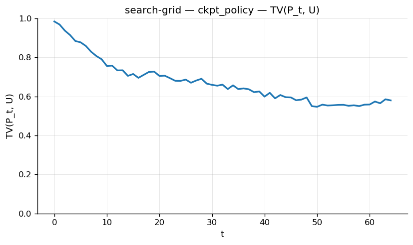

#### Condition: `ckpt_policy_abl_GlobalCoin`

- **confusion_matrix** `run__search-grid__ckpt__seed1__256__0_1_2_3_4_5_6_7_8_9__b13e14a8__ckpt_policy_abl_GlobalCoin.png`

- **position_timelines** `run__search-grid__ckpt__seed1__256__0_1_2_3_4_5_6_7_8_9__b13e14a8__ckpt_policy_abl_GlobalCoin.png`

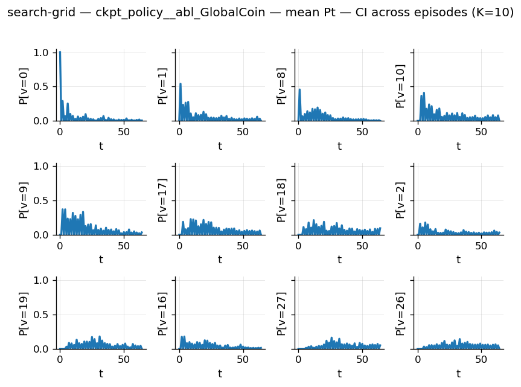

- **tv_to_uniform** `run__search-grid__ckpt__seed1__256__0_1_2_3_4_5_6_7_8_9__b13e14a8__ckpt_policy_abl_GlobalCoin.png`

#### Condition: `ckpt_policy_abl_NoPE`

- **confusion_matrix** `run__search-grid__ckpt__seed1__256__0_1_2_3_4_5_6_7_8_9__b13e14a8__ckpt_policy_abl_NoPE.png`

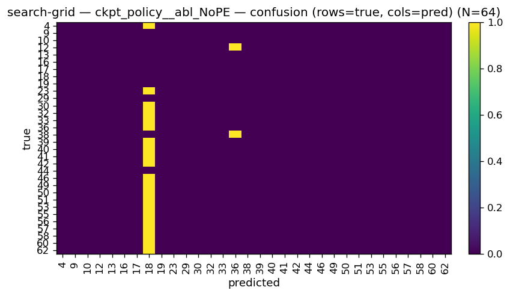

- **position_timelines** `run__search-grid__ckpt__seed1__256__0_1_2_3_4_5_6_7_8_9__b13e14a8__ckpt_policy_abl_NoPE.png`

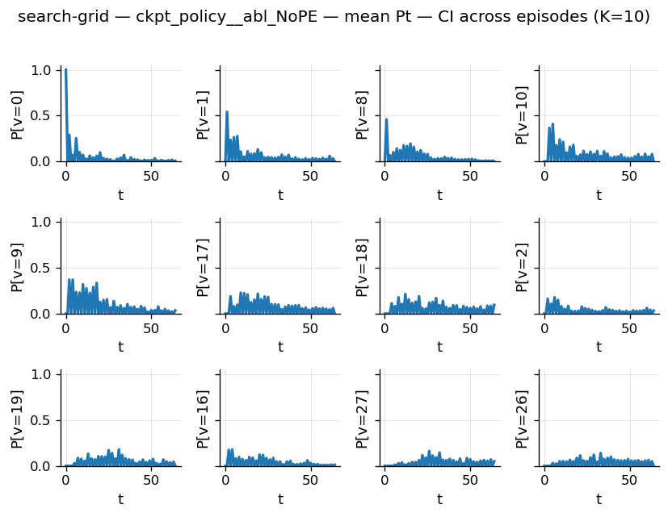

- **tv_to_uniform** `run__search-grid__ckpt__seed1__256__0_1_2_3_4_5_6_7_8_9__b13e14a8__ckpt_policy_abl_NoPE.png`

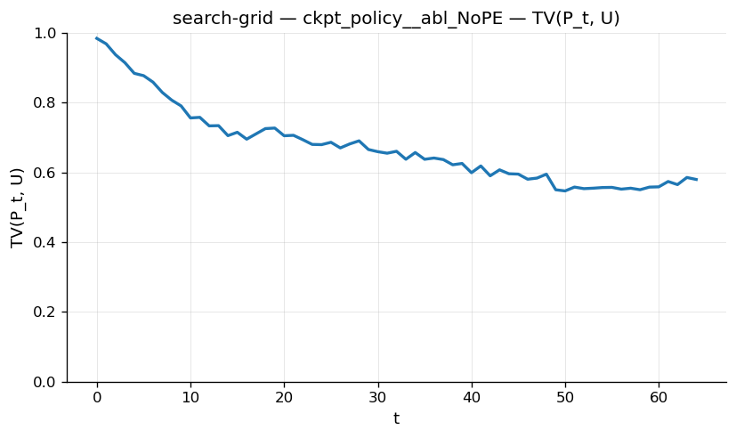

#### Condition: `ckpt_policy_abl_NodePermute`

- **confusion_matrix** `run__search-grid__ckpt__seed1__256__0_1_2_3_4_5_6_7_8_9__b13e14a8__ckpt_policy_abl_NodePermute.png`

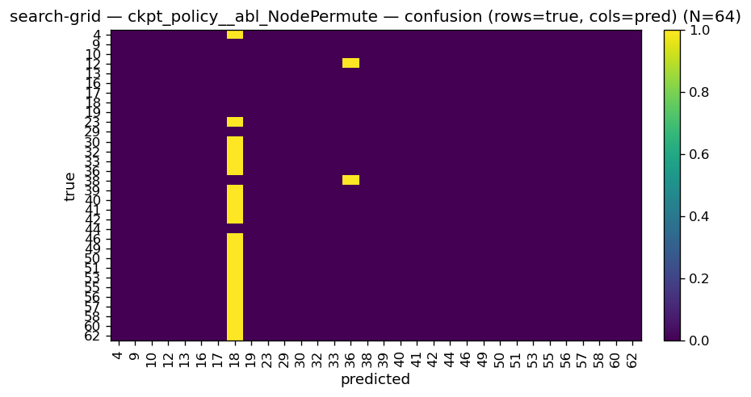

- **position_timelines** `run__search-grid__ckpt__seed1__256__0_1_2_3_4_5_6_7_8_9__b13e14a8__ckpt_policy_abl_NodePermute.png`

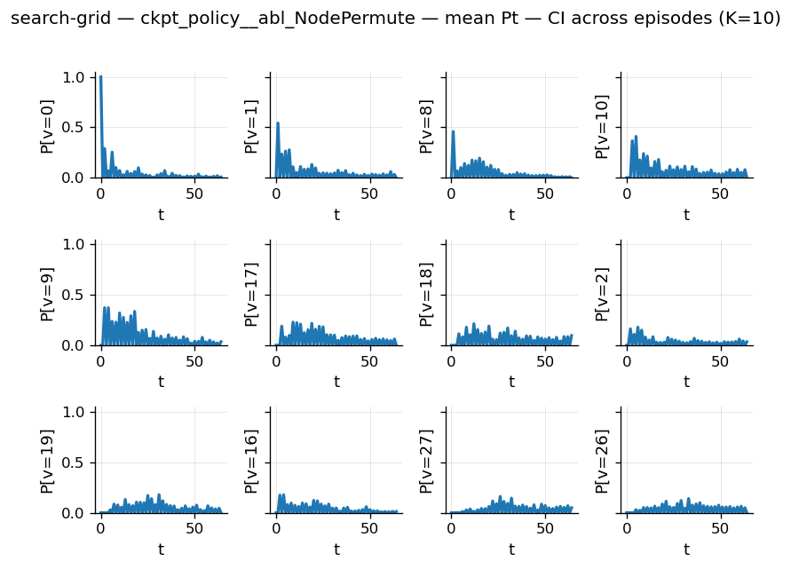

- **tv_to_uniform** `run__search-grid__ckpt__seed1__256__0_1_2_3_4_5_6_7_8_9__b13e14a8__ckpt_policy_abl_NodePermute.png`

#### Condition: `ckpt_policy_abl_TimeFrozen`

- **confusion_matrix** `run__search-grid__ckpt__seed1__256__0_1_2_3_4_5_6_7_8_9__b13e14a8__ckpt_policy_abl_TimeFrozen.png`

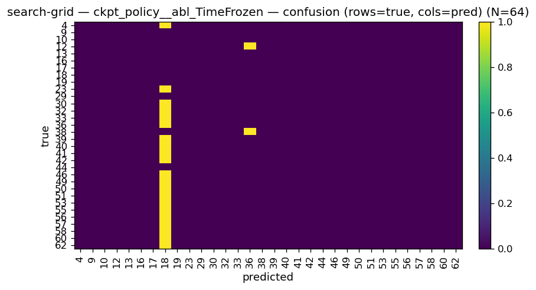

- **position_timelines** `run__search-grid__ckpt__seed1__256__0_1_2_3_4_5_6_7_8_9__b13e14a8__ckpt_policy_abl_TimeFrozen.png`

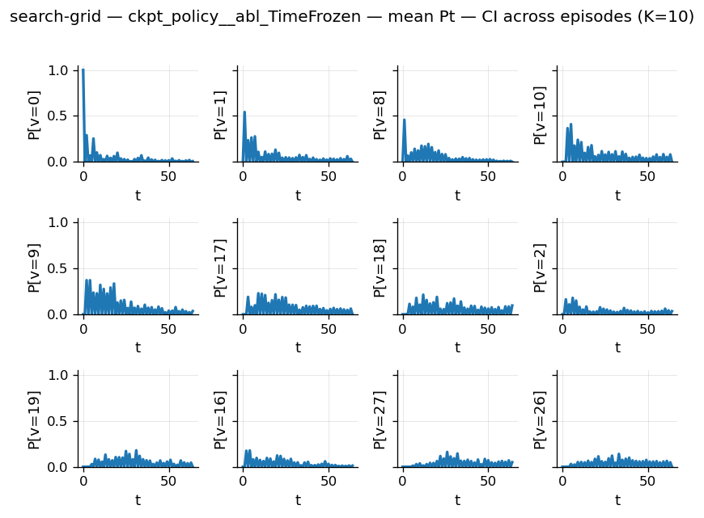

- **tv_to_uniform** `run__search-grid__ckpt__seed1__256__0_1_2_3_4_5_6_7_8_9__b13e14a8__ckpt_policy_abl_TimeFrozen.png`

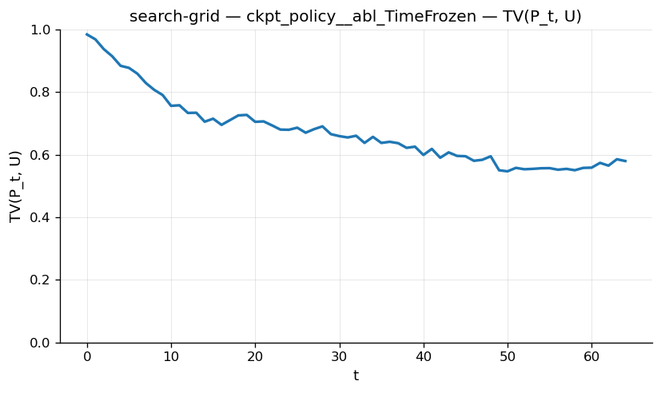

### Run: `search-grid__ckpt__seed2__256__0_1_2_3_4_5_6_7_8_9__ca061395`

- Checkpoint: `runs/search-grid/seed2`
- Evaldir: `/mnt/c/Users/Angel/Desktop/CS598/acpl-qwalk/eval/search-grid/seed2/main`
- Meta hash: `ca06139561a950fd27c8f761af5db9cd`

#### Condition: `ckpt_policy`

- **confusion_matrix** `run__search-grid__ckpt__seed2__256__0_1_2_3_4_5_6_7_8_9__ca061395__ckpt_policy.png`

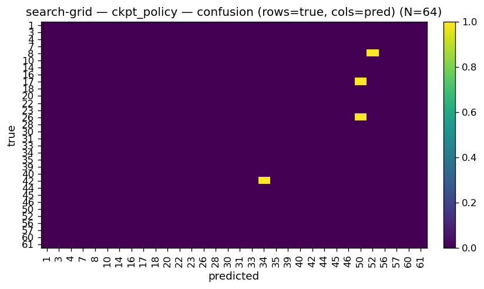

- **position_timelines** `run__search-grid__ckpt__seed2__256__0_1_2_3_4_5_6_7_8_9__ca061395__ckpt_policy.png`

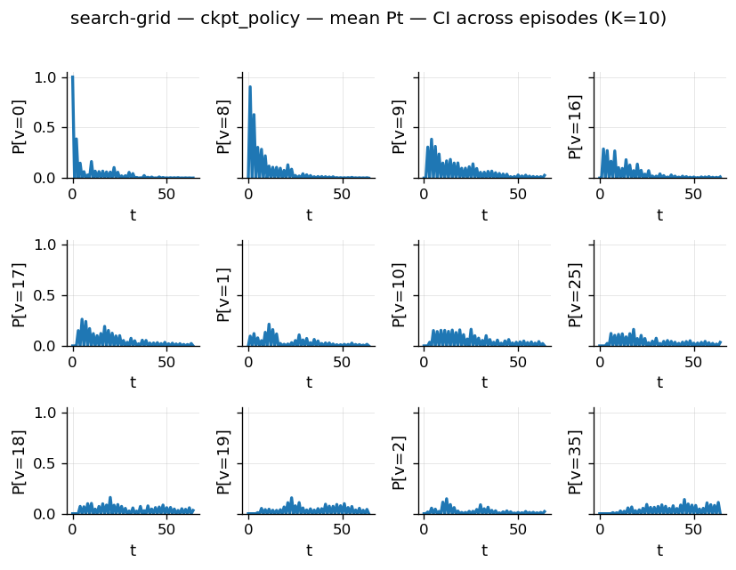

- **tv_to_uniform** `run__search-grid__ckpt__seed2__256__0_1_2_3_4_5_6_7_8_9__ca061395__ckpt_policy.png`

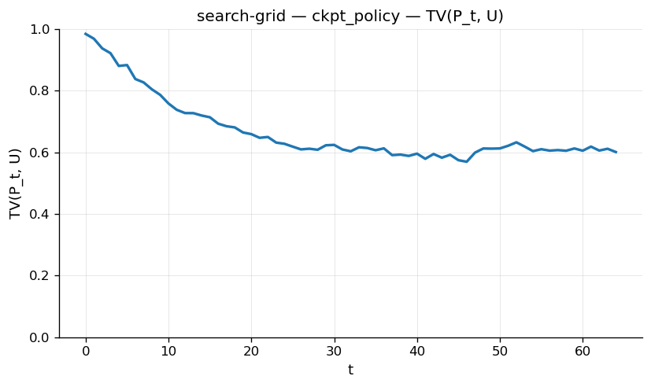

#### Condition: `ckpt_policy_abl_GlobalCoin`

- **confusion_matrix** `run__search-grid__ckpt__seed2__256__0_1_2_3_4_5_6_7_8_9__ca061395__ckpt_policy_abl_GlobalCoin.png`

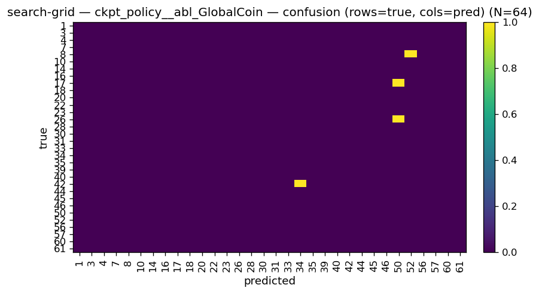

- **position_timelines** `run__search-grid__ckpt__seed2__256__0_1_2_3_4_5_6_7_8_9__ca061395__ckpt_policy_abl_GlobalCoin.png`

- **tv_to_uniform** `run__search-grid__ckpt__seed2__256__0_1_2_3_4_5_6_7_8_9__ca061395__ckpt_policy_abl_GlobalCoin.png`

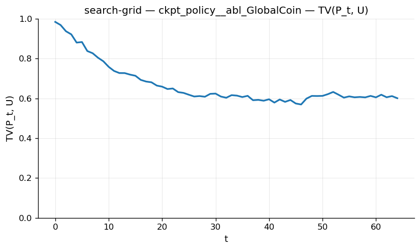

#### Condition: `ckpt_policy_abl_NoPE`

- **confusion_matrix** `run__search-grid__ckpt__seed2__256__0_1_2_3_4_5_6_7_8_9__ca061395__ckpt_policy_abl_NoPE.png`

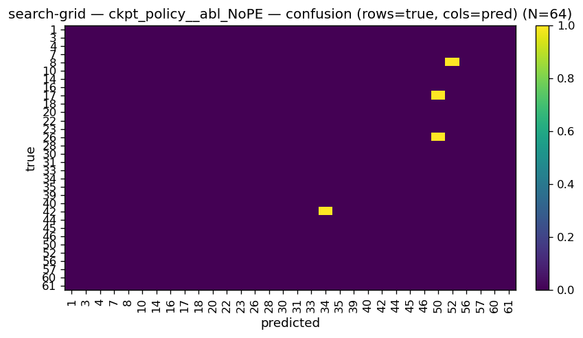

- **position_timelines** `run__search-grid__ckpt__seed2__256__0_1_2_3_4_5_6_7_8_9__ca061395__ckpt_policy_abl_NoPE.png`

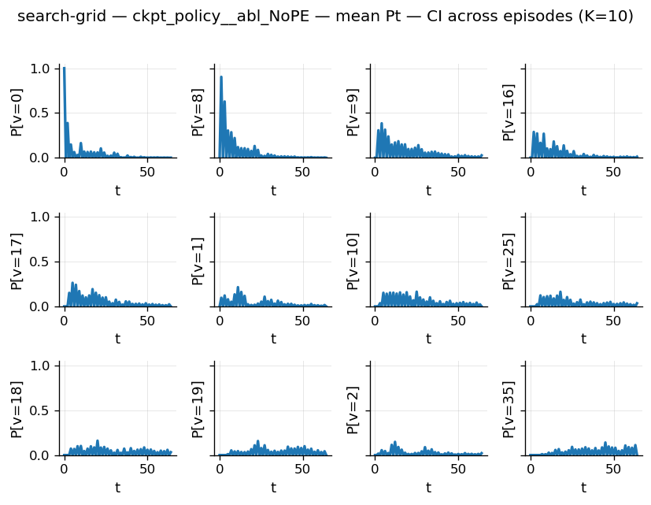

- **tv_to_uniform** `run__search-grid__ckpt__seed2__256__0_1_2_3_4_5_6_7_8_9__ca061395__ckpt_policy_abl_NoPE.png`

#### Condition: `ckpt_policy_abl_NodePermute`

- **confusion_matrix** `run__search-grid__ckpt__seed2__256__0_1_2_3_4_5_6_7_8_9__ca061395__ckpt_policy_abl_NodePermute.png`

- **position_timelines** `run__search-grid__ckpt__seed2__256__0_1_2_3_4_5_6_7_8_9__ca061395__ckpt_policy_abl_NodePermute.png`

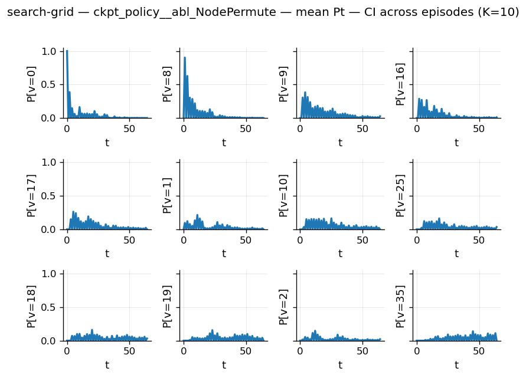

- **tv_to_uniform** `run__search-grid__ckpt__seed2__256__0_1_2_3_4_5_6_7_8_9__ca061395__ckpt_policy_abl_NodePermute.png`

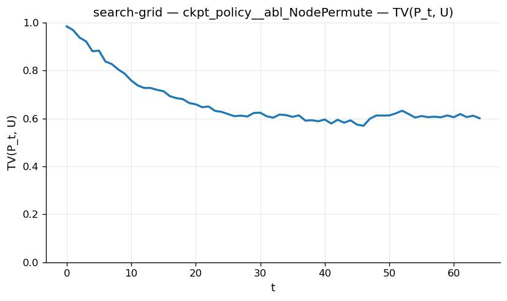

#### Condition: `ckpt_policy_abl_TimeFrozen`

- **confusion_matrix** `run__search-grid__ckpt__seed2__256__0_1_2_3_4_5_6_7_8_9__ca061395__ckpt_policy_abl_TimeFrozen.png`

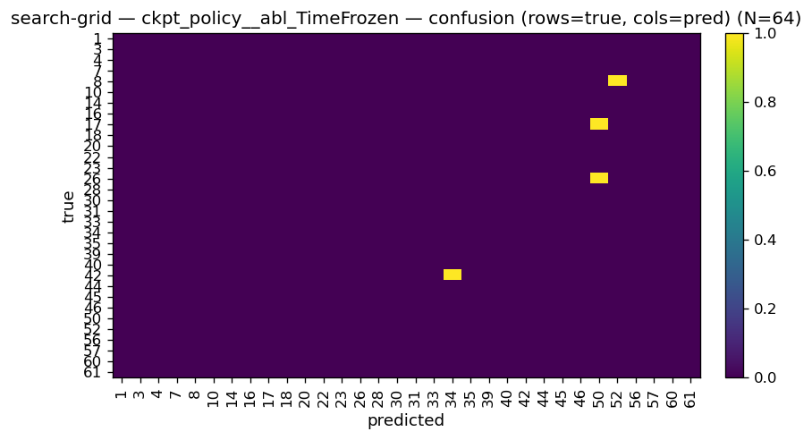

- **position_timelines** `run__search-grid__ckpt__seed2__256__0_1_2_3_4_5_6_7_8_9__ca061395__ckpt_policy_abl_TimeFrozen.png`

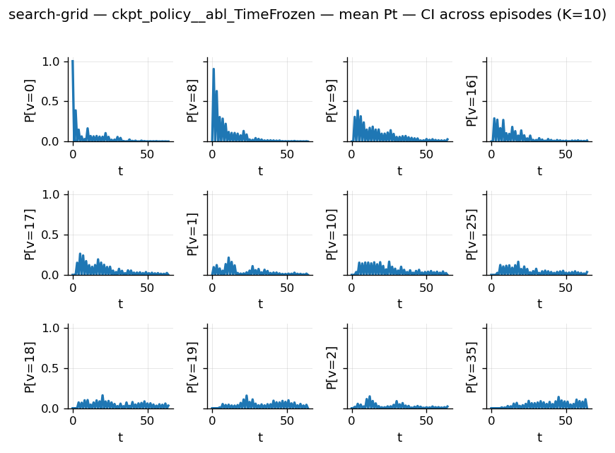

- **tv_to_uniform** `run__search-grid__ckpt__seed2__256__0_1_2_3_4_5_6_7_8_9__ca061395__ckpt_policy_abl_TimeFrozen.png`

## Suite: `transfer-line`

### Run: `transfer-line__baseline__ckpt__256__0_1_2_3_4_5_6_7_8_9__cbcd5574`

- Evaldir: `/mnt/c/Users/Angel/Desktop/CS598/acpl-qwalk/eval/transfer-line/baseline/hadamard`
- Meta hash: `cbcd557419a6699015b27eb7732934fe`

#### Condition: `baseline_hadamard`

- **position_timelines** `run__transfer-line__baseline__ckpt__256__0_1_2_3_4_5_6_7_8_9__cbcd5574__baseline_hadamard.png`

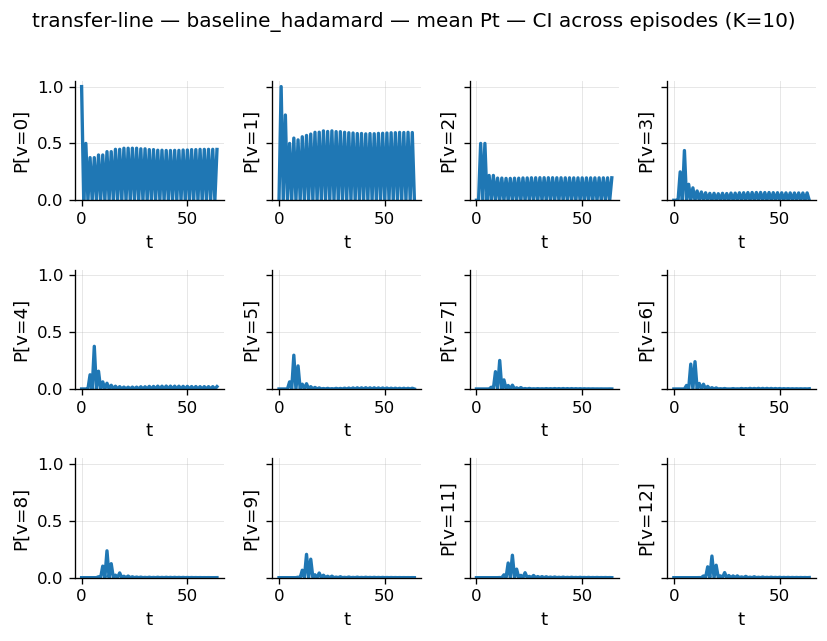

- **tv_to_uniform** `run__transfer-line__baseline__ckpt__256__0_1_2_3_4_5_6_7_8_9__cbcd5574__baseline_hadamard.png`

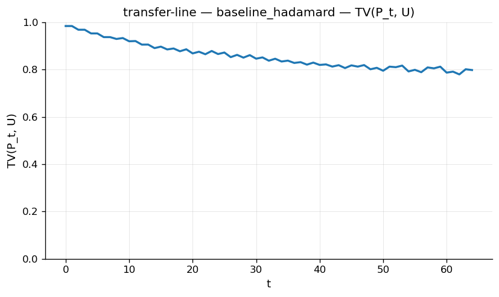

### Run: `transfer-line__ckpt__seed0__256__0_1_2_3_4_5_6_7_8_9__82f98af6`

- Checkpoint: `runs/transfer-line/seed0`
- Evaldir: `/mnt/c/Users/Angel/Desktop/CS598/acpl-qwalk/eval/transfer-line/seed0/main`
- Meta hash: `82f98af678294965b3c2fa2d9bccbe37`

#### Condition: `ckpt_policy`

- **position_timelines** `run__transfer-line__ckpt__seed0__256__0_1_2_3_4_5_6_7_8_9__82f98af6__ckpt_policy.png`

- **tv_to_uniform** `run__transfer-line__ckpt__seed0__256__0_1_2_3_4_5_6_7_8_9__82f98af6__ckpt_policy.png`

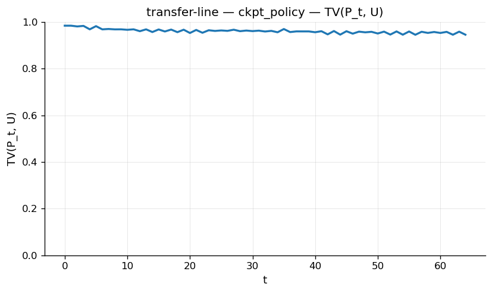

#### Condition: `ckpt_policy_abl_GlobalCoin`

- **position_timelines** `run__transfer-line__ckpt__seed0__256__0_1_2_3_4_5_6_7_8_9__82f98af6__ckpt_policy_abl_GlobalCoin.png`

- **tv_to_uniform** `run__transfer-line__ckpt__seed0__256__0_1_2_3_4_5_6_7_8_9__82f98af6__ckpt_policy_abl_GlobalCoin.png`

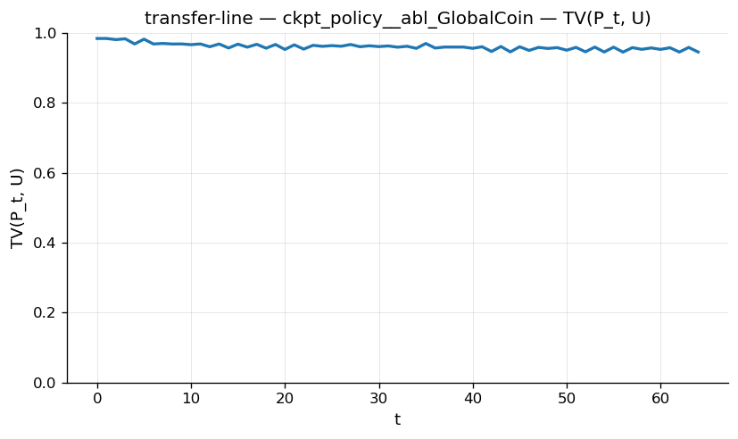

#### Condition: `ckpt_policy_abl_NoPE`

- **position_timelines** `run__transfer-line__ckpt__seed0__256__0_1_2_3_4_5_6_7_8_9__82f98af6__ckpt_policy_abl_NoPE.png`

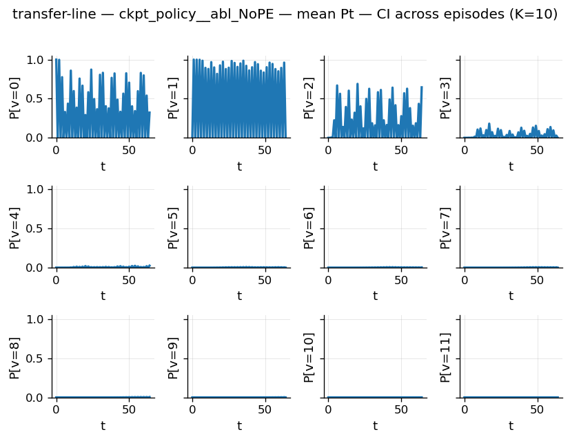

- **tv_to_uniform** `run__transfer-line__ckpt__seed0__256__0_1_2_3_4_5_6_7_8_9__82f98af6__ckpt_policy_abl_NoPE.png`

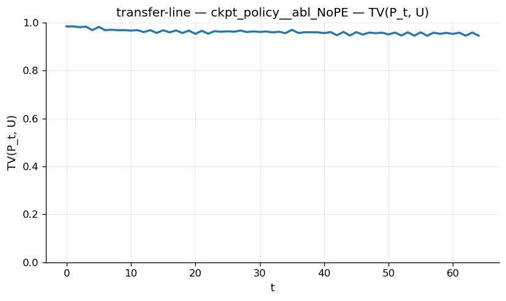

#### Condition: `ckpt_policy_abl_NodePermute`

- **position_timelines** `run__transfer-line__ckpt__seed0__256__0_1_2_3_4_5_6_7_8_9__82f98af6__ckpt_policy_abl_NodePermute.png`

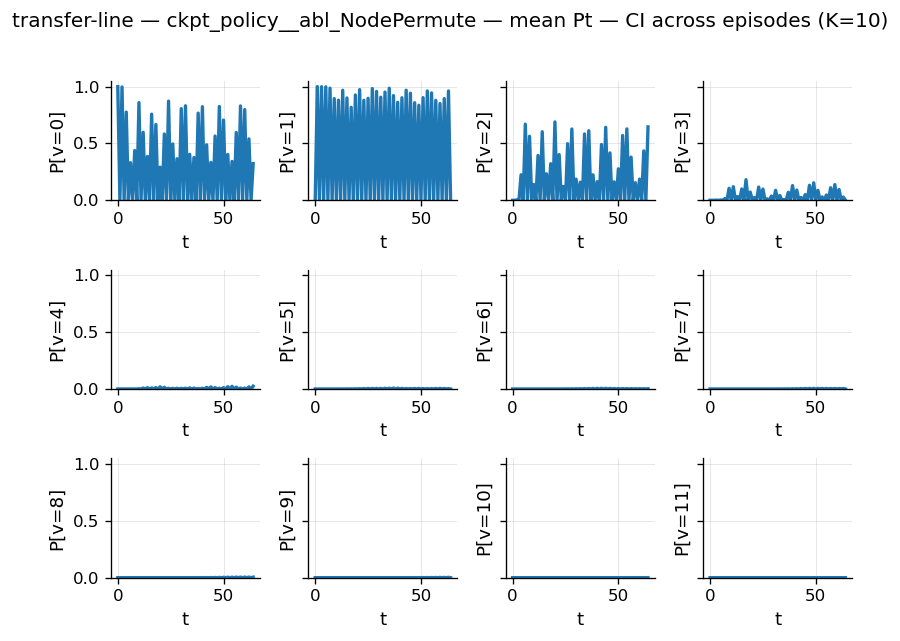

- **tv_to_uniform** `run__transfer-line__ckpt__seed0__256__0_1_2_3_4_5_6_7_8_9__82f98af6__ckpt_policy_abl_NodePermute.png`

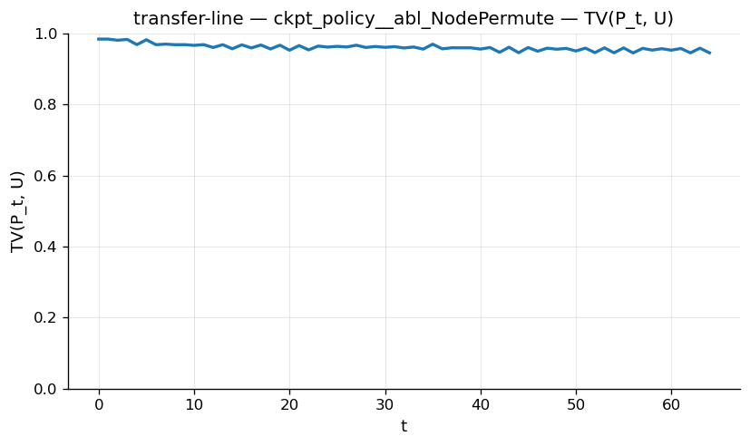

#### Condition: `ckpt_policy_abl_TimeFrozen`

- **position_timelines** `run__transfer-line__ckpt__seed0__256__0_1_2_3_4_5_6_7_8_9__82f98af6__ckpt_policy_abl_TimeFrozen.png`

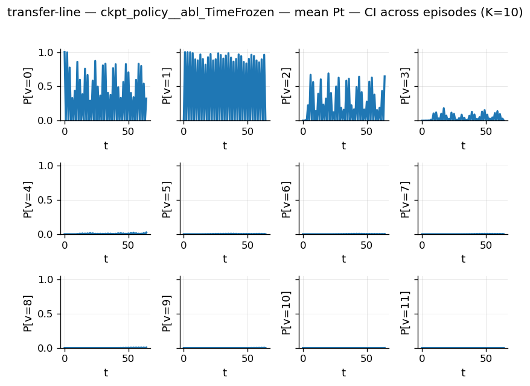

- **tv_to_uniform** `run__transfer-line__ckpt__seed0__256__0_1_2_3_4_5_6_7_8_9__82f98af6__ckpt_policy_abl_TimeFrozen.png`

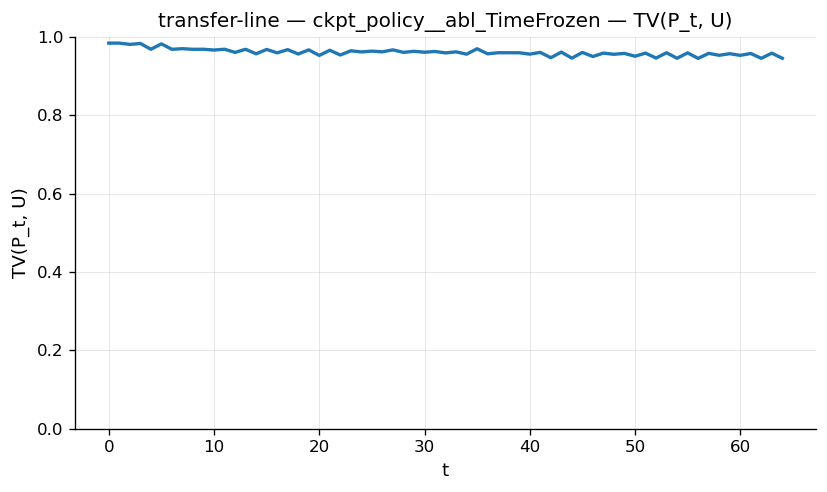

### Run: `transfer-line__ckpt__seed1__256__0_1_2_3_4_5_6_7_8_9__07a180f1`

- Checkpoint: `runs/transfer-line/seed1`
- Evaldir: `/mnt/c/Users/Angel/Desktop/CS598/acpl-qwalk/eval/transfer-line/seed1/main`
- Meta hash: `07a180f15afffe2a1948666547768552`

#### Condition: `ckpt_policy`

- **position_timelines** `run__transfer-line__ckpt__seed1__256__0_1_2_3_4_5_6_7_8_9__07a180f1__ckpt_policy.png`

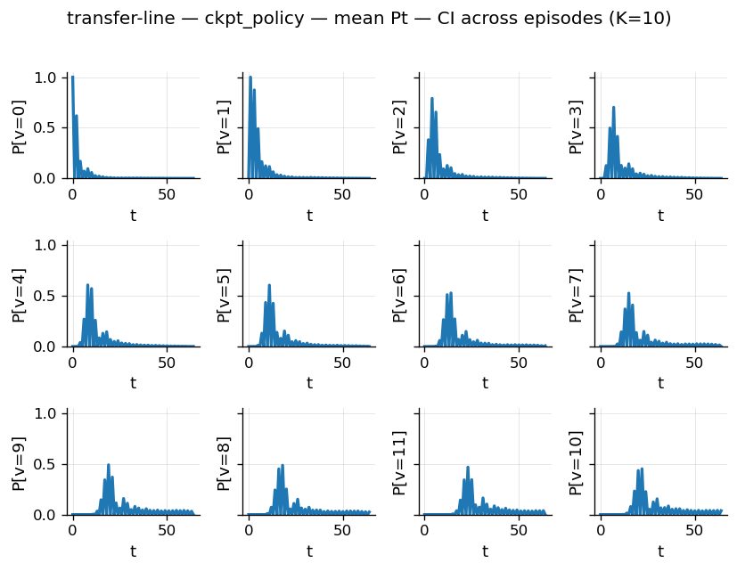

- **tv_to_uniform** `run__transfer-line__ckpt__seed1__256__0_1_2_3_4_5_6_7_8_9__07a180f1__ckpt_policy.png`

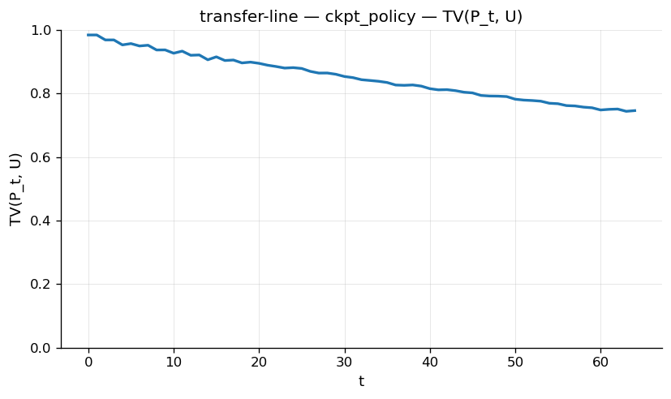

#### Condition: `ckpt_policy_abl_GlobalCoin`

- **position_timelines** `run__transfer-line__ckpt__seed1__256__0_1_2_3_4_5_6_7_8_9__07a180f1__ckpt_policy_abl_GlobalCoin.png`

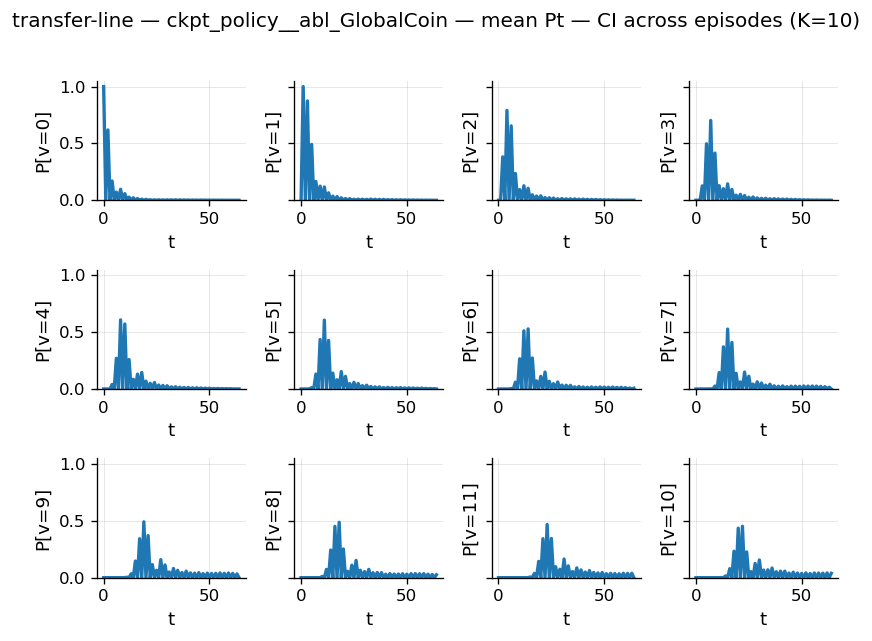

- **tv_to_uniform** `run__transfer-line__ckpt__seed1__256__0_1_2_3_4_5_6_7_8_9__07a180f1__ckpt_policy_abl_GlobalCoin.png`

#### Condition: `ckpt_policy_abl_NoPE`

- **position_timelines** `run__transfer-line__ckpt__seed1__256__0_1_2_3_4_5_6_7_8_9__07a180f1__ckpt_policy_abl_NoPE.png`

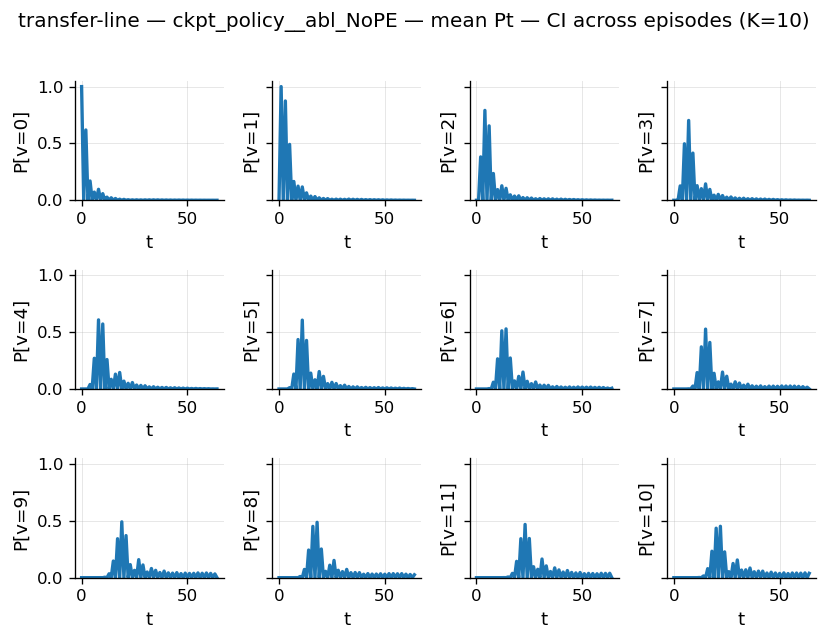

- **tv_to_uniform** `run__transfer-line__ckpt__seed1__256__0_1_2_3_4_5_6_7_8_9__07a180f1__ckpt_policy_abl_NoPE.png`

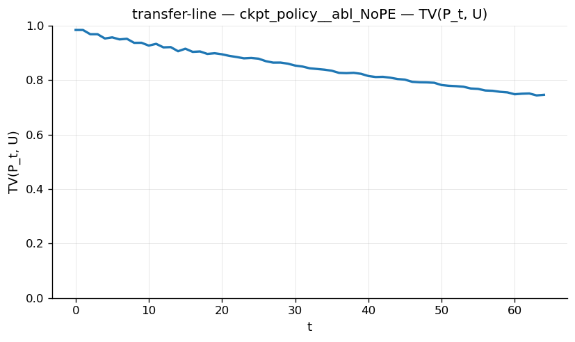

#### Condition: `ckpt_policy_abl_NodePermute`

- **position_timelines** `run__transfer-line__ckpt__seed1__256__0_1_2_3_4_5_6_7_8_9__07a180f1__ckpt_policy_abl_NodePermute.png`

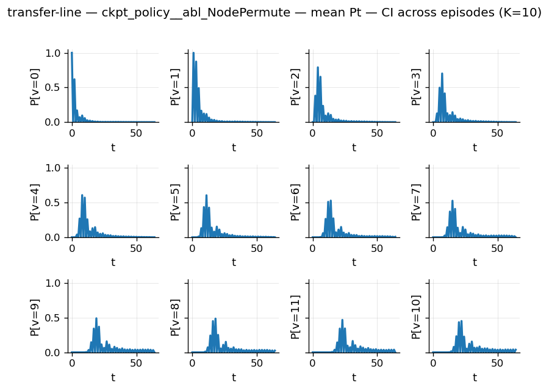

- **tv_to_uniform** `run__transfer-line__ckpt__seed1__256__0_1_2_3_4_5_6_7_8_9__07a180f1__ckpt_policy_abl_NodePermute.png`

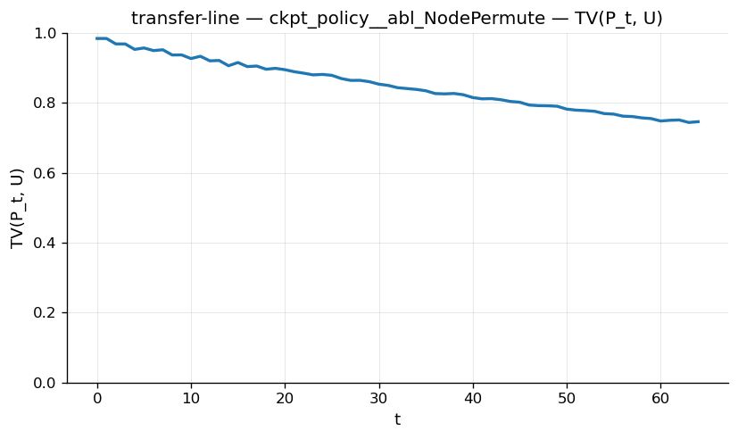

#### Condition: `ckpt_policy_abl_TimeFrozen`

- **position_timelines** `run__transfer-line__ckpt__seed1__256__0_1_2_3_4_5_6_7_8_9__07a180f1__ckpt_policy_abl_TimeFrozen.png`

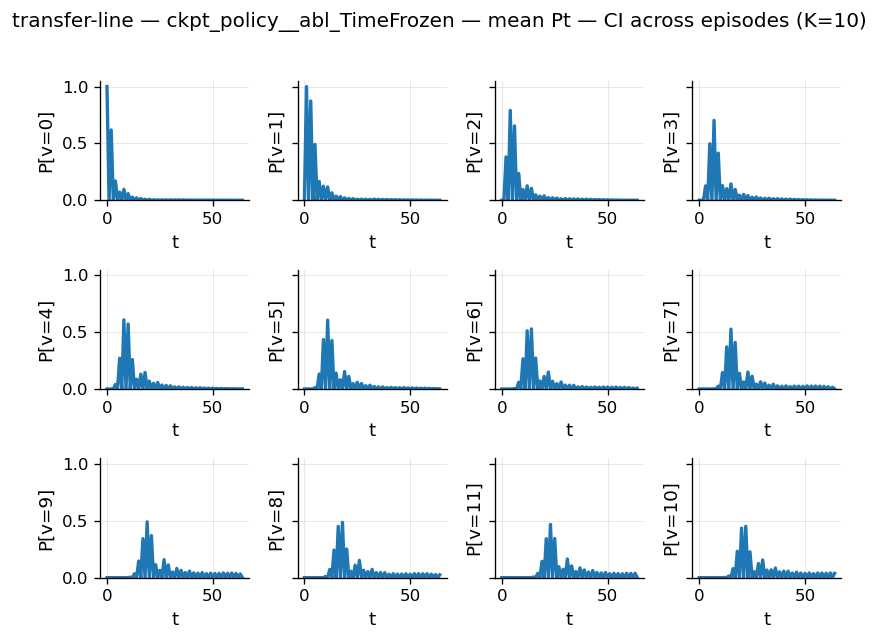

- **tv_to_uniform** `run__transfer-line__ckpt__seed1__256__0_1_2_3_4_5_6_7_8_9__07a180f1__ckpt_policy_abl_TimeFrozen.png`

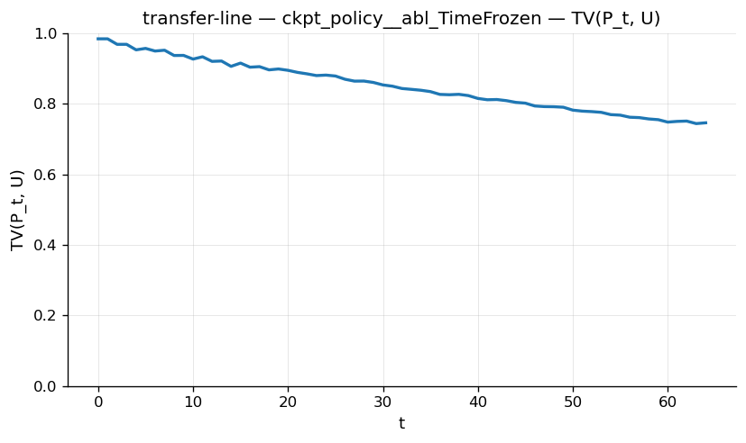

### Run: `transfer-line__ckpt__seed2__256__0_1_2_3_4_5_6_7_8_9__69f3e004`

- Checkpoint: `runs/transfer-line/seed2`
- Evaldir: `/mnt/c/Users/Angel/Desktop/CS598/acpl-qwalk/eval/transfer-line/seed2/main`
- Meta hash: `69f3e00430fc9c2a13c2699e07fb0433`

#### Condition: `ckpt_policy`

- **position_timelines** `run__transfer-line__ckpt__seed2__256__0_1_2_3_4_5_6_7_8_9__69f3e004__ckpt_policy.png`

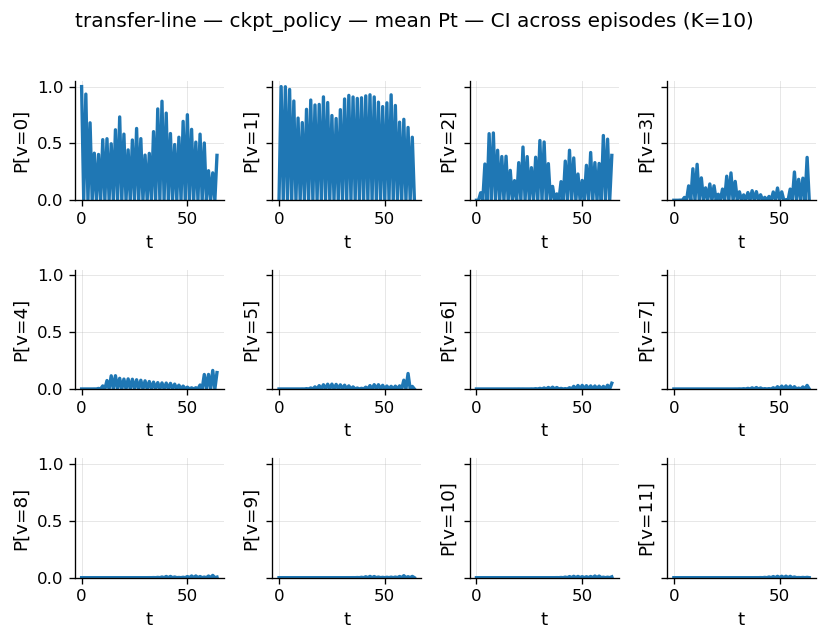

- **tv_to_uniform** `run__transfer-line__ckpt__seed2__256__0_1_2_3_4_5_6_7_8_9__69f3e004__ckpt_policy.png`

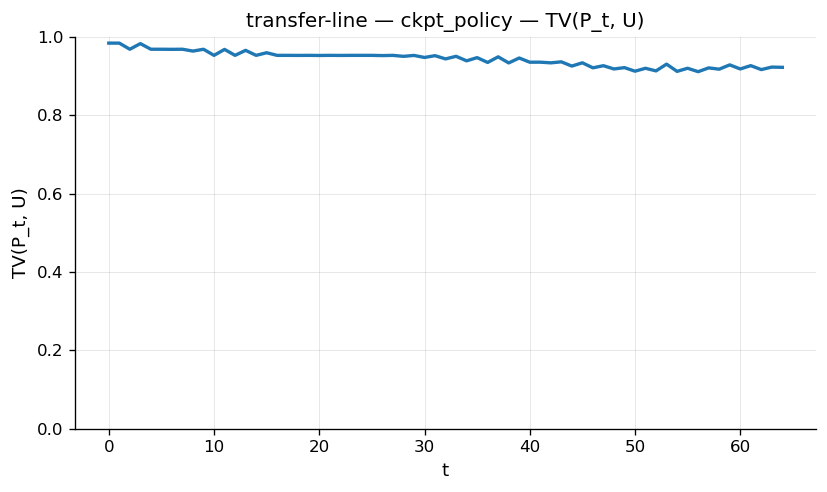

#### Condition: `ckpt_policy_abl_GlobalCoin`

- **position_timelines** `run__transfer-line__ckpt__seed2__256__0_1_2_3_4_5_6_7_8_9__69f3e004__ckpt_policy_abl_GlobalCoin.png`

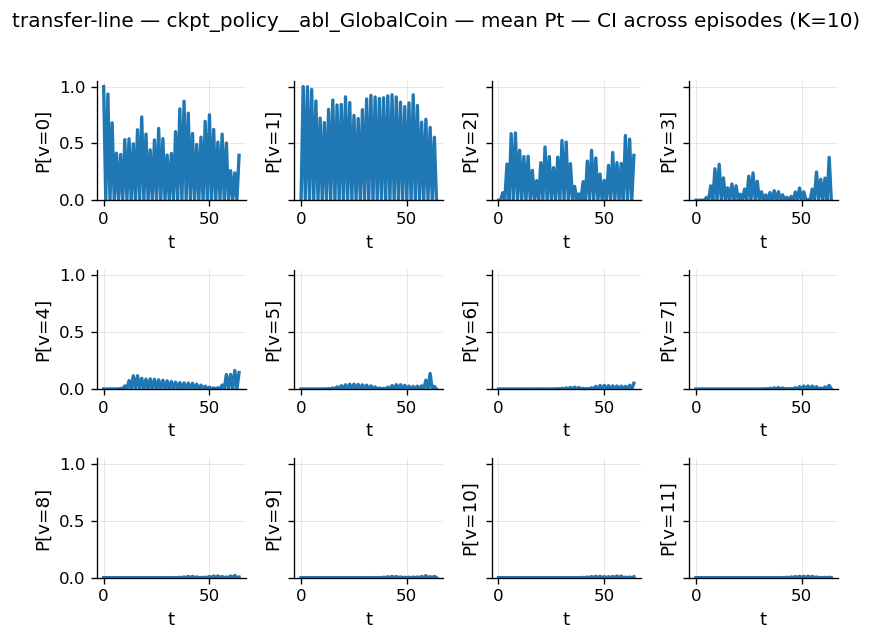

- **tv_to_uniform** `run__transfer-line__ckpt__seed2__256__0_1_2_3_4_5_6_7_8_9__69f3e004__ckpt_policy_abl_GlobalCoin.png`

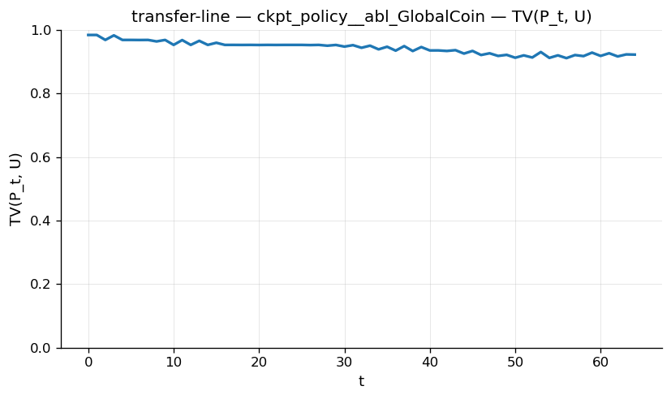

#### Condition: `ckpt_policy_abl_NoPE`

- **position_timelines** `run__transfer-line__ckpt__seed2__256__0_1_2_3_4_5_6_7_8_9__69f3e004__ckpt_policy_abl_NoPE.png`

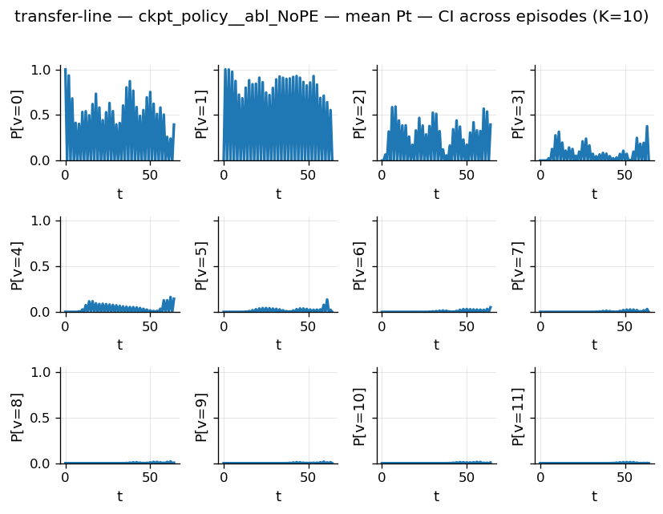

- **tv_to_uniform** `run__transfer-line__ckpt__seed2__256__0_1_2_3_4_5_6_7_8_9__69f3e004__ckpt_policy_abl_NoPE.png`

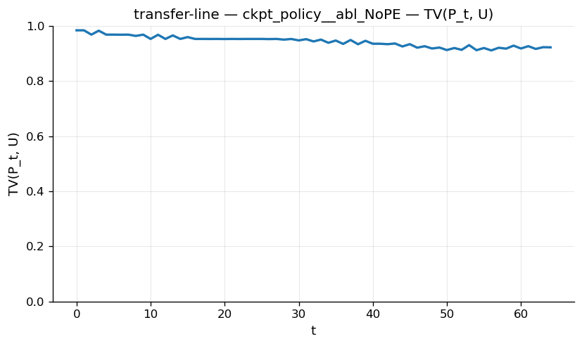

#### Condition: `ckpt_policy_abl_NodePermute`

- **position_timelines** `run__transfer-line__ckpt__seed2__256__0_1_2_3_4_5_6_7_8_9__69f3e004__ckpt_policy_abl_NodePermute.png`

- **tv_to_uniform** `run__transfer-line__ckpt__seed2__256__0_1_2_3_4_5_6_7_8_9__69f3e004__ckpt_policy_abl_NodePermute.png`

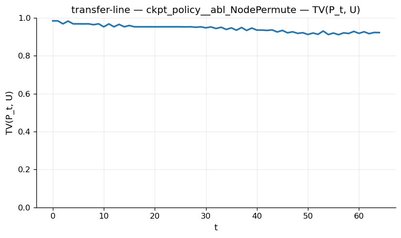

#### Condition: `ckpt_policy_abl_TimeFrozen`

- **position_timelines** `run__transfer-line__ckpt__seed2__256__0_1_2_3_4_5_6_7_8_9__69f3e004__ckpt_policy_abl_TimeFrozen.png`

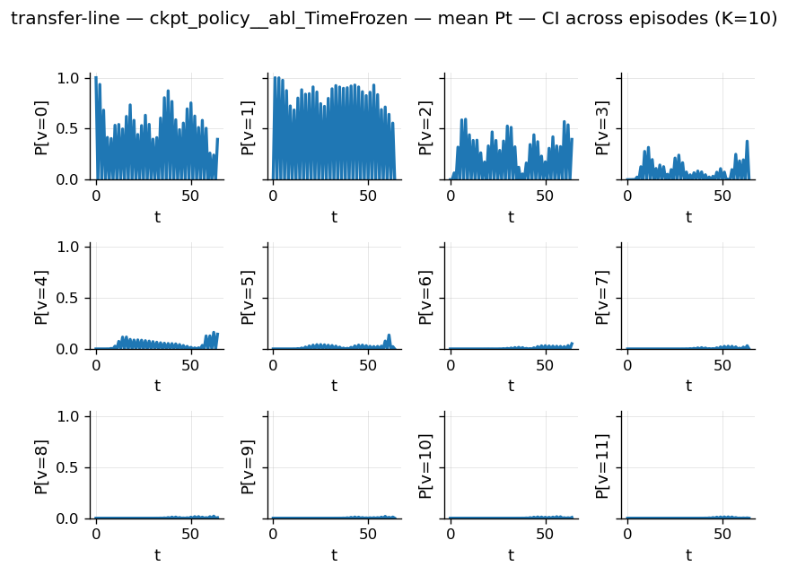

- **tv_to_uniform** `run__transfer-line__ckpt__seed2__256__0_1_2_3_4_5_6_7_8_9__69f3e004__ckpt_policy_abl_TimeFrozen.png`

## Suite: `transfer-regular`

### Run: `transfer-regular__baseline__ckpt__256__0_1_2_3_4_5_6_7_8_9__31ea239a`

- Evaldir: `/mnt/c/Users/Angel/Desktop/CS598/acpl-qwalk/eval/transfer-regular/baseline/hadamard`
- Meta hash: `31ea239aa2a8516bd60b751547eddf06`

#### Condition: `baseline_hadamard`

- **confusion_matrix** `run__transfer-regular__baseline__ckpt__256__0_1_2_3_4_5_6_7_8_9__31ea239a__baseline_hadamard.png`

- **position_timelines** `run__transfer-regular__baseline__ckpt__256__0_1_2_3_4_5_6_7_8_9__31ea239a__baseline_hadamard.png`

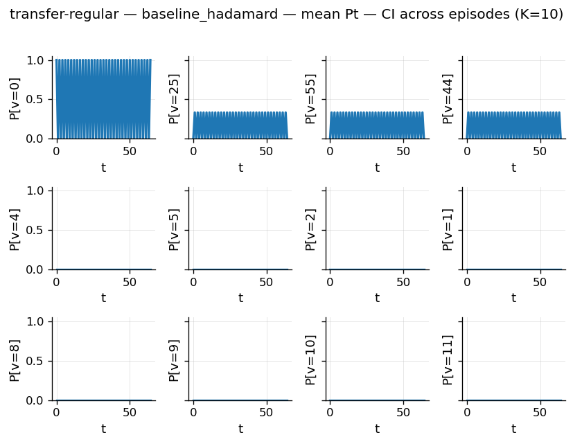

- **tv_to_uniform** `run__transfer-regular__baseline__ckpt__256__0_1_2_3_4_5_6_7_8_9__31ea239a__baseline_hadamard.png`

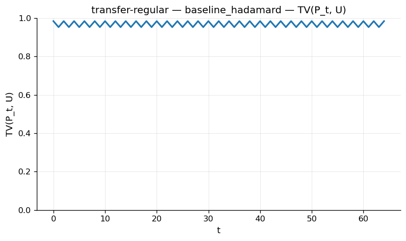

### Run: `transfer-regular__ckpt__seed0__256__0_1_2_3_4_5_6_7_8_9__b61b3506`

- Checkpoint: `runs/transfer-regular/seed0`
- Evaldir: `/mnt/c/Users/Angel/Desktop/CS598/acpl-qwalk/eval/transfer-regular/seed0/main`
- Meta hash: `b61b35060d925e20f8e617f6a3c313e7`

#### Condition: `ckpt_policy`

- **confusion_matrix** `run__transfer-regular__ckpt__seed0__256__0_1_2_3_4_5_6_7_8_9__b61b3506__ckpt_policy.png`

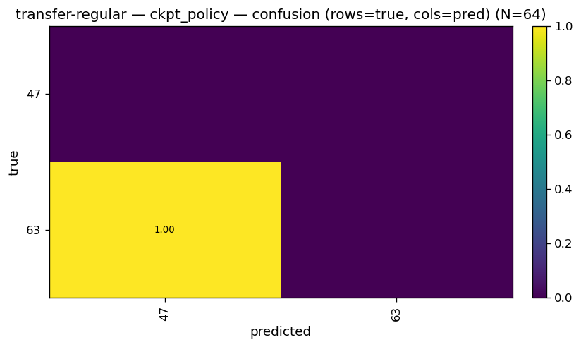

- **position_timelines** `run__transfer-regular__ckpt__seed0__256__0_1_2_3_4_5_6_7_8_9__b61b3506__ckpt_policy.png`

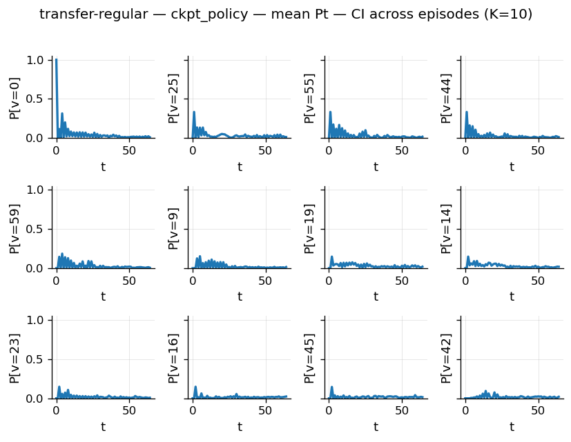

- **tv_to_uniform** `run__transfer-regular__ckpt__seed0__256__0_1_2_3_4_5_6_7_8_9__b61b3506__ckpt_policy.png`

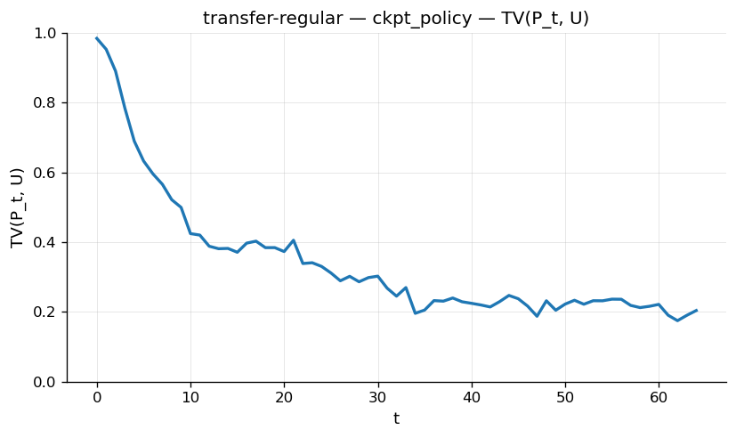

#### Condition: `ckpt_policy_abl_GlobalCoin`

- **confusion_matrix** `run__transfer-regular__ckpt__seed0__256__0_1_2_3_4_5_6_7_8_9__b61b3506__ckpt_policy_abl_GlobalCoin.png`

- **position_timelines** `run__transfer-regular__ckpt__seed0__256__0_1_2_3_4_5_6_7_8_9__b61b3506__ckpt_policy_abl_GlobalCoin.png`

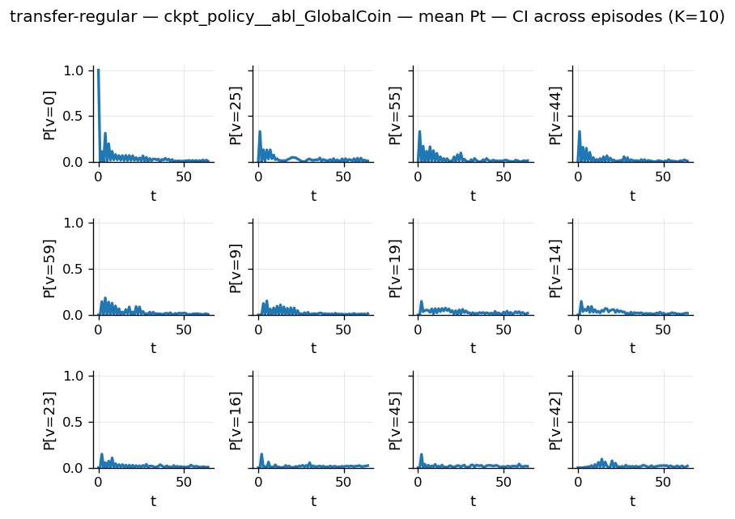

- **tv_to_uniform** `run__transfer-regular__ckpt__seed0__256__0_1_2_3_4_5_6_7_8_9__b61b3506__ckpt_policy_abl_GlobalCoin.png`

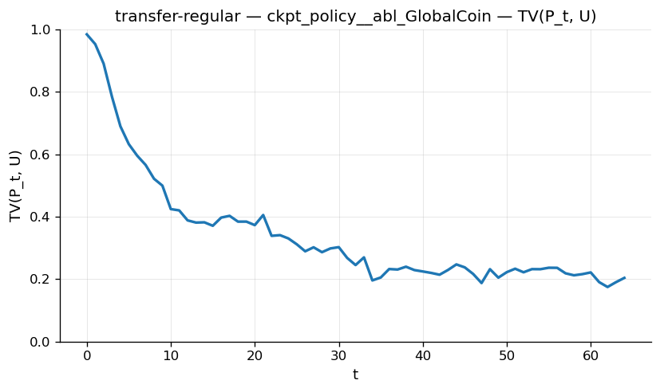

#### Condition: `ckpt_policy_abl_NoPE`

- **confusion_matrix** `run__transfer-regular__ckpt__seed0__256__0_1_2_3_4_5_6_7_8_9__b61b3506__ckpt_policy_abl_NoPE.png`

- **position_timelines** `run__transfer-regular__ckpt__seed0__256__0_1_2_3_4_5_6_7_8_9__b61b3506__ckpt_policy_abl_NoPE.png`

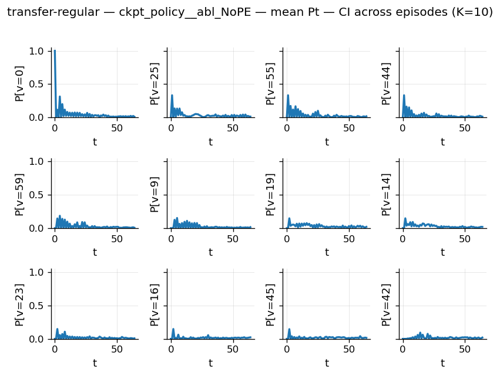

- **tv_to_uniform** `run__transfer-regular__ckpt__seed0__256__0_1_2_3_4_5_6_7_8_9__b61b3506__ckpt_policy_abl_NoPE.png`

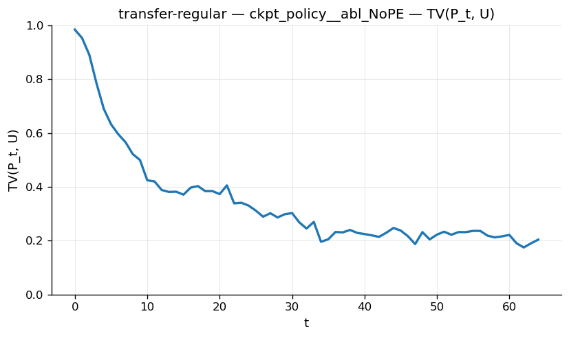

#### Condition: `ckpt_policy_abl_NodePermute`

- **confusion_matrix** `run__transfer-regular__ckpt__seed0__256__0_1_2_3_4_5_6_7_8_9__b61b3506__ckpt_policy_abl_NodePermute.png`

- **position_timelines** `run__transfer-regular__ckpt__seed0__256__0_1_2_3_4_5_6_7_8_9__b61b3506__ckpt_policy_abl_NodePermute.png`

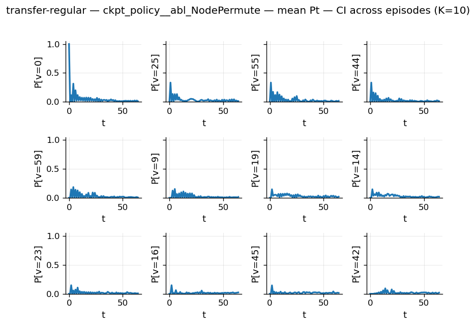

- **tv_to_uniform** `run__transfer-regular__ckpt__seed0__256__0_1_2_3_4_5_6_7_8_9__b61b3506__ckpt_policy_abl_NodePermute.png`

#### Condition: `ckpt_policy_abl_TimeFrozen`

- **confusion_matrix** `run__transfer-regular__ckpt__seed0__256__0_1_2_3_4_5_6_7_8_9__b61b3506__ckpt_policy_abl_TimeFrozen.png`

- **position_timelines** `run__transfer-regular__ckpt__seed0__256__0_1_2_3_4_5_6_7_8_9__b61b3506__ckpt_policy_abl_TimeFrozen.png`

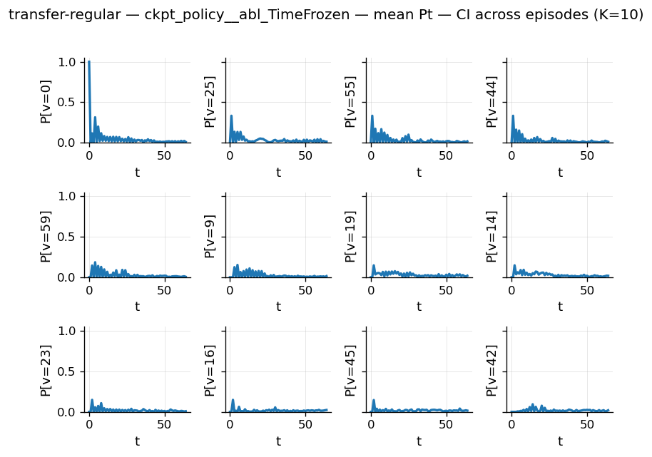

- **tv_to_uniform** `run__transfer-regular__ckpt__seed0__256__0_1_2_3_4_5_6_7_8_9__b61b3506__ckpt_policy_abl_TimeFrozen.png`

### Run: `transfer-regular__ckpt__seed1__256__0_1_2_3_4_5_6_7_8_9__dc74de67`

- Checkpoint: `runs/transfer-regular/seed1`
- Evaldir: `/mnt/c/Users/Angel/Desktop/CS598/acpl-qwalk/eval/transfer-regular/seed1/main`
- Meta hash: `dc74de67196e1f7a5f72536a6b46c898`

#### Condition: `ckpt_policy`

- **confusion_matrix** `run__transfer-regular__ckpt__seed1__256__0_1_2_3_4_5_6_7_8_9__dc74de67__ckpt_policy.png`

- **position_timelines** `run__transfer-regular__ckpt__seed1__256__0_1_2_3_4_5_6_7_8_9__dc74de67__ckpt_policy.png`

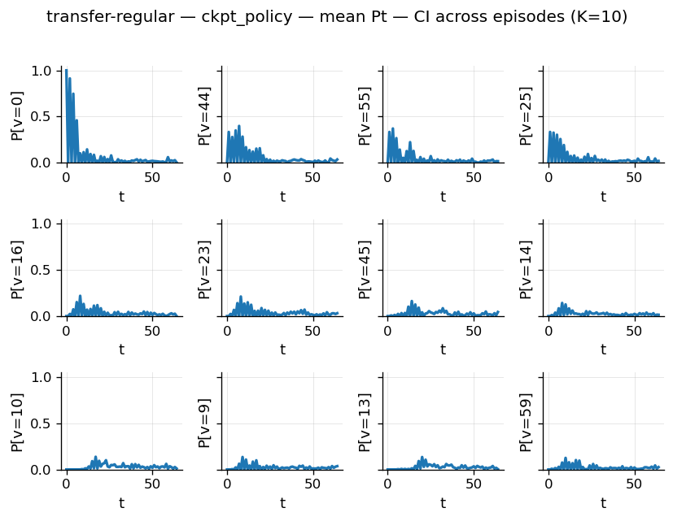

- **tv_to_uniform** `run__transfer-regular__ckpt__seed1__256__0_1_2_3_4_5_6_7_8_9__dc74de67__ckpt_policy.png`

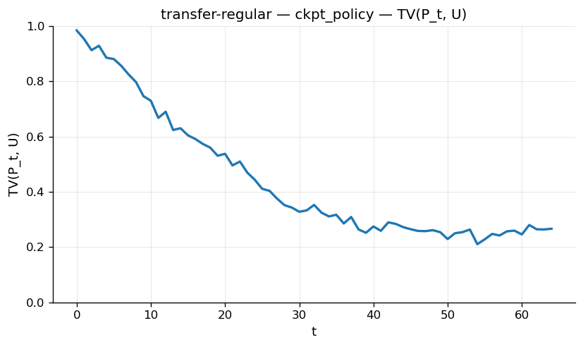

#### Condition: `ckpt_policy_abl_GlobalCoin`

- **confusion_matrix** `run__transfer-regular__ckpt__seed1__256__0_1_2_3_4_5_6_7_8_9__dc74de67__ckpt_policy_abl_GlobalCoin.png`

- **position_timelines** `run__transfer-regular__ckpt__seed1__256__0_1_2_3_4_5_6_7_8_9__dc74de67__ckpt_policy_abl_GlobalCoin.png`

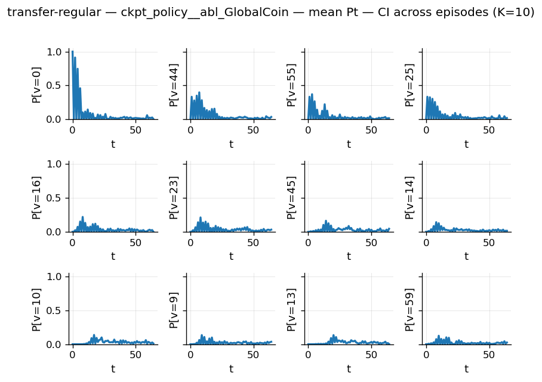

- **tv_to_uniform** `run__transfer-regular__ckpt__seed1__256__0_1_2_3_4_5_6_7_8_9__dc74de67__ckpt_policy_abl_GlobalCoin.png`

#### Condition: `ckpt_policy_abl_NoPE`

- **confusion_matrix** `run__transfer-regular__ckpt__seed1__256__0_1_2_3_4_5_6_7_8_9__dc74de67__ckpt_policy_abl_NoPE.png`

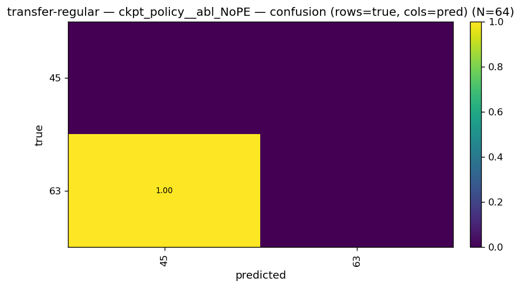

- **position_timelines** `run__transfer-regular__ckpt__seed1__256__0_1_2_3_4_5_6_7_8_9__dc74de67__ckpt_policy_abl_NoPE.png`

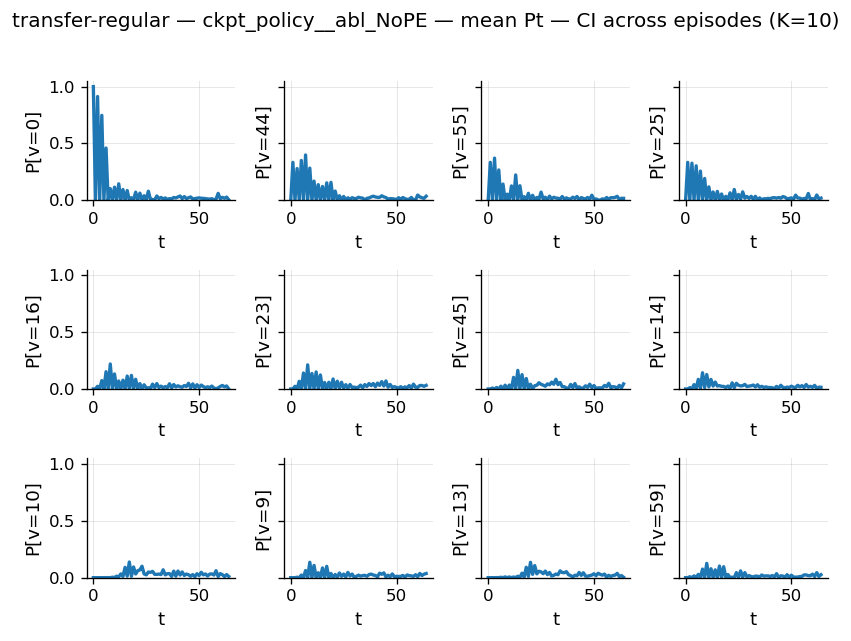

- **tv_to_uniform** `run__transfer-regular__ckpt__seed1__256__0_1_2_3_4_5_6_7_8_9__dc74de67__ckpt_policy_abl_NoPE.png`

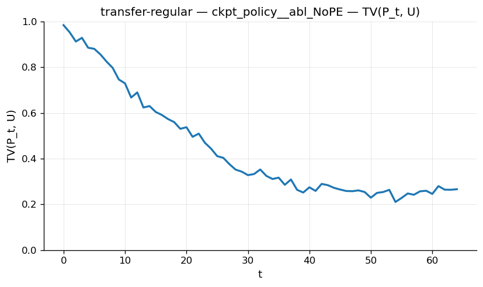

#### Condition: `ckpt_policy_abl_NodePermute`

- **confusion_matrix** `run__transfer-regular__ckpt__seed1__256__0_1_2_3_4_5_6_7_8_9__dc74de67__ckpt_policy_abl_NodePermute.png`

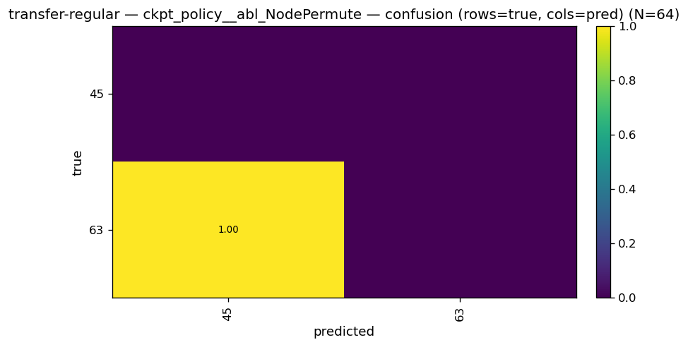

- **position_timelines** `run__transfer-regular__ckpt__seed1__256__0_1_2_3_4_5_6_7_8_9__dc74de67__ckpt_policy_abl_NodePermute.png`

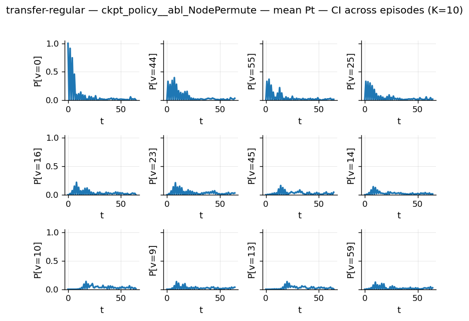

- **tv_to_uniform** `run__transfer-regular__ckpt__seed1__256__0_1_2_3_4_5_6_7_8_9__dc74de67__ckpt_policy_abl_NodePermute.png`

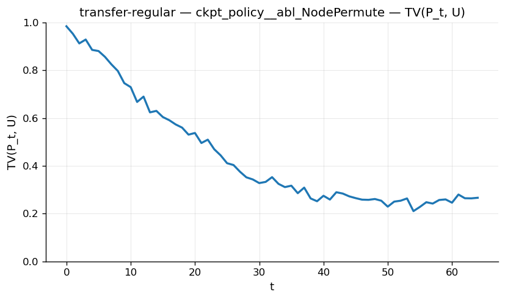

#### Condition: `ckpt_policy_abl_TimeFrozen`

- **confusion_matrix** `run__transfer-regular__ckpt__seed1__256__0_1_2_3_4_5_6_7_8_9__dc74de67__ckpt_policy_abl_TimeFrozen.png`

- **position_timelines** `run__transfer-regular__ckpt__seed1__256__0_1_2_3_4_5_6_7_8_9__dc74de67__ckpt_policy_abl_TimeFrozen.png`

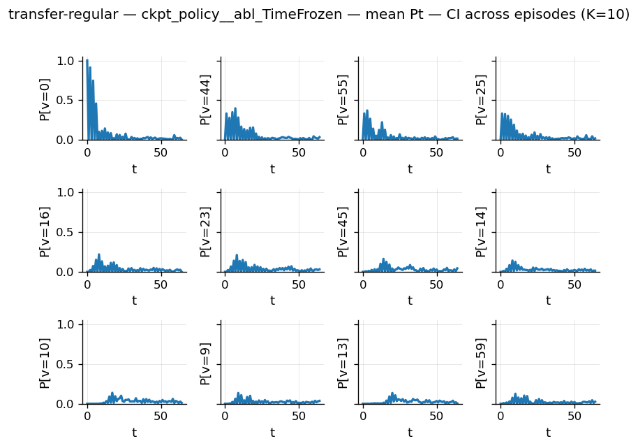

- **tv_to_uniform** `run__transfer-regular__ckpt__seed1__256__0_1_2_3_4_5_6_7_8_9__dc74de67__ckpt_policy_abl_TimeFrozen.png`

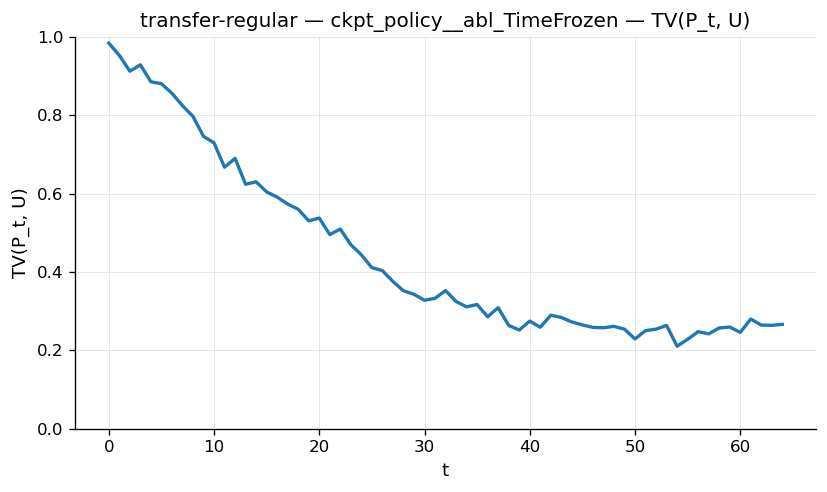

### Run: `transfer-regular__ckpt__seed2__256__0_1_2_3_4_5_6_7_8_9__2994e82e`

- Checkpoint: `runs/transfer-regular/seed2`
- Evaldir: `/mnt/c/Users/Angel/Desktop/CS598/acpl-qwalk/eval/transfer-regular/seed2/main`
- Meta hash: `2994e82e220f67d8be72d73e289f26ee`

#### Condition: `ckpt_policy`

- **confusion_matrix** `run__transfer-regular__ckpt__seed2__256__0_1_2_3_4_5_6_7_8_9__2994e82e__ckpt_policy.png`

- **position_timelines** `run__transfer-regular__ckpt__seed2__256__0_1_2_3_4_5_6_7_8_9__2994e82e__ckpt_policy.png`

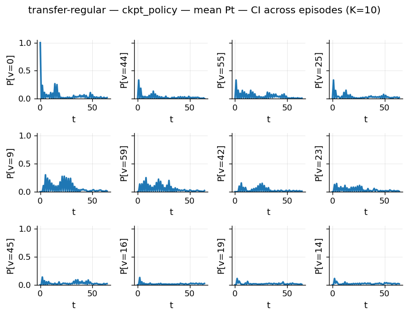

- **tv_to_uniform** `run__transfer-regular__ckpt__seed2__256__0_1_2_3_4_5_6_7_8_9__2994e82e__ckpt_policy.png`

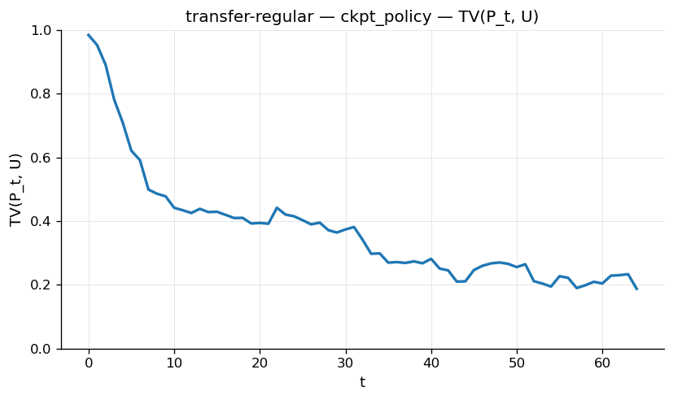

#### Condition: `ckpt_policy_abl_GlobalCoin`

- **confusion_matrix** `run__transfer-regular__ckpt__seed2__256__0_1_2_3_4_5_6_7_8_9__2994e82e__ckpt_policy_abl_GlobalCoin.png`

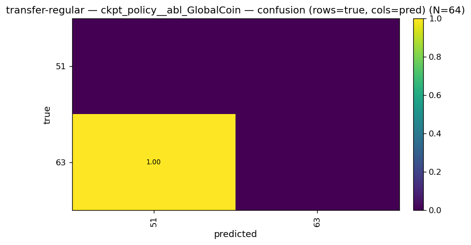

- **position_timelines** `run__transfer-regular__ckpt__seed2__256__0_1_2_3_4_5_6_7_8_9__2994e82e__ckpt_policy_abl_GlobalCoin.png`

- **tv_to_uniform** `run__transfer-regular__ckpt__seed2__256__0_1_2_3_4_5_6_7_8_9__2994e82e__ckpt_policy_abl_GlobalCoin.png`

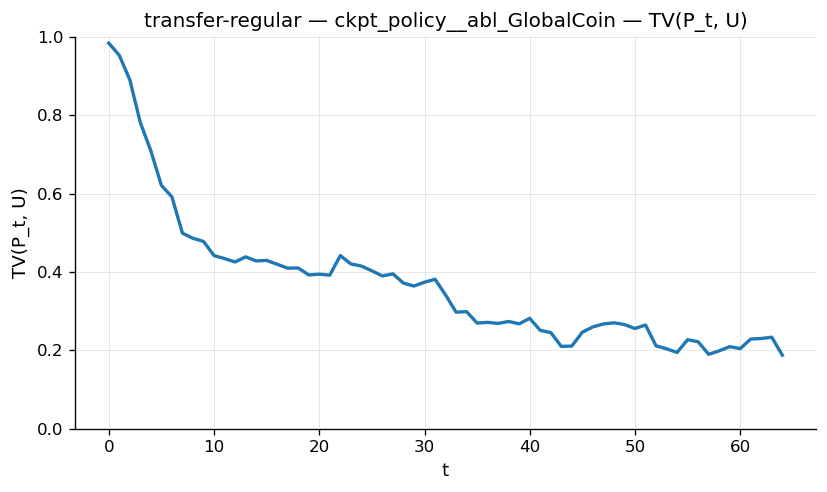

#### Condition: `ckpt_policy_abl_NoPE`

- **confusion_matrix** `run__transfer-regular__ckpt__seed2__256__0_1_2_3_4_5_6_7_8_9__2994e82e__ckpt_policy_abl_NoPE.png`

- **position_timelines** `run__transfer-regular__ckpt__seed2__256__0_1_2_3_4_5_6_7_8_9__2994e82e__ckpt_policy_abl_NoPE.png`

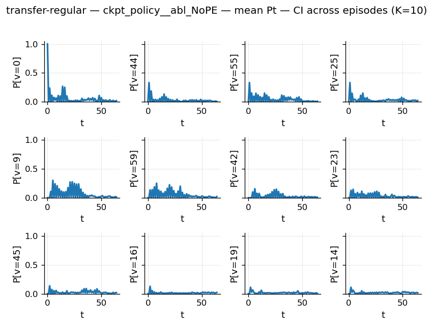

- **tv_to_uniform** `run__transfer-regular__ckpt__seed2__256__0_1_2_3_4_5_6_7_8_9__2994e82e__ckpt_policy_abl_NoPE.png`

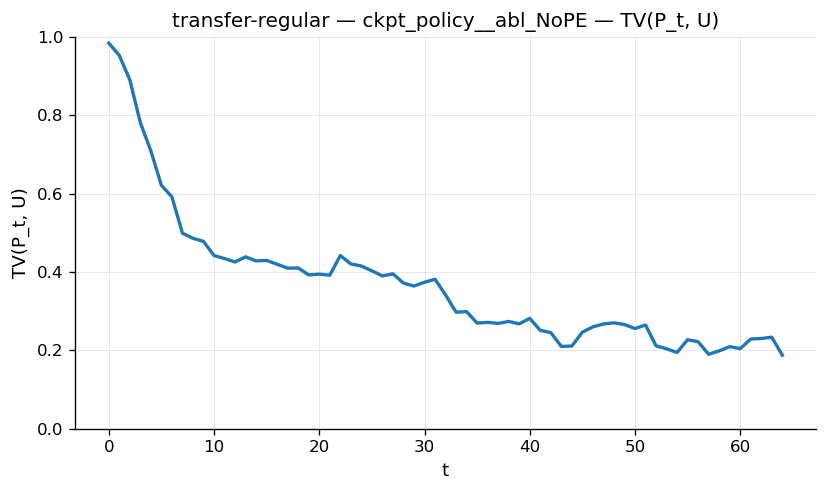

#### Condition: `ckpt_policy_abl_NodePermute`

- **confusion_matrix** `run__transfer-regular__ckpt__seed2__256__0_1_2_3_4_5_6_7_8_9__2994e82e__ckpt_policy_abl_NodePermute.png`

- **position_timelines** `run__transfer-regular__ckpt__seed2__256__0_1_2_3_4_5_6_7_8_9__2994e82e__ckpt_policy_abl_NodePermute.png`

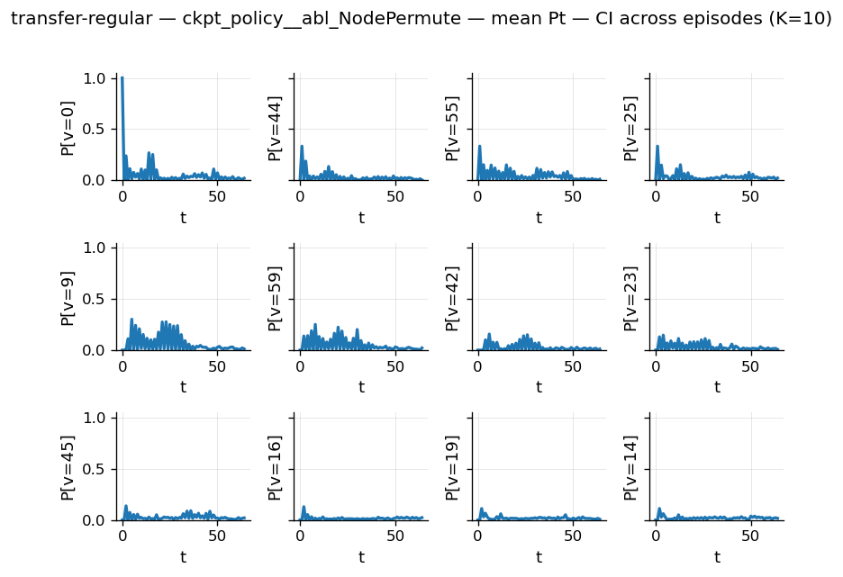

- **tv_to_uniform** `run__transfer-regular__ckpt__seed2__256__0_1_2_3_4_5_6_7_8_9__2994e82e__ckpt_policy_abl_NodePermute.png`

#### Condition: `ckpt_policy_abl_TimeFrozen`

- **confusion_matrix** `run__transfer-regular__ckpt__seed2__256__0_1_2_3_4_5_6_7_8_9__2994e82e__ckpt_policy_abl_TimeFrozen.png`

- **position_timelines** `run__transfer-regular__ckpt__seed2__256__0_1_2_3_4_5_6_7_8_9__2994e82e__ckpt_policy_abl_TimeFrozen.png`

- **tv_to_uniform** `run__transfer-regular__ckpt__seed2__256__0_1_2_3_4_5_6_7_8_9__2994e82e__ckpt_policy_abl_TimeFrozen.png`

## Suite: `xfer_line_to_regular`

### Run: `xfer_line_to_regular__ckpt__seed0__256__0_1_2_3_4_5_6_7_8_9__d960b32b`

- Checkpoint: `runs/transfer-line/seed0`
- Evaldir: `/mnt/c/Users/Angel/Desktop/CS598/acpl-qwalk/eval/xfer_cross/line_to_regular/seed0`
- Meta hash: `d960b32b8e8b18d1012fe526bf922d75`

#### Condition: `ckpt_policy`

- **position_timelines** `run__xfer_line_to_regular__ckpt__seed0__256__0_1_2_3_4_5_6_7_8_9__d960b32b__ckpt_policy.png`

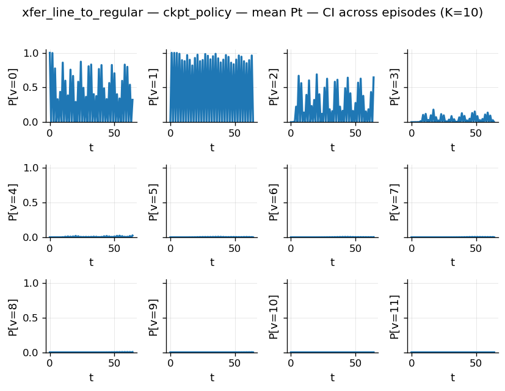

- **tv_to_uniform** `run__xfer_line_to_regular__ckpt__seed0__256__0_1_2_3_4_5_6_7_8_9__d960b32b__ckpt_policy.png`

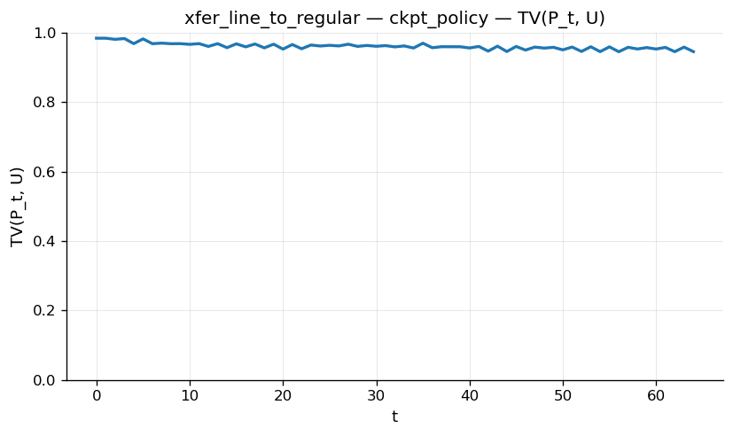

#### Condition: `ckpt_policy_abl_GlobalCoin`

- **position_timelines** `run__xfer_line_to_regular__ckpt__seed0__256__0_1_2_3_4_5_6_7_8_9__d960b32b__ckpt_policy_abl_GlobalCoin.png`

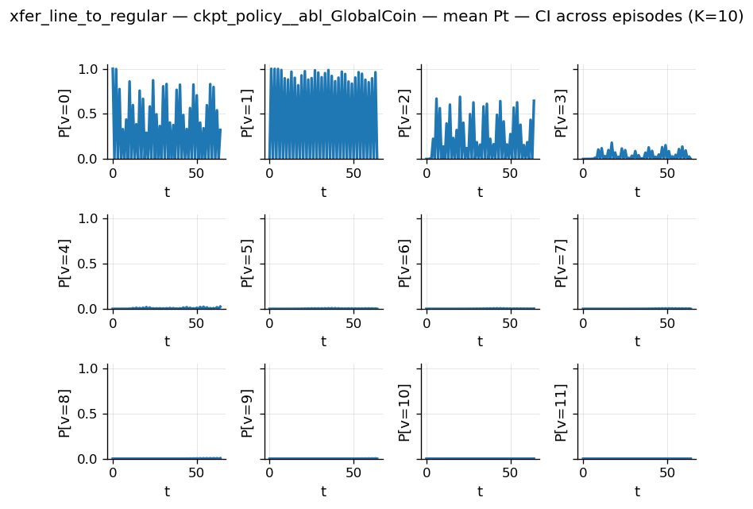

- **tv_to_uniform** `run__xfer_line_to_regular__ckpt__seed0__256__0_1_2_3_4_5_6_7_8_9__d960b32b__ckpt_policy_abl_GlobalCoin.png`

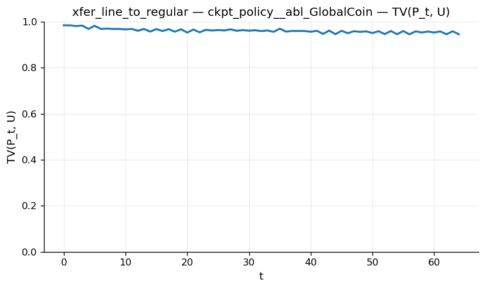

#### Condition: `ckpt_policy_abl_NoPE`

- **position_timelines** `run__xfer_line_to_regular__ckpt__seed0__256__0_1_2_3_4_5_6_7_8_9__d960b32b__ckpt_policy_abl_NoPE.png`

- **tv_to_uniform** `run__xfer_line_to_regular__ckpt__seed0__256__0_1_2_3_4_5_6_7_8_9__d960b32b__ckpt_policy_abl_NoPE.png`

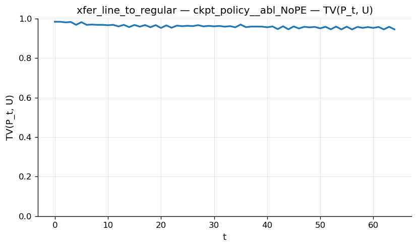

#### Condition: `ckpt_policy_abl_NodePermute`

- **position_timelines** `run__xfer_line_to_regular__ckpt__seed0__256__0_1_2_3_4_5_6_7_8_9__d960b32b__ckpt_policy_abl_NodePermute.png`

- **tv_to_uniform** `run__xfer_line_to_regular__ckpt__seed0__256__0_1_2_3_4_5_6_7_8_9__d960b32b__ckpt_policy_abl_NodePermute.png`

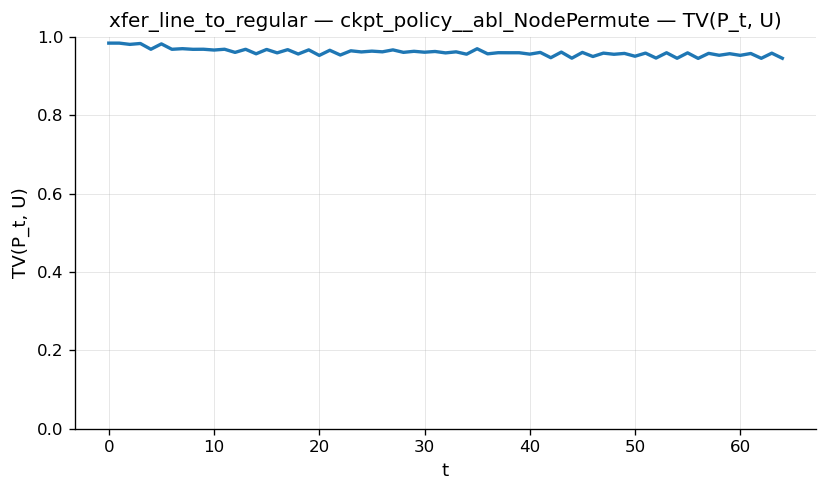

#### Condition: `ckpt_policy_abl_TimeFrozen`

- **position_timelines** `run__xfer_line_to_regular__ckpt__seed0__256__0_1_2_3_4_5_6_7_8_9__d960b32b__ckpt_policy_abl_TimeFrozen.png`

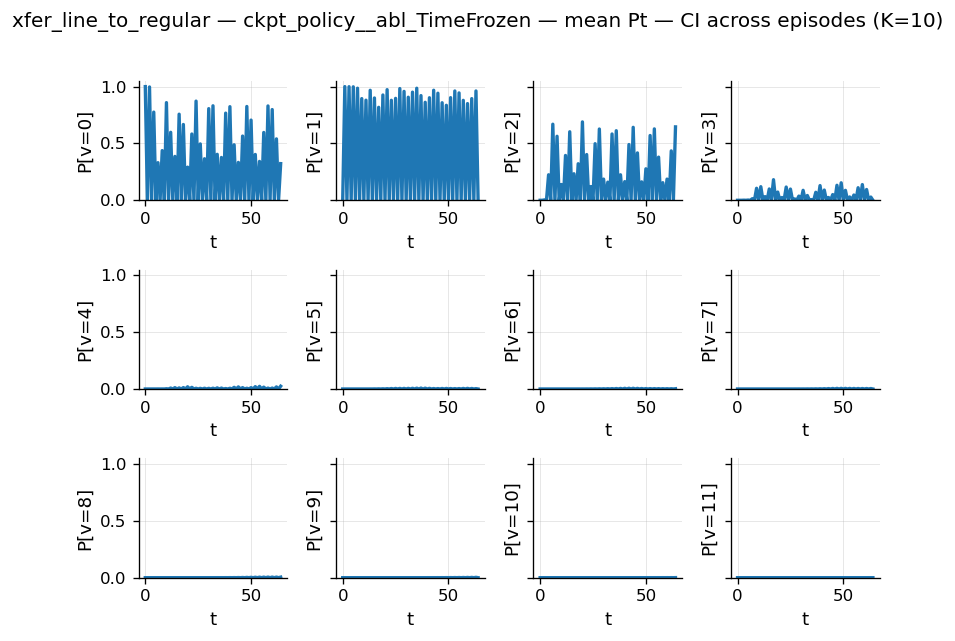

- **tv_to_uniform** `run__xfer_line_to_regular__ckpt__seed0__256__0_1_2_3_4_5_6_7_8_9__d960b32b__ckpt_policy_abl_TimeFrozen.png`

### Run: `xfer_line_to_regular__ckpt__seed1__256__0_1_2_3_4_5_6_7_8_9__65185b2c`

- Checkpoint: `runs/transfer-line/seed1`
- Evaldir: `/mnt/c/Users/Angel/Desktop/CS598/acpl-qwalk/eval/xfer_cross/line_to_regular/seed1`
- Meta hash: `65185b2c70f4cdc0f430e3204d155fa0`

#### Condition: `ckpt_policy`

- **position_timelines** `run__xfer_line_to_regular__ckpt__seed1__256__0_1_2_3_4_5_6_7_8_9__65185b2c__ckpt_policy.png`

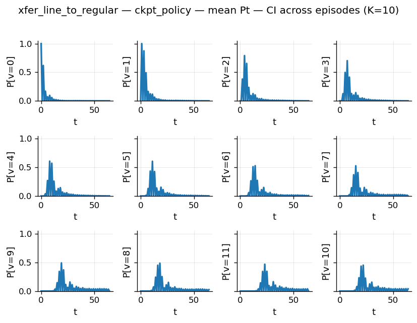

- **tv_to_uniform** `run__xfer_line_to_regular__ckpt__seed1__256__0_1_2_3_4_5_6_7_8_9__65185b2c__ckpt_policy.png`

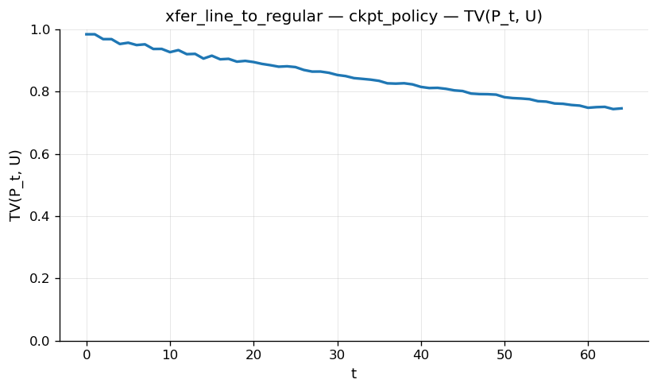

#### Condition: `ckpt_policy_abl_GlobalCoin`

- **position_timelines** `run__xfer_line_to_regular__ckpt__seed1__256__0_1_2_3_4_5_6_7_8_9__65185b2c__ckpt_policy_abl_GlobalCoin.png`

- **tv_to_uniform** `run__xfer_line_to_regular__ckpt__seed1__256__0_1_2_3_4_5_6_7_8_9__65185b2c__ckpt_policy_abl_GlobalCoin.png`

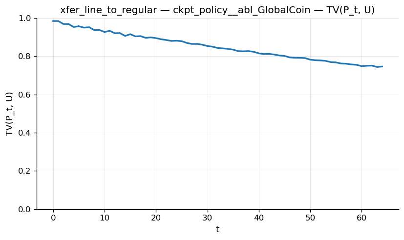

#### Condition: `ckpt_policy_abl_NoPE`

- **position_timelines** `run__xfer_line_to_regular__ckpt__seed1__256__0_1_2_3_4_5_6_7_8_9__65185b2c__ckpt_policy_abl_NoPE.png`

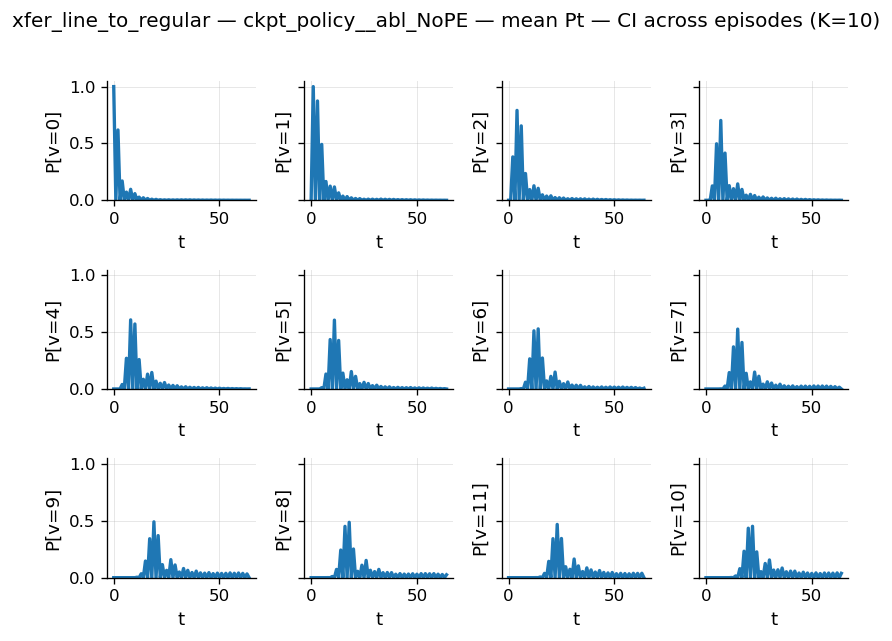

- **tv_to_uniform** `run__xfer_line_to_regular__ckpt__seed1__256__0_1_2_3_4_5_6_7_8_9__65185b2c__ckpt_policy_abl_NoPE.png`

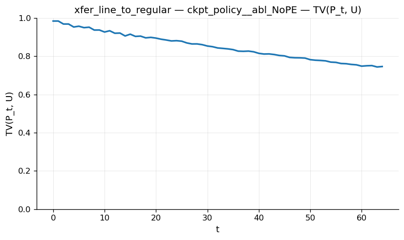

#### Condition: `ckpt_policy_abl_NodePermute`

- **position_timelines** `run__xfer_line_to_regular__ckpt__seed1__256__0_1_2_3_4_5_6_7_8_9__65185b2c__ckpt_policy_abl_NodePermute.png`

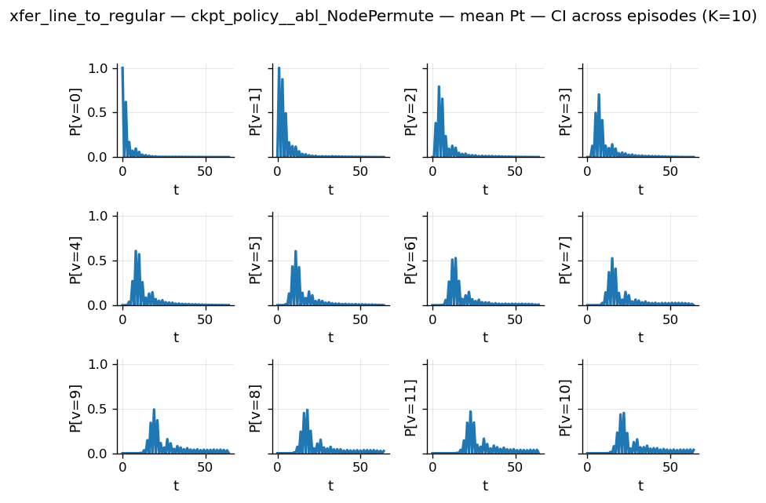

- **tv_to_uniform** `run__xfer_line_to_regular__ckpt__seed1__256__0_1_2_3_4_5_6_7_8_9__65185b2c__ckpt_policy_abl_NodePermute.png`

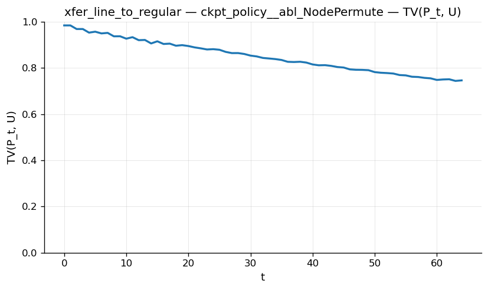

#### Condition: `ckpt_policy_abl_TimeFrozen`

- **position_timelines** `run__xfer_line_to_regular__ckpt__seed1__256__0_1_2_3_4_5_6_7_8_9__65185b2c__ckpt_policy_abl_TimeFrozen.png`

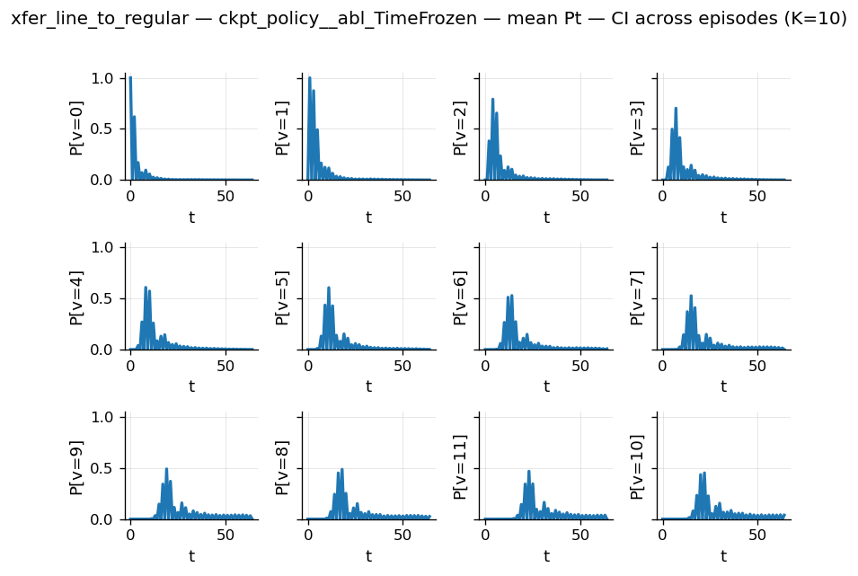

- **tv_to_uniform** `run__xfer_line_to_regular__ckpt__seed1__256__0_1_2_3_4_5_6_7_8_9__65185b2c__ckpt_policy_abl_TimeFrozen.png`

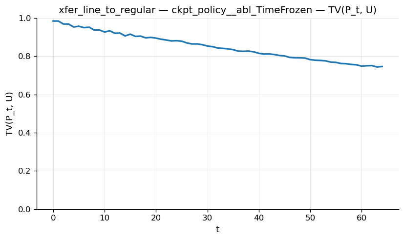

### Run: `xfer_line_to_regular__ckpt__seed2__256__0_1_2_3_4_5_6_7_8_9__e0eae765`

- Checkpoint: `runs/transfer-line/seed2`
- Evaldir: `/mnt/c/Users/Angel/Desktop/CS598/acpl-qwalk/eval/xfer_cross/line_to_regular/seed2`
- Meta hash: `e0eae7653ed9c56dacac567abdf9465f`

#### Condition: `ckpt_policy`

- **position_timelines** `run__xfer_line_to_regular__ckpt__seed2__256__0_1_2_3_4_5_6_7_8_9__e0eae765__ckpt_policy.png`

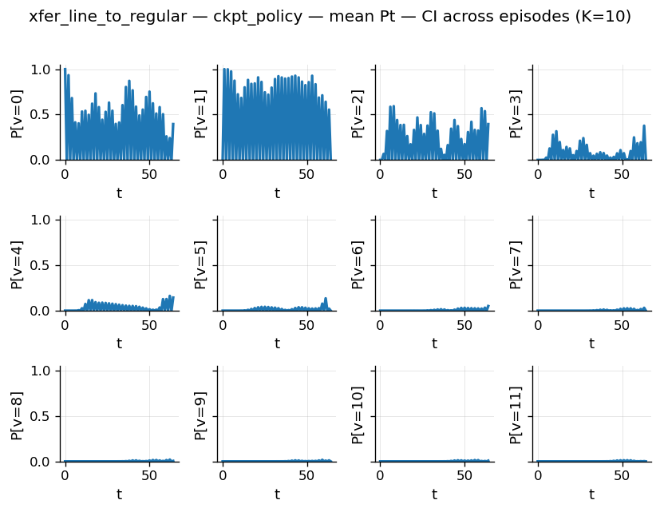

- **tv_to_uniform** `run__xfer_line_to_regular__ckpt__seed2__256__0_1_2_3_4_5_6_7_8_9__e0eae765__ckpt_policy.png`

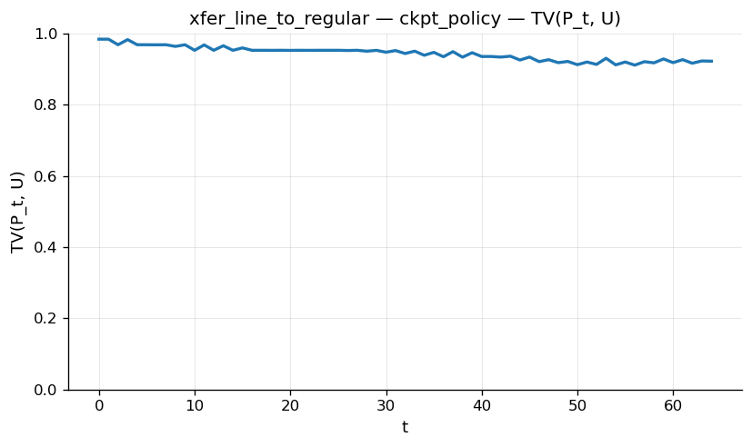

#### Condition: `ckpt_policy_abl_GlobalCoin`

- **position_timelines** `run__xfer_line_to_regular__ckpt__seed2__256__0_1_2_3_4_5_6_7_8_9__e0eae765__ckpt_policy_abl_GlobalCoin.png`

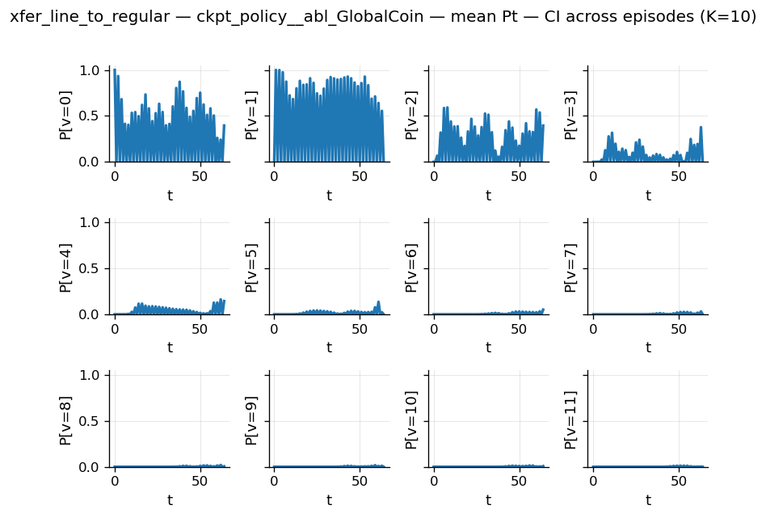

- **tv_to_uniform** `run__xfer_line_to_regular__ckpt__seed2__256__0_1_2_3_4_5_6_7_8_9__e0eae765__ckpt_policy_abl_GlobalCoin.png`

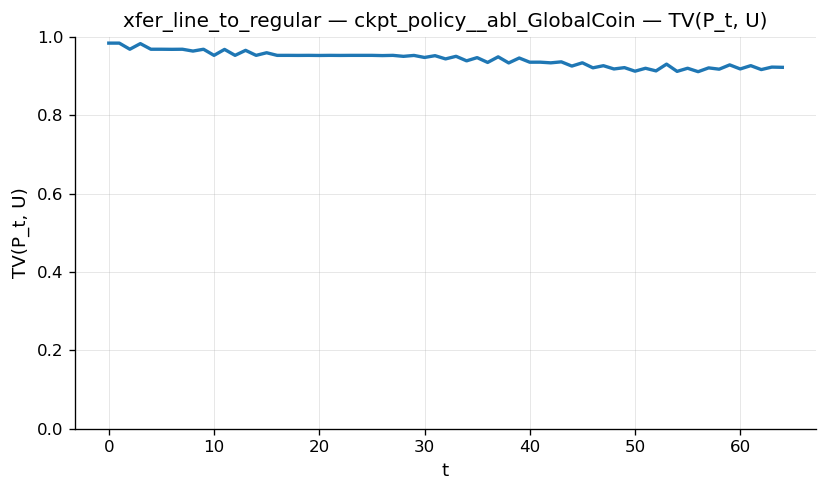

#### Condition: `ckpt_policy_abl_NoPE`

- **position_timelines** `run__xfer_line_to_regular__ckpt__seed2__256__0_1_2_3_4_5_6_7_8_9__e0eae765__ckpt_policy_abl_NoPE.png`

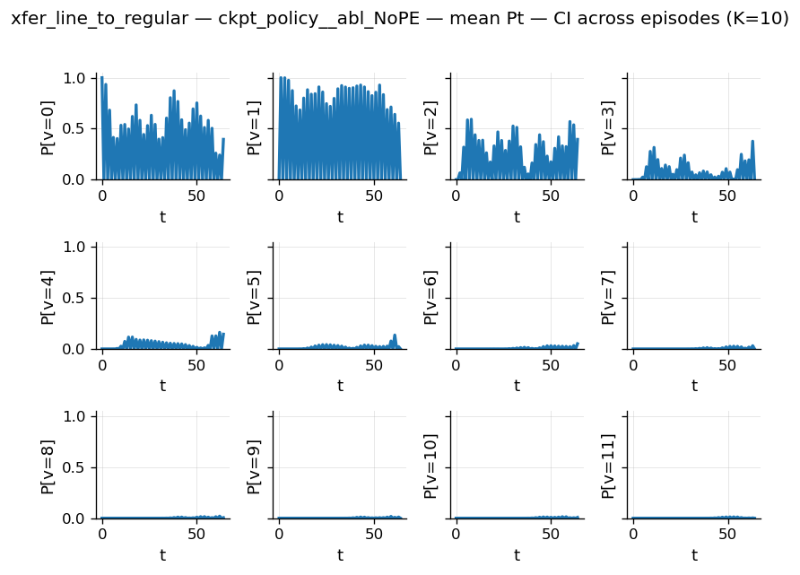

- **tv_to_uniform** `run__xfer_line_to_regular__ckpt__seed2__256__0_1_2_3_4_5_6_7_8_9__e0eae765__ckpt_policy_abl_NoPE.png`

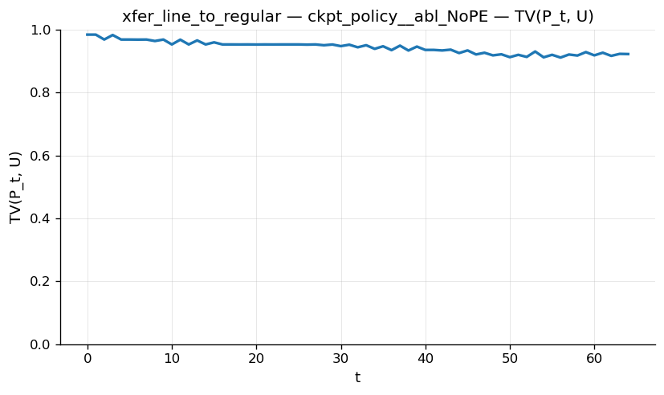

#### Condition: `ckpt_policy_abl_NodePermute`

- **position_timelines** `run__xfer_line_to_regular__ckpt__seed2__256__0_1_2_3_4_5_6_7_8_9__e0eae765__ckpt_policy_abl_NodePermute.png`

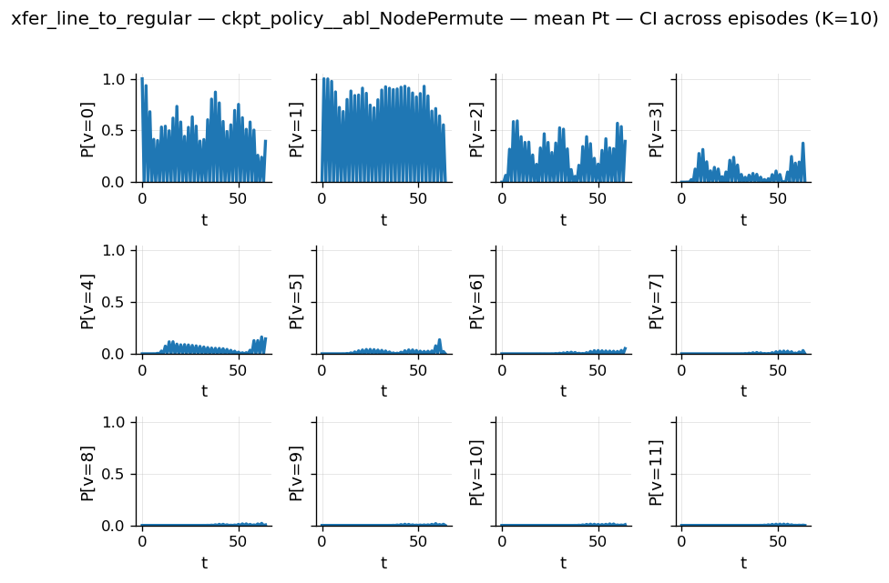

- **tv_to_uniform** `run__xfer_line_to_regular__ckpt__seed2__256__0_1_2_3_4_5_6_7_8_9__e0eae765__ckpt_policy_abl_NodePermute.png`

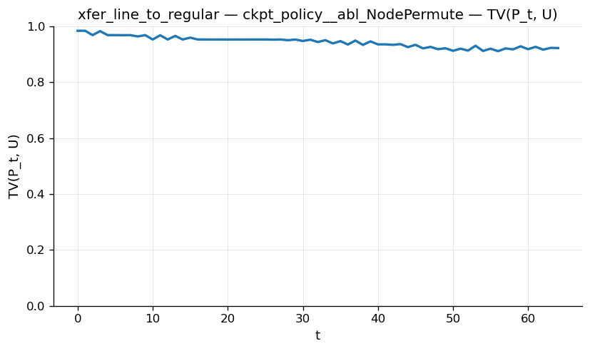

#### Condition: `ckpt_policy_abl_TimeFrozen`

- **position_timelines** `run__xfer_line_to_regular__ckpt__seed2__256__0_1_2_3_4_5_6_7_8_9__e0eae765__ckpt_policy_abl_TimeFrozen.png`

- **tv_to_uniform** `run__xfer_line_to_regular__ckpt__seed2__256__0_1_2_3_4_5_6_7_8_9__e0eae765__ckpt_policy_abl_TimeFrozen.png`

## Suite: `xfer_regular_to_line`

### Run: `xfer_regular_to_line__ckpt__seed0__256__0_1_2_3_4_5_6_7_8_9__0ac69e89`

- Checkpoint: `runs/transfer-regular/seed0`
- Evaldir: `/mnt/c/Users/Angel/Desktop/CS598/acpl-qwalk/eval/xfer_cross/regular_to_line/seed0`
- Meta hash: `0ac69e896fb7559178013db5254a4ee9`

#### Condition: `ckpt_policy`

- **confusion_matrix** `run__xfer_regular_to_line__ckpt__seed0__256__0_1_2_3_4_5_6_7_8_9__0ac69e89__ckpt_policy.png`

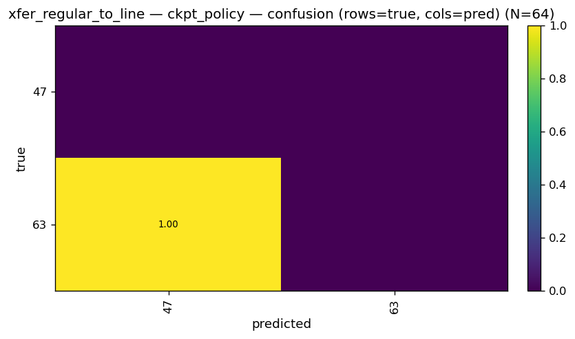

- **position_timelines** `run__xfer_regular_to_line__ckpt__seed0__256__0_1_2_3_4_5_6_7_8_9__0ac69e89__ckpt_policy.png`

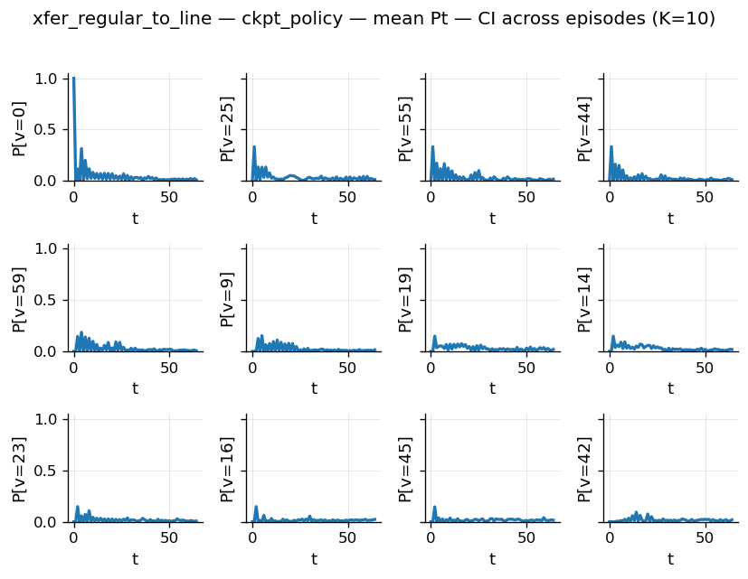

- **tv_to_uniform** `run__xfer_regular_to_line__ckpt__seed0__256__0_1_2_3_4_5_6_7_8_9__0ac69e89__ckpt_policy.png`

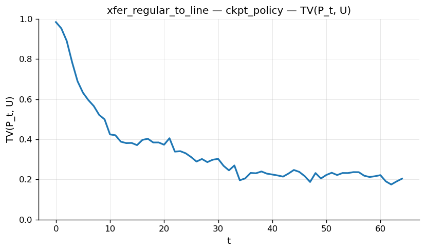

#### Condition: `ckpt_policy_abl_GlobalCoin`

- **confusion_matrix** `run__xfer_regular_to_line__ckpt__seed0__256__0_1_2_3_4_5_6_7_8_9__0ac69e89__ckpt_policy_abl_GlobalCoin.png`

- **position_timelines** `run__xfer_regular_to_line__ckpt__seed0__256__0_1_2_3_4_5_6_7_8_9__0ac69e89__ckpt_policy_abl_GlobalCoin.png`

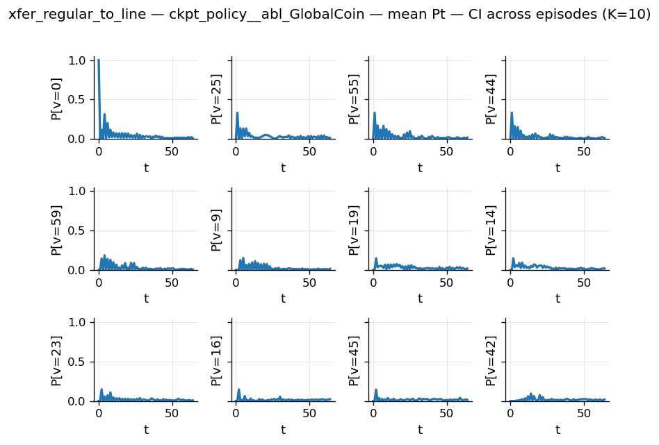

- **tv_to_uniform** `run__xfer_regular_to_line__ckpt__seed0__256__0_1_2_3_4_5_6_7_8_9__0ac69e89__ckpt_policy_abl_GlobalCoin.png`

#### Condition: `ckpt_policy_abl_NoPE`

- **confusion_matrix** `run__xfer_regular_to_line__ckpt__seed0__256__0_1_2_3_4_5_6_7_8_9__0ac69e89__ckpt_policy_abl_NoPE.png`

- **position_timelines** `run__xfer_regular_to_line__ckpt__seed0__256__0_1_2_3_4_5_6_7_8_9__0ac69e89__ckpt_policy_abl_NoPE.png`

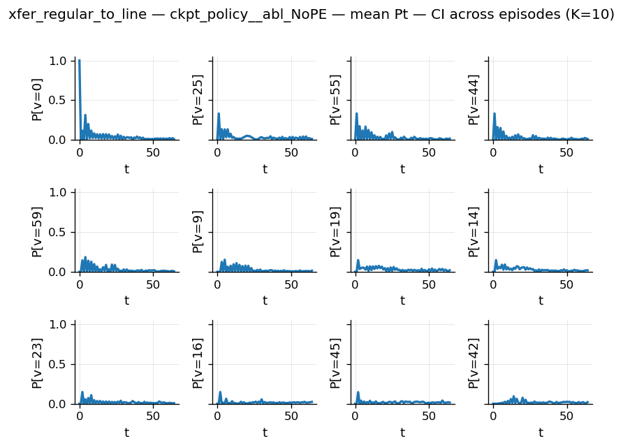

- **tv_to_uniform** `run__xfer_regular_to_line__ckpt__seed0__256__0_1_2_3_4_5_6_7_8_9__0ac69e89__ckpt_policy_abl_NoPE.png`

#### Condition: `ckpt_policy_abl_NodePermute`

- **confusion_matrix** `run__xfer_regular_to_line__ckpt__seed0__256__0_1_2_3_4_5_6_7_8_9__0ac69e89__ckpt_policy_abl_NodePermute.png`

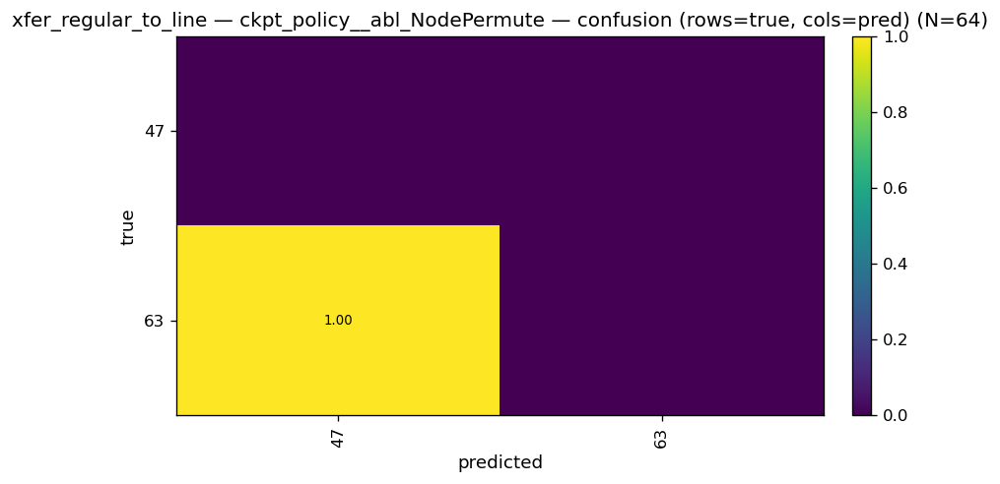

- **position_timelines** `run__xfer_regular_to_line__ckpt__seed0__256__0_1_2_3_4_5_6_7_8_9__0ac69e89__ckpt_policy_abl_NodePermute.png`

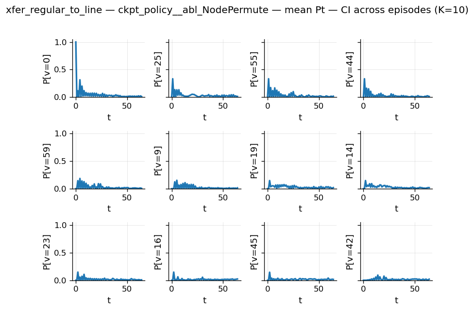

- **tv_to_uniform** `run__xfer_regular_to_line__ckpt__seed0__256__0_1_2_3_4_5_6_7_8_9__0ac69e89__ckpt_policy_abl_NodePermute.png`

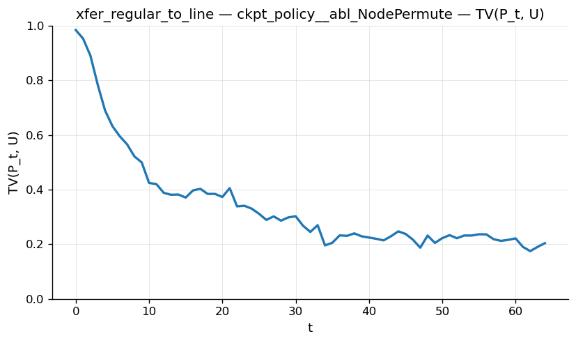

#### Condition: `ckpt_policy_abl_TimeFrozen`

- **confusion_matrix** `run__xfer_regular_to_line__ckpt__seed0__256__0_1_2_3_4_5_6_7_8_9__0ac69e89__ckpt_policy_abl_TimeFrozen.png`

- **position_timelines** `run__xfer_regular_to_line__ckpt__seed0__256__0_1_2_3_4_5_6_7_8_9__0ac69e89__ckpt_policy_abl_TimeFrozen.png`

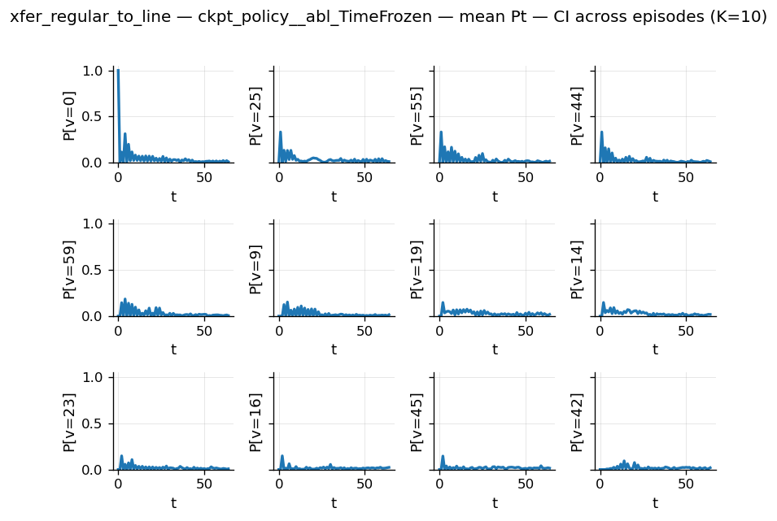

- **tv_to_uniform** `run__xfer_regular_to_line__ckpt__seed0__256__0_1_2_3_4_5_6_7_8_9__0ac69e89__ckpt_policy_abl_TimeFrozen.png`

### Run: `xfer_regular_to_line__ckpt__seed1__256__0_1_2_3_4_5_6_7_8_9__e92b0f5f`

- Checkpoint: `runs/transfer-regular/seed1`
- Evaldir: `/mnt/c/Users/Angel/Desktop/CS598/acpl-qwalk/eval/xfer_cross/regular_to_line/seed1`
- Meta hash: `e92b0f5f1cf706ae67eb5e772f456c34`

#### Condition: `ckpt_policy`

- **confusion_matrix** `run__xfer_regular_to_line__ckpt__seed1__256__0_1_2_3_4_5_6_7_8_9__e92b0f5f__ckpt_policy.png`

- **position_timelines** `run__xfer_regular_to_line__ckpt__seed1__256__0_1_2_3_4_5_6_7_8_9__e92b0f5f__ckpt_policy.png`

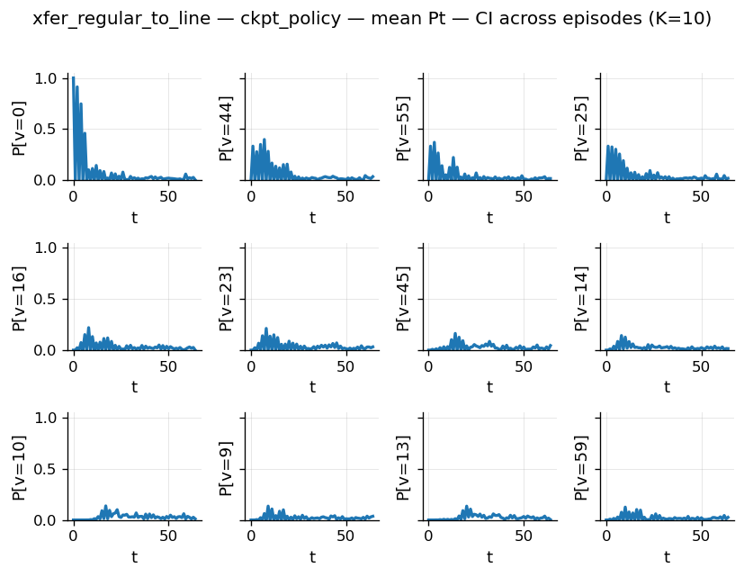

- **tv_to_uniform** `run__xfer_regular_to_line__ckpt__seed1__256__0_1_2_3_4_5_6_7_8_9__e92b0f5f__ckpt_policy.png`

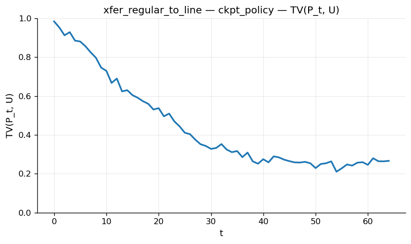

#### Condition: `ckpt_policy_abl_GlobalCoin`

- **confusion_matrix** `run__xfer_regular_to_line__ckpt__seed1__256__0_1_2_3_4_5_6_7_8_9__e92b0f5f__ckpt_policy_abl_GlobalCoin.png`

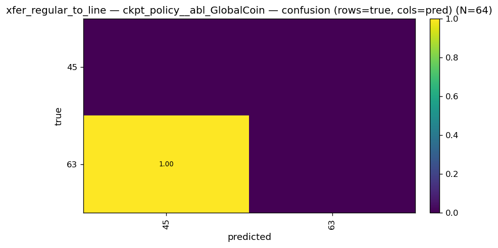

- **position_timelines** `run__xfer_regular_to_line__ckpt__seed1__256__0_1_2_3_4_5_6_7_8_9__e92b0f5f__ckpt_policy_abl_GlobalCoin.png`

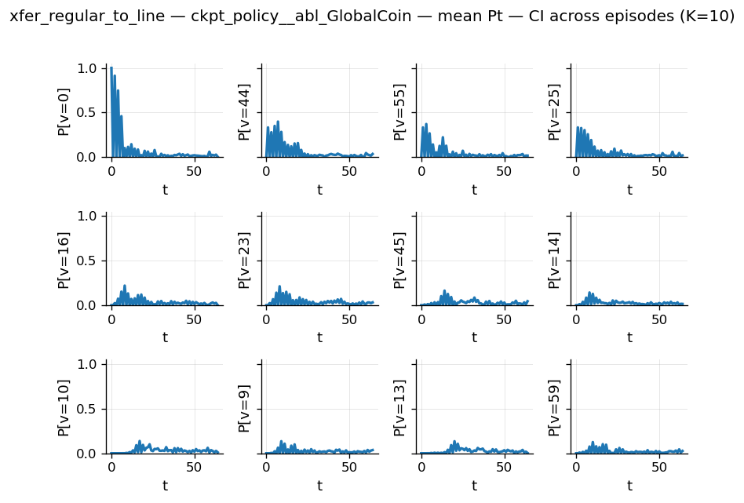

- **tv_to_uniform** `run__xfer_regular_to_line__ckpt__seed1__256__0_1_2_3_4_5_6_7_8_9__e92b0f5f__ckpt_policy_abl_GlobalCoin.png`

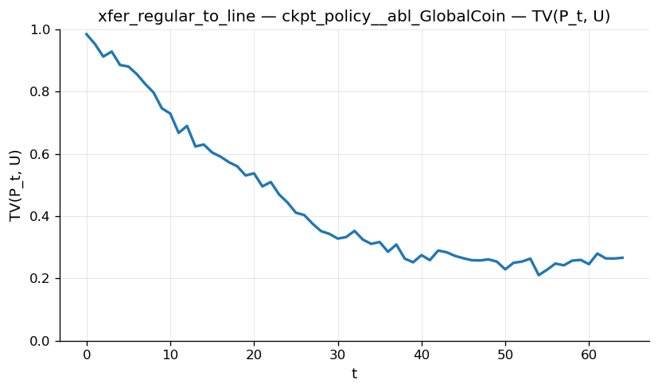

#### Condition: `ckpt_policy_abl_NoPE`

- **confusion_matrix** `run__xfer_regular_to_line__ckpt__seed1__256__0_1_2_3_4_5_6_7_8_9__e92b0f5f__ckpt_policy_abl_NoPE.png`

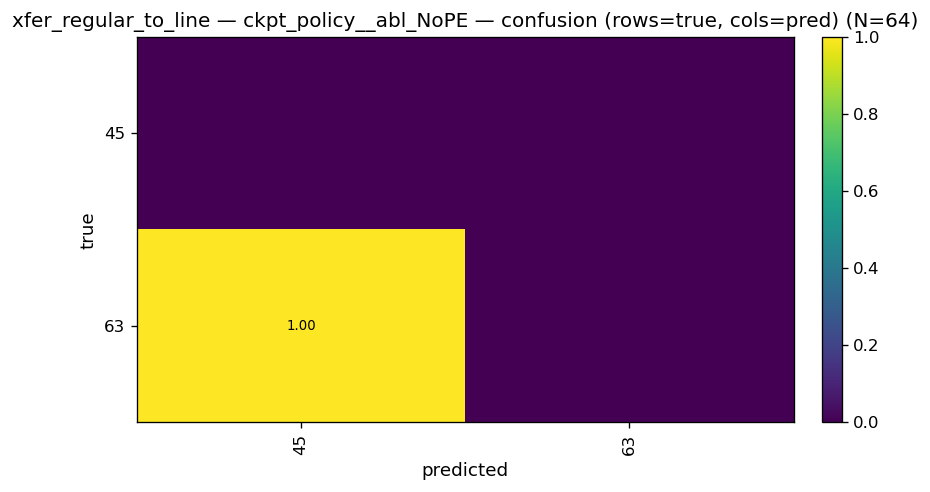

- **position_timelines** `run__xfer_regular_to_line__ckpt__seed1__256__0_1_2_3_4_5_6_7_8_9__e92b0f5f__ckpt_policy_abl_NoPE.png`

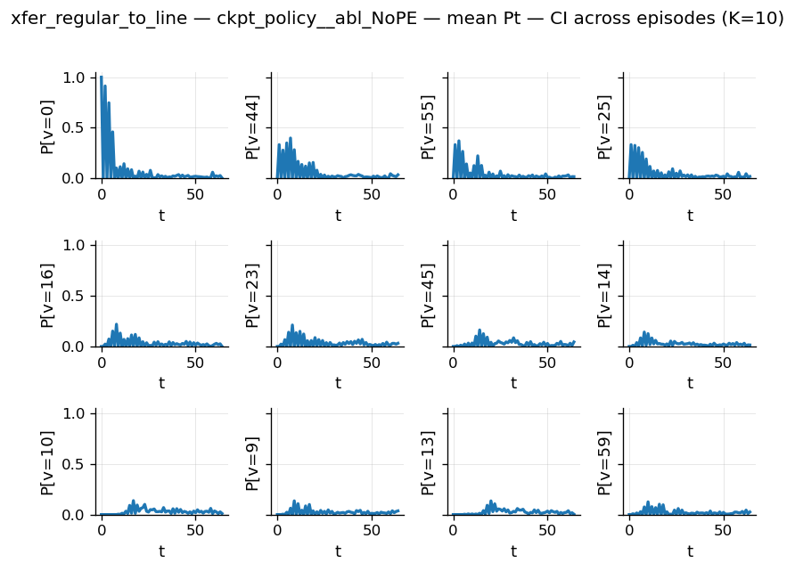

- **tv_to_uniform** `run__xfer_regular_to_line__ckpt__seed1__256__0_1_2_3_4_5_6_7_8_9__e92b0f5f__ckpt_policy_abl_NoPE.png`

#### Condition: `ckpt_policy_abl_NodePermute`

- **confusion_matrix** `run__xfer_regular_to_line__ckpt__seed1__256__0_1_2_3_4_5_6_7_8_9__e92b0f5f__ckpt_policy_abl_NodePermute.png`

- **position_timelines** `run__xfer_regular_to_line__ckpt__seed1__256__0_1_2_3_4_5_6_7_8_9__e92b0f5f__ckpt_policy_abl_NodePermute.png`

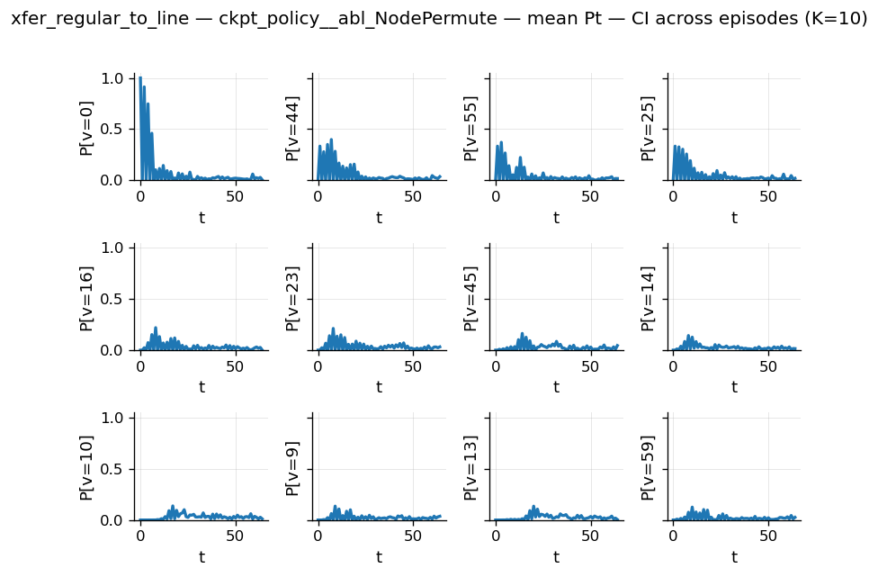

- **tv_to_uniform** `run__xfer_regular_to_line__ckpt__seed1__256__0_1_2_3_4_5_6_7_8_9__e92b0f5f__ckpt_policy_abl_NodePermute.png`

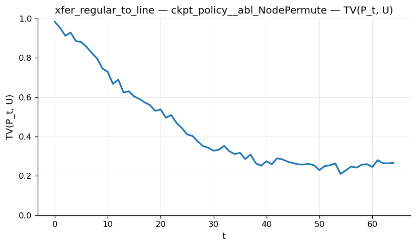

#### Condition: `ckpt_policy_abl_TimeFrozen`

- **confusion_matrix** `run__xfer_regular_to_line__ckpt__seed1__256__0_1_2_3_4_5_6_7_8_9__e92b0f5f__ckpt_policy_abl_TimeFrozen.png`

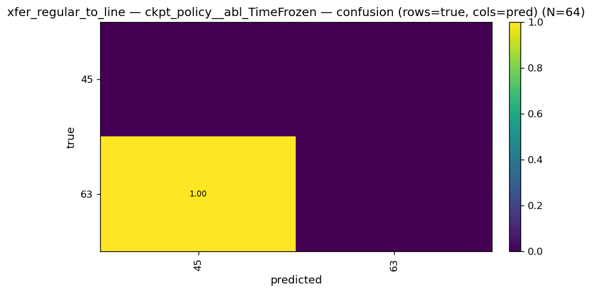

- **position_timelines** `run__xfer_regular_to_line__ckpt__seed1__256__0_1_2_3_4_5_6_7_8_9__e92b0f5f__ckpt_policy_abl_TimeFrozen.png`

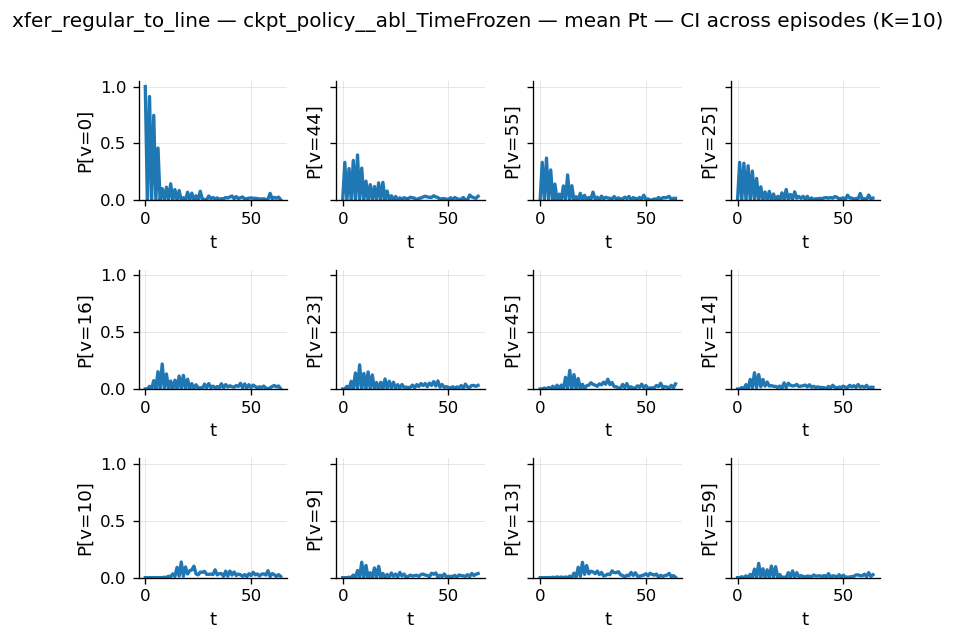

- **tv_to_uniform** `run__xfer_regular_to_line__ckpt__seed1__256__0_1_2_3_4_5_6_7_8_9__e92b0f5f__ckpt_policy_abl_TimeFrozen.png`

### Run: `xfer_regular_to_line__ckpt__seed2__256__0_1_2_3_4_5_6_7_8_9__e12a3b4c`

- Checkpoint: `runs/transfer-regular/seed2`
- Evaldir: `/mnt/c/Users/Angel/Desktop/CS598/acpl-qwalk/eval/xfer_cross/regular_to_line/seed2`
- Meta hash: `e12a3b4c81ddac669dfe4ff2c1572fc4`

#### Condition: `ckpt_policy`

- **confusion_matrix** `run__xfer_regular_to_line__ckpt__seed2__256__0_1_2_3_4_5_6_7_8_9__e12a3b4c__ckpt_policy.png`

- **position_timelines** `run__xfer_regular_to_line__ckpt__seed2__256__0_1_2_3_4_5_6_7_8_9__e12a3b4c__ckpt_policy.png`

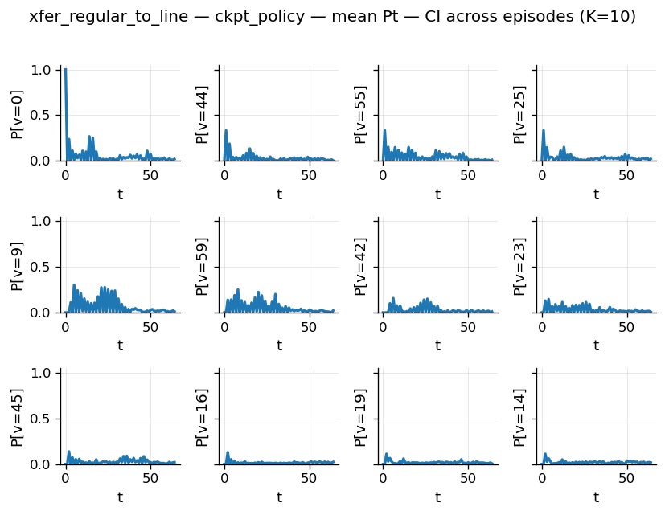

- **tv_to_uniform** `run__xfer_regular_to_line__ckpt__seed2__256__0_1_2_3_4_5_6_7_8_9__e12a3b4c__ckpt_policy.png`

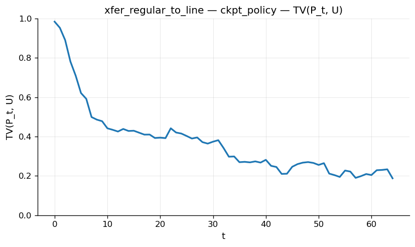

#### Condition: `ckpt_policy_abl_GlobalCoin`

- **confusion_matrix** `run__xfer_regular_to_line__ckpt__seed2__256__0_1_2_3_4_5_6_7_8_9__e12a3b4c__ckpt_policy_abl_GlobalCoin.png`

- **position_timelines** `run__xfer_regular_to_line__ckpt__seed2__256__0_1_2_3_4_5_6_7_8_9__e12a3b4c__ckpt_policy_abl_GlobalCoin.png`

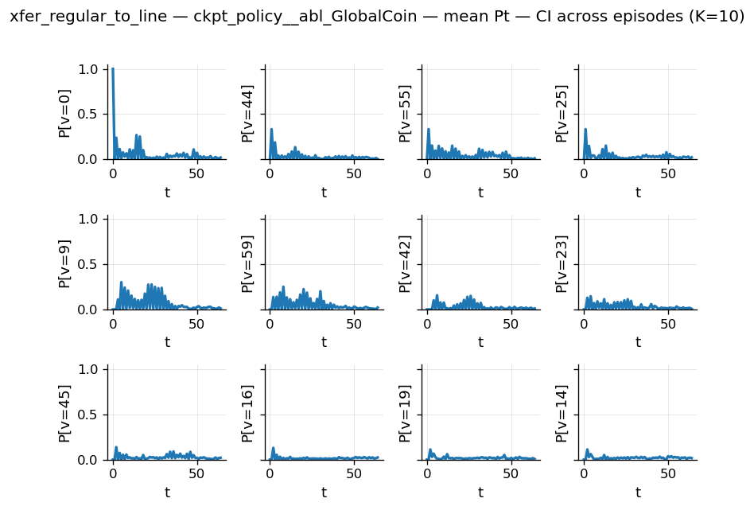

- **tv_to_uniform** `run__xfer_regular_to_line__ckpt__seed2__256__0_1_2_3_4_5_6_7_8_9__e12a3b4c__ckpt_policy_abl_GlobalCoin.png`

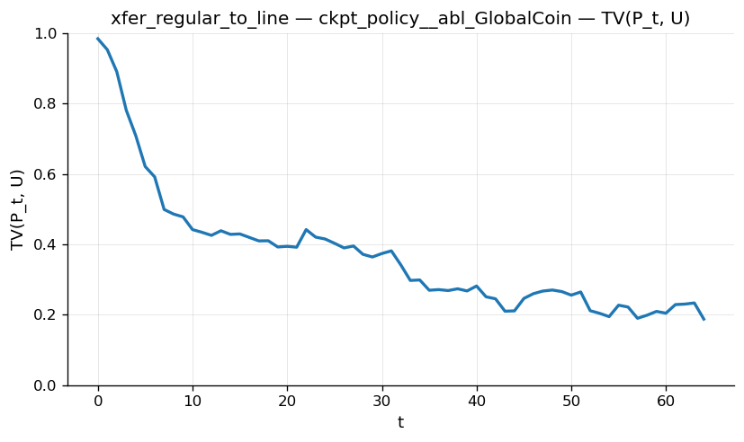

#### Condition: `ckpt_policy_abl_NoPE`

- **confusion_matrix** `run__xfer_regular_to_line__ckpt__seed2__256__0_1_2_3_4_5_6_7_8_9__e12a3b4c__ckpt_policy_abl_NoPE.png`

- **position_timelines** `run__xfer_regular_to_line__ckpt__seed2__256__0_1_2_3_4_5_6_7_8_9__e12a3b4c__ckpt_policy_abl_NoPE.png`

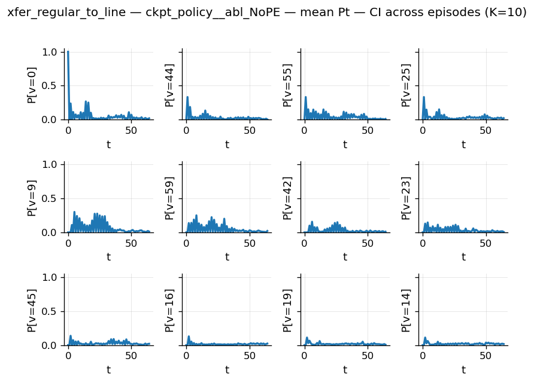

- **tv_to_uniform** `run__xfer_regular_to_line__ckpt__seed2__256__0_1_2_3_4_5_6_7_8_9__e12a3b4c__ckpt_policy_abl_NoPE.png`

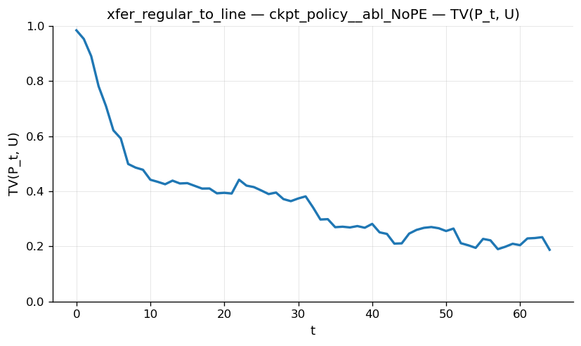

#### Condition: `ckpt_policy_abl_NodePermute`

- **confusion_matrix** `run__xfer_regular_to_line__ckpt__seed2__256__0_1_2_3_4_5_6_7_8_9__e12a3b4c__ckpt_policy_abl_NodePermute.png`

- **position_timelines** `run__xfer_regular_to_line__ckpt__seed2__256__0_1_2_3_4_5_6_7_8_9__e12a3b4c__ckpt_policy_abl_NodePermute.png`

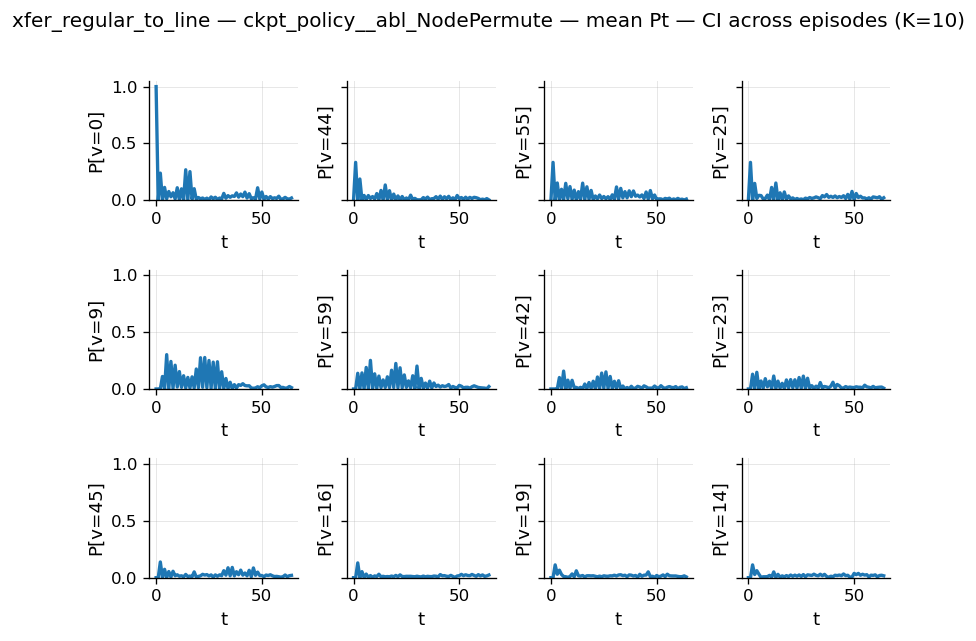

- **tv_to_uniform** `run__xfer_regular_to_line__ckpt__seed2__256__0_1_2_3_4_5_6_7_8_9__e12a3b4c__ckpt_policy_abl_NodePermute.png`

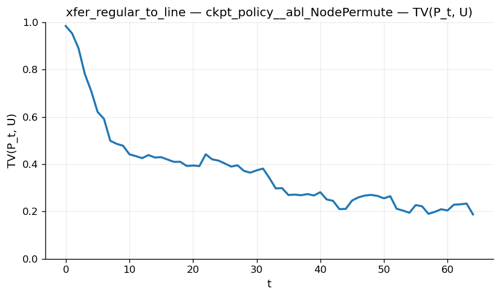

#### Condition: `ckpt_policy_abl_TimeFrozen`

- **confusion_matrix** `run__xfer_regular_to_line__ckpt__seed2__256__0_1_2_3_4_5_6_7_8_9__e12a3b4c__ckpt_policy_abl_TimeFrozen.png`

- **position_timelines** `run__xfer_regular_to_line__ckpt__seed2__256__0_1_2_3_4_5_6_7_8_9__e12a3b4c__ckpt_policy_abl_TimeFrozen.png`

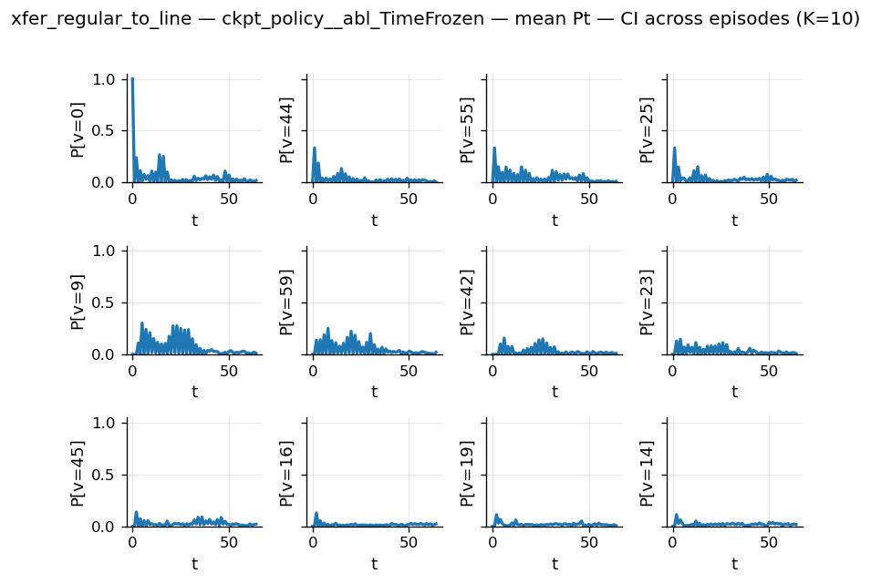

- **tv_to_uniform** `run__xfer_regular_to_line__ckpt__seed2__256__0_1_2_3_4_5_6_7_8_9__e12a3b4c__ckpt_policy_abl_TimeFrozen.png`

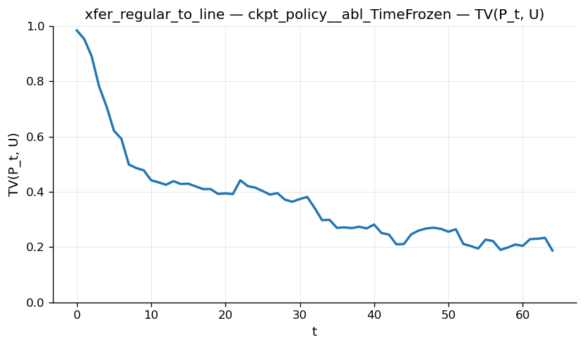
